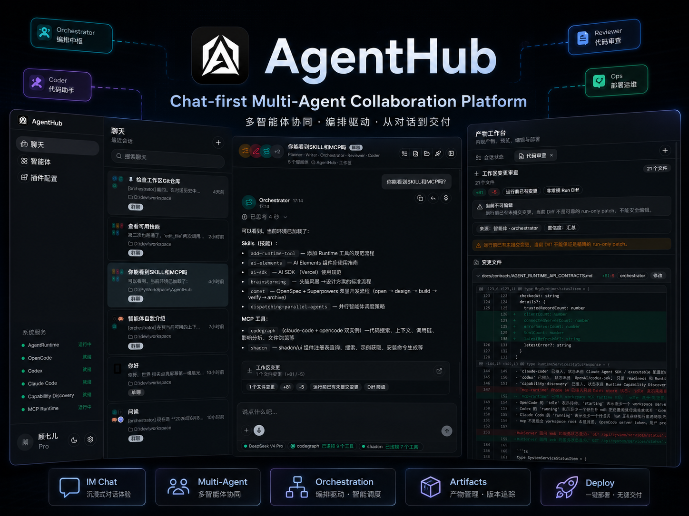

# AgentHub

> Chat-first Multi-Agent Collaboration Platform

[](package.json)
[](https://github.com/GuqierMcl/AgentHub/actions/workflows/release.yml)
[](https://bun.sh/)
[](https://www.typescriptlang.org/)
[](LICENSE)



## ✨ What Is AgentHub?

AgentHub 是一个以 IM 聊天为核心交互范式的多 Agent 协作平台。用户可以像使用聊天软件一样创建会话、发送消息，并与不同智能体单聊或群聊。

它把内部预设 Agent、Claude Code、Codex、OpenCode 等外部智能体统一呈现为聊天参与者，并把代码、Diff、文件、计划、权限请求和网页预览等产物沉淀到同一个对话工作流中。

AgentHub 的目标不是再做一个单轮 Chatbot，而是提供一个从“对话发起任务”到“多智能体协作执行”再到“产物交付与审查”的完整工作台。

## 🚀 Features

- **IM Chat First**: 以会话列表、单聊、群聊、消息流和回复引用组织任务上下文。
- **Multi-Agent Collaboration**: 支持 Orchestrator 拆分任务、委派子任务、汇总结果。
- **External Agent Adapters**: 以统一产品体验接入 Claude Code、Codex、OpenCode 等外部智能体。
- **Artifact Workspace**: 在聊天流和右侧工作台中展示代码、Diff、文件、计划和预览产物。
- **Permission-Aware Execution**: 文件、命令、网络、部署等高风险能力通过结构化权限流程进入产品体验。
- **CLI And Desktop Distribution**: CLI 与 Desktop 共享 HubServer + Agent Runtime sidecar 的生产启动模式。
- **Local-First Runtime Boundary**: 浏览器只访问 HubServer；LLM 凭据、工具执行、文件访问和外部 Agent 能力都收敛到 Agent Runtime。

## 📦 Quick Start

AgentHub 的生产分发分为两条主线：

- **Desktop**: 面向普通用户的桌面安装包。
- **CLI**: 面向开发者和自动化场景的命令行启动包。

从 GitHub Release 下载对应平台的产物：

[Download Latest Release](https://github.com/GuqierMcl/AgentHub/releases/latest)

### Desktop

下载并安装对应平台的 Desktop 安装包，启动后 AgentHub 会自动拉起 HubServer 与 Agent Runtime。首次启动时会先显示加载窗口，HubServer 就绪后进入主界面。

### CLI

下载对应平台的 CLI 压缩包并解压，进入解压目录后运行：

```bash
./agenthub-cli --no-browser
```

Windows:

```powershell
.\agenthub-cli.exe --no-browser
```

启动成功后，终端会输出本地访问地址，例如：

```text
AgentHub running at http://127.0.0.1:54321
```

## 🧠 Architecture

AgentHub 的核心边界是：

```text
Web / Desktop WebView
        |
        v
HubServer
        |
        v
Agent Runtime
```

- `web` 负责 IM 聊天界面、智能体身份、消息流、产物工作台和设置页。
- `hub-server` 负责产品 API、会话与消息持久化、Web 静态资源托管、全局事件和生产 sidecar 管理。
- `agent-runtime` 负责 LLM 调用、外部 Agent adapter、工具执行、权限判断、沙箱策略和 Runtime SSE 事件。
- `cli` 与 `desktop` 是生产入口，二者都复用 HubServer 托管 Web 和管理 Agent Runtime 的能力。

更多设计细节见 [Architecture Docs](docs/architecture/ARCHITECTURE.md) 和 [Production Distribution](docs/architecture/PRODUCTION_DISTRIBUTION.md)。

## 🧩 Demo

Demo video coming soon.

当前版本可先参考上方 cover 图和 `docs/` 中的产品/架构文档了解完整交互路径。

## 📁 Project Structure

```text
AgentHub/
├── web/              React + Vite 前端应用
├── hub-server/       Hono + Bun 平台后端
├── agent-runtime/    Agent 执行运行时与外部智能体适配层
├── cli/              生产 CLI 启动入口
├── desktop/          Electrobun 桌面端入口
├── scripts/          根级构建与打包脚本
├── docs/             产品、架构、契约、ADR 和路线图文档
└── .agents/          本地 AI 协作技能与工具约束
```

## 🔌 External Agents & Extensions

AgentHub 将外部智能体能力收敛到 Agent Runtime 中，当前架构覆盖：

- Claude Code Adapter
- Codex Adapter
- OpenCode Adapter
- Skill / MCP discovery
- Workspace Skill trust
- Runtime tool permission flow

相关文档：

- [External Agent Adapters](docs/external_agents/EXTERNAL_AGENT_ADAPTERS.md)
- [Claude Code Adapter](docs/external_agents/CLAUDE_CODE_ADAPTER.md)
- [Codex Adapter](docs/external_agents/CODEX_ADAPTER.md)
- [OpenCode Adapter](docs/external_agents/OPENCODE_ADAPTER.md)
- [Runtime API Contracts](docs/contracts/AGENT_RUNTIME_API_CONTRACTS.md)

## 📚 Documentation

`docs/` 是 AgentHub 产品设计、技术设计、接口契约、交付说明和 AI 协作记录的事实来源。

推荐阅读：

- [Documentation Index](docs/README.md)
- [Product Spec](docs/product/PRODUCT_SPEC.md)
- [System Architecture](docs/architecture/ARCHITECTURE.md)
- [Web Architecture](docs/architecture/WEB.md)
- [HubServer Architecture](docs/architecture/HUB_SERVER.md)
- [Agent Runtime Architecture](docs/architecture/AGENT_RUNTIME.md)
- [Production Distribution](docs/architecture/PRODUCTION_DISTRIBUTION.md)
- [GitHub Release Workflow](docs/architecture/GITHUB_RELEASE_WORKFLOW.md)

## 🤝 Contributing

AgentHub 使用 Bun 作为 JavaScript/TypeScript 运行时。开发前请先阅读 [docs/README.md](docs/README.md) 和与任务相关的架构/契约文档。

### Development

```bash
bun run dev:web
bun run dev:server
bun run dev:runtime
```

也可以同时启动 Web、HubServer 和 Agent Runtime：

```bash
bun run dev
```

Desktop 开发入口：

```bash
bun run dev:desktop
```

### Build

```bash
bun run build
bun run package
```

Desktop release build:

```bash
bun run build:desktop
```

### Verification

常用轻量检查：

```bash
cd web && bunx tsc --noEmit -p tsconfig.app.json
cd hub-server && bun test
cd hub-server && bunx tsc --noEmit
cd agent-runtime && bun test
cd cli && bunx tsc --noEmit
```

### Configuration

开发模式下，Web、HubServer 和 Agent Runtime 由开发者手动启动。生产模式下，CLI 或 Desktop 启动 HubServer，HubServer 再管理 Agent Runtime sidecar。

常用配置入口：

- `AGENTHUB_DATA_DIR`: 覆盖默认数据目录。
- `AGENTHUB_RUNTIME_URL`: 开发模式连接已运行的 Runtime。
- `--data-dir`: CLI/HubServer 数据目录参数。
- `--log-level`: CLI/HubServer 日志级别参数。

当行为、架构、接口契约、权限模型、编排逻辑或产物协议发生变化时，必须同步更新 `docs/` 中的对应文档。

## ❓ FAQ

### AgentHub 和普通 Chatbot 有什么区别？

AgentHub 不是只围绕单轮问答设计，而是把任务上下文、多个智能体、工具执行、权限审批和产物工作台组织在同一个 IM 风格工作流里。

### 为什么要拆分 HubServer 和 Agent Runtime？

HubServer 负责产品状态和浏览器 API，Agent Runtime 负责 LLM、工具、外部 Agent 和沙箱能力。这个边界避免浏览器直接持有敏感凭据，也让执行层可以作为 sidecar 独立演进。

### 开发模式和生产模式有什么区别？

开发模式中 Web、HubServer、Agent Runtime 分别手动启动，便于热重载和调试。生产模式中 CLI/Desktop 只启动 HubServer，HubServer 负责启动和管理 Agent Runtime sidecar，并托管构建后的 Web assets。

### CLI 和 Desktop 是什么关系？

二者是两条分发入口，共享同一套生产核心资源和 HubServer 生产行为。Desktop 不通过 CLI 启动，而是直接管理 HubServer 进程和窗口生命周期。

### npm 分发支持了吗？

首轮生产分发以 GitHub Release 为主。npm 官方仓库分发可以后续采用 meta package + platform package 的方式接入。

## 📜 License

AgentHub is licensed under the [MIT License](LICENSE).
