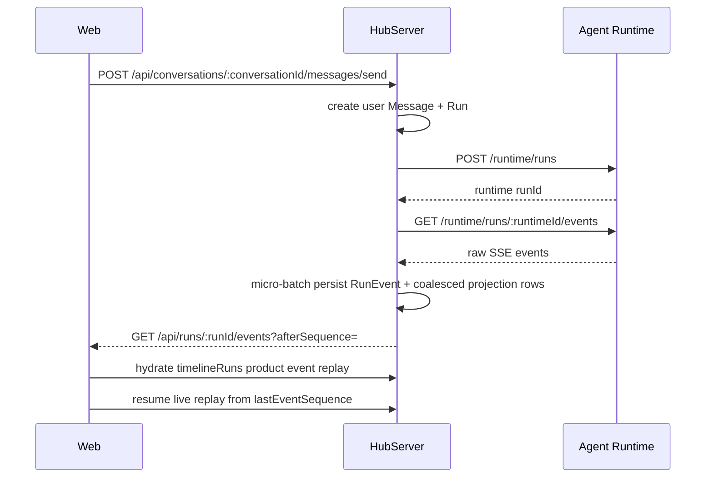

# Run Persistence And Streaming

HubServer 是聊天产品事实源。Web 通过产品 API 发送消息、订阅事件和恢复会话；HubServer 负责把 Runtime SSE 转成可持久化的产品状态。

## 流程

## 关键 API

- `POST /api/conversations/:conversationId/messages/send`
- `POST /api/conversations/:conversationId/assets/images`
- `GET /api/conversations/:conversationId/assets/images/:assetId/file`
- `GET /api/conversations/:conversationId/messages`
- `GET /api/runs/:runId/events?afterSequence=`
- `POST /api/runs/:runId/cancel`
- `POST /api/runs/:runId/permissions/:requestId/decision`
- `POST /api/runs/:runId/questions/:requestId/answer`

## 运行时持久化

- HubServer 创建 user `Message`；仅当 `content.trim()` 非空时创建 `MessagePart(type="text", partKey="text")`，并为已校验的图片资产引用创建 `MessagePart(type="image", partKey="image:{assetId}")`。图片-only 用户消息是合法消息。
- HubServer 创建本地 `Run`，并写入 `Run.runtimeId`。
- HubServer 从已持久化消息投影 Runtime `history`，再调用 Runtime 创建 run。
- 后台 consumer 消费 Runtime SSE。
- 每条 Runtime event 先写 `RunEvent.payloadJson`，再尝试结构化投影。
- HubServer 对每个 run 使用 raw event micro-batch，默认最多约 50ms 或 50 条事件落库一次；terminal event 强制 flush。
- Runtime SSE 底层连接若发生 `ECONNRESET` 等可重试中断，HubServer 会先 flush 已读事件、确认本地是否已到达终态，再通过 Runtime events replay 重连补齐；只有重试后仍未获得 terminal event 的情况才将本地 Run 标记为 failed。
- HubServer 在 raw event 成功落库后才向 `/api/runs/:runId/events` 订阅者发布 envelope，因此 live SSE 可能有约 50ms 的可控延迟，但不会发布不可 replay 的事件。产品 Run SSE 与 `timelineRuns` 可对大工具结果做 UI 摘要投影（例如 `web_fetch` 不向前端传输 response body，只保留 URL、状态码、bytes、耗时等摘要字段；`bash` 只向前端发送 stdout/stderr 预览、exit code、cwd、耗时和截断状态），并把产品 envelope 的 `event.runId` 规范为 HubServer 本地 Run id、把 Runtime run id 放在 `event.runtimeRunId`，以保护浏览器热路径并避免 Web 产品 API 混用 Runtime id；数据库中的 `RunEvent.payloadJson` 仍保留 Runtime raw event，但 `bash` raw event 本身已经只包含截断后的输出。
- 高频 `message.delta` / `reasoning.delta` 的结构化投影合并写入，默认约 150ms flush 一次；`message.completed`、`reasoning.completed` 和 terminal event 会强制追平。
- `Run.lastProjectedSequence` 记录结构化投影进度。读取会话消息或组装 Runtime history 前，HubServer 会从 raw `RunEvent` 补齐落后的 projection。
- `system_agent.completed(systemAgentId="title")` 会在 `Conversation.metadataJson.titleSource !== "manual"` 时更新 `Conversation.title`，并写入 `titleSource = "auto"`。
- `GET /api/conversations/:conversationId/messages` 返回最近窗口的消息快照、active run 快照、latest plan、runItems 和 `timelineRuns`；默认读取最新 50 条消息 / 50 个 run，再按正序返回给 UI，避免刷新或重启后回到会话开头。
- `timelineRuns` 是聊天 UI 恢复的主数据：每个 run 带 trigger user message 和按 `RunEvent.sequence` 排序的产品 event envelopes；大工具结果可能已被投影为 UI 摘要，完整 raw event 留在 `RunEvent.payloadJson`。`messages` 中的 `surface="chat"` user/assistant 记录是聊天气泡的持久化兜底，Web 在 event replay 后按 `runId + runtimeMessageId` 去重合并，修复 raw event replay 窗口缺失或历史事件不完整时的 assistant 消息恢复。
- 权限请求先作为 raw Runtime event 落库，再投影到 `PermissionRequest`；投影优先使用事件 payload 中的 `permissionType`，例如 `web_fetch` 的 `network_access` 和 `bash` 的 `command_execute`。
- 用户问答请求不新增 Prisma 表；`question.requested`、`question.answered`、`question.cancelled` 原样作为 raw event 落库，并由 Web 通过 `timelineRuns` replay 恢复 pending/answered/cancelled 状态。HubServer 在 `question.requested` 时将本地 Run 投影为 `waiting_input`，在 `question.answered` / `question.cancelled` 后按 Runtime 后续事件恢复运行态或终态。
- 产品 cancel API 会在 Runtime cancel 成功返回后立即把本地 Run 标记为终态，发布全局 `run.status.changed`，并 finalize 本地 streaming message/task/permission 投影；如果 Runtime 因重启或不可用丢失了该 run，HubServer 也会把本地 Run 收口为 `cancelled`，解除产品侧 active run 阻塞。后续 Runtime SSE 的 `question.cancelled` / `run.cancelled` 事件仍会落库和幂等投影。

## 恢复规则

- 切会话时只关闭前端 EventSource，不 cancel Runtime run。
- 切回时先强制重新加载最近窗口的 `timelineRuns` 和 `messages`，Web 先插入每个 run 的 trigger user message，再用与 live SSE 相同的 projection reducer 重放产品 event envelopes，最后合并持久化 chat 消息作为兜底。
- 若 active run 非终态，Web 用 fresh snapshot 中的 `activeRun.lastEventSequence` 续订 `/api/runs/:runId/events?afterSequence=`；HubServer 会 replay sequence 更大的已持久化事件并继续推送 live events。切换会话时 Web 必须关闭旧 EventSource，但不得 cancel Run。
- 如果 run 在切走期间完成，`timelineRuns` 已包含最终产品 event envelopes，前端不再保持连接。
- 结构化投影行的 `firstEventSequence` 仍用于查询和非聊天 UI 排序；聊天主 UI 恢复顺序以产品 event replay 为准。

## 兼容性

更完整的 raw event 保留与投影规则见 [`RUN_EVENT_SCHEMA_AND_PROJECTION.md`](./RUN_EVENT_SCHEMA_AND_PROJECTION.md)。

## 产品级权限决定

Web 对 pending permission 卡片的批准/拒绝操作调用 `POST /api/runs/:runId/permissions/:requestId/decision`。HubServer 使用本地 Run 记录找到 `runtimeId` 后转发 Runtime decision API，随后继续依赖 Runtime SSE 事件更新本地 `PermissionRequest`、消息 part 和时间线状态。浏览器不直接调用 Runtime 调试代理。

## 产品级问题回答

Web 从 `timelineRuns` 或 live product SSE 中投影 pending question；存在 pending question 时，聊天输入框替换为 Question 回答组件。提交答案时调用 `POST /api/runs/:runId/questions/:requestId/answer`，HubServer 使用本地 Run 记录找到 `runtimeId` 后转发 Runtime answer API。Runtime 继续通过 `question.answered`、`tool.completed` 和后续 `message.*` 事件恢复同一执行分支，浏览器不直接调用 Runtime 调试代理。

Question 回答组件的 `Skip/跳过` 不提交答案，而是调用 `POST /api/runs/:runId/cancel` 取消整个当前 Run；多个 pending question request 会一起取消。聊天输入框在 Run 运行中把发送按钮替换为 `停止回答`，同样调用产品 cancel API。前端在 cancel 成功后会本地应用 terminal run event 并恢复输入框，不只依赖 SSE 延迟到达。若 Skip 的 cancel 请求失败，前端仍会本地应用 `cancelled` 终态以恢复普通输入框；提交答案失败则仍留在回答组件中显示错误，允许重试。
