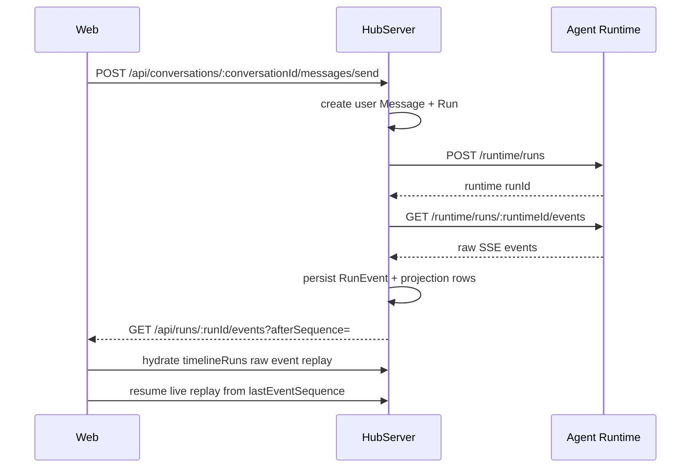

# Run Persistence And Streaming

HubServer 是聊天产品事实源。Web 通过产品 API 发送消息、订阅事件和恢复会话；HubServer 负责把 Runtime SSE 转成可持久化的产品状态。

## 流程

## 关键 API

- `POST /api/conversations/:conversationId/messages/send`
- `GET /api/conversations/:conversationId/messages`
- `GET /api/runs/:runId/events?afterSequence=`
- `POST /api/runs/:runId/cancel`

## 运行时持久化

- HubServer 创建 user `Message` 和 text `MessagePart`。
- HubServer 创建本地 `Run`，并写入 `Run.runtimeId`。
- HubServer 从已持久化消息投影 Runtime `history`，再调用 Runtime 创建 run。
- 后台 consumer 消费 Runtime SSE。
- 每条 Runtime event 先写 `RunEvent.payloadJson`，再尝试结构化投影。
- `system_agent.completed(systemAgentId="title")` 会在 `Conversation.metadataJson.titleSource !== "manual"` 时更新 `Conversation.title`，并写入 `titleSource = "auto"`。
- `GET /api/conversations/:conversationId/messages` 返回消息快照、active run 快照、latest plan、runItems 和 `timelineRuns`。
- `timelineRuns` 是聊天 UI 恢复的主数据：每个 run 带 trigger user message 和按 `RunEvent.sequence` 排序的 raw event envelopes。

## 恢复规则

- 切会话时只关闭前端 EventSource，不 cancel Runtime run。
- 切回时先强制重新加载 `timelineRuns`，Web 先插入每个 run 的 trigger user message，再用与 live SSE 相同的 projection reducer 重放 raw events。
- 若 active run 非终态，Web 用 fresh snapshot 中的 `activeRun.lastEventSequence` 续订 `/api/runs/:runId/events?afterSequence=`；HubServer 会 replay sequence 更大的已持久化事件并继续推送 live events。切换会话时 Web 必须关闭旧 EventSource，但不得 cancel Run。
- 如果 run 在切走期间完成，`timelineRuns` 已包含最终 raw events，前端不再保持连接。
- 结构化投影行的 `firstEventSequence` 仍用于查询和非聊天 UI 排序；聊天主 UI 恢复顺序以 raw replay 为准。

## 兼容性

更完整的 raw event 保留与投影规则见 [`RUN_EVENT_SCHEMA_AND_PROJECTION.md`](./RUN_EVENT_SCHEMA_AND_PROJECTION.md)。
