# AgentHub 产品设计文档

## 1. 项目背景与原始需求

### 1.1 课题背景

随着 Claude Code、Codex、OpenCode 等智能体工具逐渐成熟，AI 辅助开发已经不再局限于单轮问答，而是开始进入“持续协作、任务拆解、代码修改、产物审查和部署交付”的阶段。用户在真实开发过程中往往需要同时完成需求理解、方案设计、代码实现、审查、预览和发布等多个环节，单一聊天窗口或单一命令行工具难以完整承载这些协作流程。

AgentHub 的课题背景正是基于这一变化：将多种 AI Agent 能力组织到一个统一的产品界面中，让用户像使用 IM 工具一样创建会话、发送消息、邀请不同 Agent 参与任务，并在同一个上下文中完成多 Agent 协作。

因此，AgentHub 的产品核心不是“再做一个 Chatbot”，而是探索一种更适合多 Agent 协作的工作台形态：以 IM 会话承载任务上下文，以 Agent 作为聊天参与者，以产物卡片和工作台承载执行结果。

### 1.2 核心需求

原始需求要求 AgentHub 围绕 IM 聊天式交互构建多 Agent 协作平台。用户应当能够创建对话、管理会话列表，并在单聊或群聊中与不同 Agent 持续沟通。聊天历史需要自动进入 Agent 上下文，关键消息可以被 pin 为长期上下文，消息类型也需要覆盖文本、代码、图片、文件附件、网页预览、Diff 视图和部署状态等多种形态。

在多 Agent 协作方面，系统需要提供 Orchestrator 协调能力。在群聊模式下，Orchestrator 应能够理解用户意图，将复杂任务拆解给合适的子 Agent 或参与 Agent，并在任务完成后将结果聚合回聊天流。该能力需要为后续并行调度、失败降级和代码冲突处理留下演进空间。

在 Agent 接入方面，系统需要通过统一适配器层接入至少两个主流 Agent 平台，并支持用户自建 Agent。每个 Agent 在产品中都应表现为独立聊天对象，具备名称、头像和能力标签。用户不应被迫理解底层平台差异，而应通过统一产品体验选择和使用不同 Agent。

在产物交付方面，Agent 输出不应只停留在文本回复。系统需要支持在聊天中内联展示网页预览、文档、代码、Diff、文件和部署状态等产物，并允许用户点击产物进入预览面板或编辑器。围绕版本历史、对话式局部修改、一键部署、预览 URL 和源码打包下载等能力，也需要保留后续扩展方向。

### 1.3 交付目标

本次交付的目标是证明 AgentHub 能够跑通从“用户发起任务”到“多 Agent 协作执行”再到“产物展示与审查”的核心链路。产品设计上，交付重点放在 IM 会话体验、单 Agent 对话、多 Agent 群聊、Orchestrator 任务拆分、外部 Agent 接入、基础产物预览和权限交互上。

从功能优先级看，本次交付以 P0/P1 为主。P0 关注对话列表、新建对话、单 Agent 聊天、基础消息流和上下文持久化；P1 关注多 Agent 群聊、Orchestrator 任务拆分与结果聚合、至少两个外部 Agent 适配器，以及代码、文件、网页预览、Diff 等内联产物卡片。P2 中的版本历史、对话式局部修改、部署与发布流程、桌面端和移动端扩展作为增强方向呈现。

最终交付物包括产品设计文档、技术文档、可运行 Demo、AI 协作开发记录和 3 分钟 Demo 视频。交付评审重点关注 AI 协作能力、功能完整度、生成效果质量、代码理解度以及创新与产品感。

## 2. 产品定位与设计目标

AgentHub 的定位是一个以 IM 聊天为核心交互方式的多 Agent 协作平台。它不是传统意义上的聊天机器人，也不是只服务于单个模型调用的工具，而是将会话、Agent、产物、权限与部署组织为统一的任务工作台，让用户在一个连续上下文中完成协作、审查与交付。

### 2.1 目标用户

AgentHub 的主要目标用户可以分为三类：

- **开发者**：需要在编码、调试、审查、预览和发布之间频繁切换，希望借助多个 Agent 提升协作效率。
- **AI 协作使用者**：已经习惯使用 Claude Code、Codex、OpenCode 等工具，希望在一个统一界面中管理不同能力来源。
- **项目执行者**：更关注任务推进、产物审查和部署交付，希望通过聊天式工作流推进整个交付过程。

### 2.2 核心使用场景

AgentHub 的典型使用场景不是单轮问答，而是连续、多阶段的协作任务。

1. **代码任务协作**：用户在会话中描述需求，Orchestrator 拆解任务，Coder 完成实现，Reviewer 完成审查，最终回到同一聊天流中汇总。
2. **问题排查与修改**：用户提供报错、截图或日志，Agent 结合历史上下文、工作区文件和运行状态定位问题，并给出修改建议或直接生成补丁。
3. **产物审查与预览**：用户在对话中打开代码文件、网页预览、Diff 或文件卡片，确认结果后继续迭代或应用变更。
4. **发布与部署**：Deploy 智能体连接远程服务器，执行部署命令，更新进度并输出可回放的部署状态。
5. **自定义 Agent 创建**：用户通过对话或设置界面创建符合自己流程的 Agent，并将其加入现有会话体系。

### 2.3 设计目标

AgentHub 的设计目标是把多 Agent 协作从“工具拼接”变成“产品化工作流”。具体来说：

- **以会话为中心**：任务发起、上下文沉淀、结果审查都围绕会话展开。
- **以 Agent 为参与者**：不同能力来源的 Agent 统一表现为可被邀请、可被 @、可被选择的协作对象。
- **以产物为结果**：代码、文件、预览、Diff 和部署状态都应成为可操作对象，而不是附属日志。
- **以权限为交互**：高风险能力必须显式、可见、可恢复，避免黑箱执行。
- **以本地优先为边界**：浏览器只面对 HubServer，敏感凭据和执行能力收敛在 Runtime 与 sidecar 边界内。

### 2.4 与同类产品的差异

与常见 AI 产品相比，AgentHub 的差异不在于“是否支持对话”，而在于它是否把对话变成完整的协作闭环。

- **相较 Chatbot 类产品**：AgentHub 不只返回答案，而是支持多 Agent 协作、任务拆解、产物预览和部署交付。
- **相较 AI IDE 类产品**：AgentHub 不把能力绑定在编辑器内，而是以 IM 会话组织上下文、参与者和结果。
- **相较 CLI 类 Agent 工具**：AgentHub 不要求用户理解命令和 Session 细节，而是以聊天界面承载协作过程。
- **相较工作流编排平台**：AgentHub 不把 Agent 视为流程节点，而是视为具有身份、上下文和产物能力的协作对象。

因此，AgentHub 的核心差异可以概括为：**以 IM 作为交互外壳，以多 Agent 作为协作单元，以产物和部署作为交付闭环。**

## 3. 产品创新点

AgentHub 的产品创新点不只来自功能堆叠，而来自一组一致的设计判断：把多 Agent 协作从“工具切换”收敛为“会话协作”，把外部平台从“底层能力差异”转译为“可见协作对象”，把高风险执行从“后台日志”转化为“可审批、可回放的产品交互”，并最终围绕代码、Diff、部署状态和自定义 Agent 形成交付闭环。

| 创新维度 | 设计主张 | 用户价值 |
| --- | --- | --- |
| 协作范式 | 以 IM 会话承载多 Agent 协作 | 用户用熟悉的聊天心智组织任务、成员和上下文 |
| 能力接入 | 外部 Agent、Skill、MCP、模型目录统一纳入产品边界 | 降低配置和切换成本，同时保留外部平台原生能力 |
| 执行边界 | 状态管理、执行引擎、工作区和权限边界清晰分层 | 降低敏感能力外泄、执行异常和上下文污染风险 |
| 交付闭环 | Diff、部署、事件回放和产物状态成为一等对象 | 用户能审查、追踪、恢复和继续迭代 |
| 体验质感 | 用动效和状态反馈表达 Agent 在线感与任务进展 | 多 Agent 执行过程更可感知、更可信 |

### 3.1 IM 范式下的多 Agent 协作统一体验

AgentHub 的首要创新，是把 Agent 从“工具入口”转化为“聊天参与者”。系统预设 Agent、用户自定义 Agent 以及 Claude Code、Codex、OpenCode 等外部智能体，在产品中都以可见主智能体的身份出现：有名称、头像、能力标签、入口策略和权限边界，也可以被用户在单聊、群聊和 `@` 提及中直接调用。

这种设计让用户不需要理解底层执行方式差异。用户面对的是“我应该邀请谁来完成这件事”，而不是“我应该打开哪个 CLI、选择哪个 Session、复制哪段上下文”。在群聊中，Orchestrator 可以作为默认入口理解意图、拆分任务和选择成员；当用户显式 `@` 某个 Agent 时，该 Agent 的回复也会像普通聊天发言一样进入消息流，而不是被后台协调器转述。

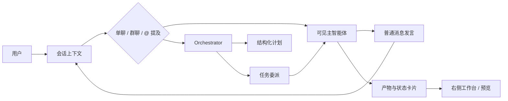

| 对比项 | 常见工具形态 | AgentHub 设计 |
| --- | --- | --- |
| 能力入口 | 多个独立窗口、命令或配置页 | 会话成员与联系人 |
| 协作组织 | 用户手动复制上下文并切换工具 | 群聊、`@`、Orchestrator 自动路由 |
| 外部 Agent 输出 | 容易成为日志或后台结果 | 作为可见发言进入同一聊天流 |
| 用户心智 | “我在调用工具” | “我在组织一组智能体协作” |

### 3.2 统一外部 Agent Adapter 体系

AgentHub 没有把外部平台拆成模型供应商、Skill、MCP、插件和工具配置面板，而是坚持把外部平台整体视为“可对话、可被委派、可产生消息和产物的聊天对象”。Adapter 的价值在于屏蔽平台私有协议，让不同外部 Agent 能进入同一套会话、事件、权限和产物投影链路。

这一点对产品体验很关键：用户可以直接选择 OpenCode、Claude Code 或 Codex 参与任务，而不必在 AgentHub 中重新学习外部平台的内部配置体系。外部 Agent 保留自己的原生模型、工具、权限和配置文件；AgentHub 只管理“本轮由 AgentHub 发起的协作请求如何被正确执行、呈现和回收上下文”。

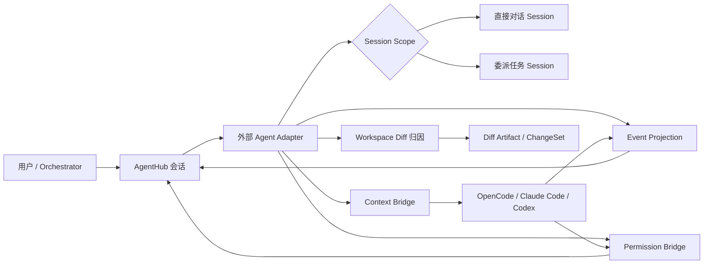

| 设计维度 | Adapter 统一内容 | 产品意义 |
| --- | --- | --- |
| 智能体身份 | 外部平台统一表现为可见主智能体 | 用户把外部能力当作协作成员使用 |
| Session 作用域 | 区分直接对话与 Orchestrator 委派任务 | 避免任务委派污染用户直接聊天记忆 |
| 上下文桥接 | 将可见会话历史、pinned context、产物摘要注入外部请求 | 外部 Agent 能理解当前 AgentHub 语境 |
| 任务交接 | 委派任务完成后生成 handoff summary | 后续直接对话能接上任务结果 |
| 权限桥接 | 外部平台权限请求映射为 AgentHub 权限事件 | 用户在同一聊天体验中审批高风险行为 |
| 事件投影 | 外部文本、工具、错误、权限统一转为稳定事件 | 前端无需理解各平台私有事件格式 |
| 变更归因 | 文件变化交给平台级 Workspace Diff 统一计算 | 内部与外部 Agent 的变更都能被审查 |

### 3.3 外部与自定义智能体的精细化配置体系

AgentHub 将智能体配置设计为“协作成员管理”，而不是简单的 Prompt 输入框。一个 Agent 不只包含名称和系统提示词，还包含能力标签、模型绑定、工具集合、可委派子智能体、Skill 注入、权限上限、头像和外部 SDK 运行覆盖项。这样，用户创建和管理的不是一次性助手，而是可以长期复用的工作流角色。

系统预设 Agent 保持只读，以保证基础协作能力稳定；用户自定义 Agent 则开放名称、职责、能力、工具和文件权限等配置；外部 Agent 支持轻量运行覆盖，例如只作用于 AgentHub 发起运行的模型或执行模式选择，并且不写入外部平台全局配置。

| 配置层面 | 面向的设计问题 | 当前产品表达 |
| --- | --- | --- |
| 身份与职责 | 这个 Agent 在团队中扮演什么角色 | 名称、描述、头像、能力标签 |
| 行为约束 | 它应该如何理解任务与回应用户 | 系统提示词 |
| 模型选择 | 内部 Agent 使用哪类模型能力 | 模型绑定与系统默认模型 |
| 工具能力 | 它能读取、编辑、搜索或调用哪些能力 | 可用工具与可委派子智能体 |
| 上下文增强 | 它是否需要特定工作方法或知识包 | Skill 引用与注入 |
| 风险边界 | 它最多能做到什么 | 文件权限与工具权限校验 |
| 外部覆盖 | 本轮 AgentHub 调用外部 SDK 时如何运行 | 外部 Agent 的轻量设置面板 |

首版对用户自定义 Agent 保持保守：可配置文件读取/写入相关能力，但不开放 Shell、网络和部署权限。这让“可自定义”与“可控风险”同时成立。

### 3.4 Orchestrator 工具化任务编排模型

Orchestrator 在 AgentHub 中不是隐藏在后台的流程引擎，而是一个特殊主智能体：它参与会话，理解用户目标，并通过受控的内部任务原语完成计划生成和任务委派。它的核心设计不是“让模型自由发挥调度”，而是把计划和委派变成可结构化消费的协作动作。

`write_plan` 负责把当前计划写成 UI 可渲染的结构；`run_task` 表示“一次委派 = 一个目标智能体 + 一个明确任务”。任务之间可以表达依赖关系，可能产生并行批次；需要并行写入时，还可以通过声明式文件锁降低冲突概率。这样，Orchestrator 的计划不再只是自然语言段落，而是可以被前端、事件流和后续恢复逻辑稳定识别的产品状态。

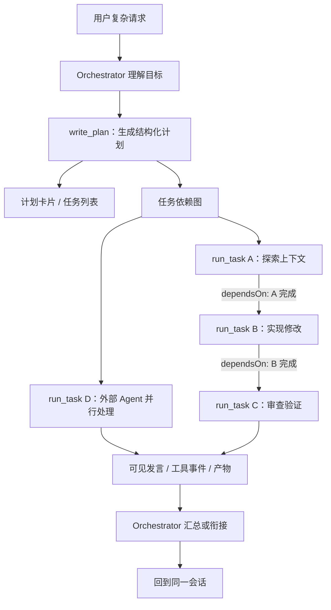

| 角色 | 设计边界 |
| --- | --- |
| Orchestrator | 负责运行时路由、任务拆分、委派执行和结果衔接 |
| Planner | 负责生成人类可读方案、风险和验收建议，不参与运行时委派 |
| 被委派 Agent | 专注完成单个任务，并将输出作为可见消息或产物回到会话 |

### 3.5 面向发布交付的 Deploy 智能体与 SSH 运行时

AgentHub 将部署从"最后一条命令"提升为"可协作的发布成员"。Deploy 是可见系统主智能体，用户可以像邀请 Coder、Reviewer 一样邀请它参与会话，让部署计划、服务器选择、命令审批、状态同步和预览 URL 都发生在同一协作上下文中。

这一设计让发布交付不再是开发完成后的黑箱动作，而是自然接入多 Agent 工作流：Coder 完成改动，Reviewer 审查风险，Deploy 读取项目部署线索、询问缺失信息、连接服务器、执行经过审批的远程命令，并持续更新部署状态。

Deploy 背后的执行引擎不是简单调用本机 Shell，而是通过受控的 SSH 部署连接运行时管理远程发布过程。服务器凭据、私钥、远程路径和连接材料只在 Runtime 内部短暂持有；模型和 Web 侧只看到脱敏后的服务器展示信息、连接状态和部署进度。远程命令采用独立的部署审批语义——用户批准的是"在某台服务器、某个目录下执行这条部署命令"，而不是泛化的本机命令权限。

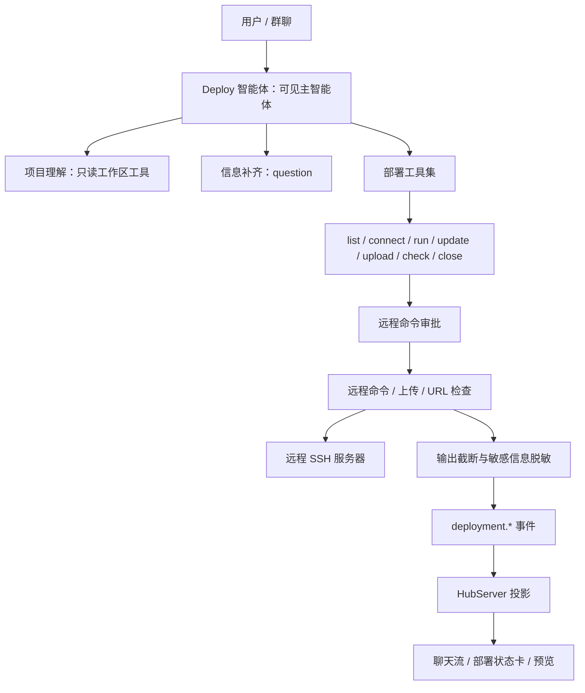

SSH 部署连接运行时的内部架构如下：

- 凭据解析和连接建立被约束在 Runtime 连接动作内部，外部只能看到脱敏后的服务器元数据；
- 每条远程命令独立审批，输出经过截断与脱敏后才进入事件流。

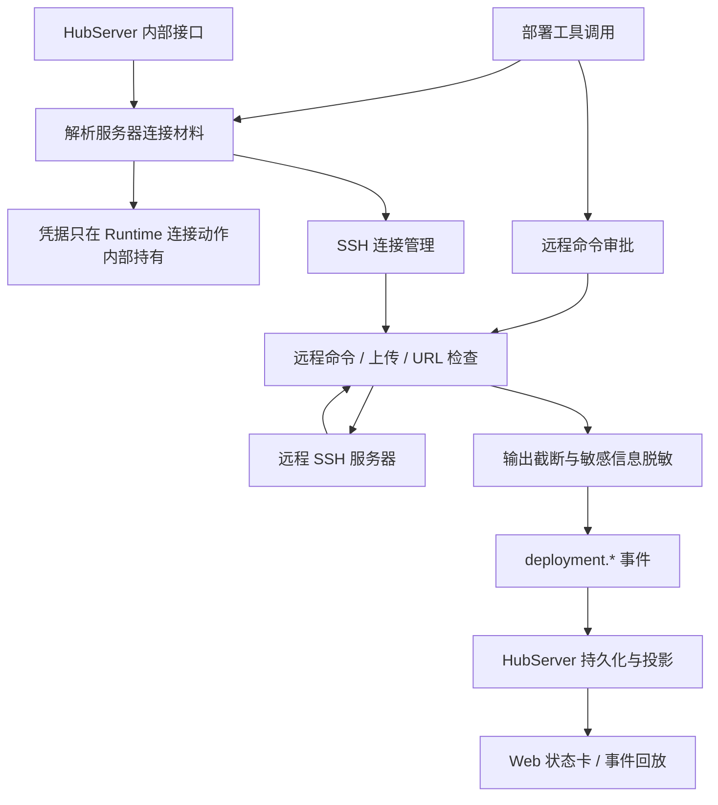

| 发布阶段 | 传统体验 | AgentHub 体验 | 风险控制 |
| --- | --- | --- | --- |
| 部署准备 | 用户手动判断项目如何发布 | Deploy 结合项目文件与会话目标分析部署策略 | — |
| 信息缺失 | 命令执行失败后再排查 | Deploy 可在会话中主动追问 | — |
| 服务器连接 | 用户在终端里直接操作 | Runtime 维护会话级 SSH 连接 | 凭据不进入消息、事件或产物 |
| 远程命令 | 用户直接执行 | 高风险命令进入结构化审批 | 审批通过前不启动远程执行 |
| 状态同步 | 日志散落在终端 | 部署进度、发布说明和预览状态进入聊天流 | stdout/stderr 做截断与脱敏 |
| 交付确认 | 用户自己打开地址验证 | Deploy 可执行 URL 健康检查并请求预览 | 历史 replay 不自动打开外部链接 |
| 连接结束 | 用户手动关闭 | 显式关闭或取消清理 | Runtime 重启后旧连接标记为不可复用 |

### 3.6 状态管理与执行引擎分离的 Sidecar 架构

AgentHub 采用状态面与执行面分离的 Sidecar 架构。Web 只访问 HubServer；HubServer 负责会话、消息、Agent 配置、Artifact、Run 状态和事件持久化；Agent Runtime 作为 Sidecar 执行引擎，负责模型调用、外部 Agent 适配、工具调用、工作区访问、权限续跑和部署执行。

这种边界的产品意义在于：浏览器不持有 LLM 凭据，不直接访问本机文件、远程服务器或外部 Agent 进程；执行层崩溃、重启或升级时，也不会把产品状态管理一起卷入不稳定区域。从用户视角看，他们不需要关心 Agent 在哪里运行、模型调用走了哪条链路、文件工具如何访问磁盘——他们只需要在会话中提出需求、审查结果、批准或拒绝高风险操作，其余执行细节被 Sidecar 边界自然屏蔽。

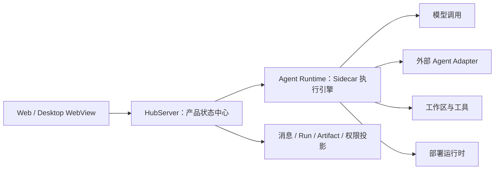

| 分层 | 主要职责 | 设计收益 |
| --- | --- | --- |
| Web | 展示会话、产物、权限、工作台 | 不接触敏感凭据和执行能力 |
| HubServer | 管理产品状态、托管 Web、持久化事件 | 保证业务事实和 UI 状态一致 |
| Agent Runtime | 执行 Agent、工具、适配器和部署 | 将高风险执行收敛到隔离边界 |
| Sidecar 生命周期 | 启动、健康检查、异常重启、优雅关闭 | 让生产运行更接近真实应用形态 |

### 3.7 工作区运行时与本地执行边界

AgentHub 的工作区运行时把“本地执行”变成明确的产品边界。一次 Run 可以绑定一个工作区；绑定后，文件读取、搜索、编辑、Diff、外部 Agent 项目目录和部署构件都围绕这个工作区发生。未绑定工作区时，系统仍然可以纯对话，但不会隐式回退到某个全局目录执行文件操作。

这一设计避免了常见本地 Agent 工具中的模糊边界：用户知道当前任务作用在哪个项目上，Runtime 也能围绕同一 workspace snapshot 捕获环境摘要、执行工具、计算变更、生成产物和处理权限。例如，用户在一个会话中让 Agent 修改 React 前端项目，在另一个会话中让 Agent 调试 Node 后端服务——两个工作区各自独立，文件变更、Git Diff 和部署构件互不干扰。

| 工作区能力 | 设计逻辑 |
| --- | --- |
| Run 级绑定 | 一个 Run 最多绑定一个主工作区，运行中不切换 |
| 环境快照 | 同一次执行共享时间、系统、工作区和 Git 摘要 |
| 文件工具 | 通过工作区相对路径访问，不让普通工具直接暴露宿主机路径 |
| 敏感路径 | `.env`、密钥、配置等内容读写触发更严格边界 |
| 外部 Agent | 以绑定工作区作为外部 Project 边界 |
| 部署构件 | 从绑定工作区读取，再进入远程部署流程 |
| 变更摘要 | Run 结束时统一沉淀 Workspace Diff |

### 3.8 结构化权限与审批续跑模型

AgentHub 把高风险操作设计成一等产品交互，而不是隐藏在 CLI 提示、终端日志或模型回复中。文件写入、敏感文件读取、网络访问、命令执行、部署命令以及外部平台权限请求，都可以通过结构化事件进入聊天体验，让用户在具体语境中批准、拒绝或取消。

权限控制由三个维度共同决定：工具是否可见、Agent 能力上限是否覆盖、当前操作是否需要审批。审批通过后，Runtime 在原 Run、原工具调用和原执行分支上恢复，而不是重新发起一次丢失上下文的新任务。

| 控制维度 | 关注问题 | 产品表达 |
| --- | --- | --- |
| `allowedTools` | Agent 是否能看到并请求某个工具 | 配置面板中的工具选择 |
| `permissionPolicy` | Agent 最多拥有哪些能力边界 | 文件、Shell、网络、部署等权限等级 |
| `approvalPolicy` | 某次具体操作是否需要用户批准 | 聊天流中的权限卡片 |

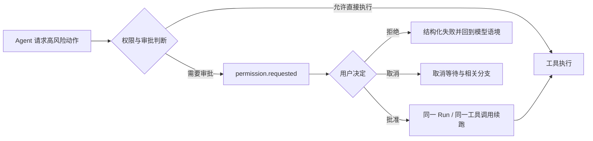

用户问答与权限审批共享“暂停后恢复”的产品节奏，但语义不同。`question` 是 Agent 主动向用户补充信息的交互，不是权限请求；用户回答后，同样回到原执行分支继续完成任务。

### 3.9 通用 Workspace Diff 与 ChangeSet 归因

AgentHub 将文件变更归因设计为平台级能力，而不是某个 Agent 或 Adapter 的私有实现。无论变更来自内部 Coder、文件子智能体、用户自定义 Agent，还是外部 OpenCode、Claude Code、Codex，只要它们作用于绑定工作区，Runtime 都可以在 Run 前后捕获 Git baseline，并在终态计算变更摘要。

这让用户不仅能看到 Agent “说了什么”，还能看到它“改了什么”。变更文件、增删行、dirty baseline、降级原因、bounded patch 和可撤销性都可以被投影为 Diff artifact 与 ChangeSet，为审查、回滚和后续迭代提供共同事实。

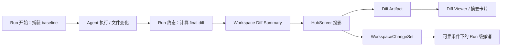

| 阶段 | 设计重点 |
| --- | --- |
| Run 开始 | 记录工作区、分支、HEAD、脏状态和文件指纹 |
| Run 执行 | 不依赖各外部平台私有 diff 事件 |
| Run 终态 | 计算 changed files、numstat、diffstat 和 bounded patch |
| Dirty baseline | 尽量过滤本轮未变化的既有脏文件，同时明确标记可靠性限制 |
| 产品投影 | 生成 Diff artifact、版本和 ChangeSet |
| 撤销能力 | 只在完整、未截断、非 binary、非 dirty baseline 等可靠条件下开放 |

### 3.10 Skill / MCP 能力发现、信任与运行时注入

AgentHub 原生集成 Skill / MCP，但没有把它们简单做成“插件开关”。产品设计把 Skill 视为上下文能力，把 MCP 视为工具能力，并围绕发现、信任、来源优先级、去重和注入边界建立统一规则。

系统可以只读发现 `.agents`、Codex、Claude Code、OpenCode 等来源中的 Skill/MCP 配置。对于工作区能力，自动发现默认 trusted，用户可以显式撤销；信任记录按工作区根哈希隔离，不暴露真实路径。运行时注入前会按来源优先级去重（`.agents > codex > claude-code > opencode`），避免同一个 Skill 或 MCP server 在多个外部平台中重复出现时污染用户体验。外部 Agent 的原生 Skill/MCP 配置不受 AgentHub 接管。

| 能力类型 | 产品含义 | 运行边界 | 隐私约束 |
| --- | --- | --- | --- |
| Skill | 让 Agent 获得特定工作方法、知识或规范 | 作为受控上下文注入内部 Agent / Orchestrator，不展示正文 | API 和事件不返回真实 root、env、headers、token |
| MCP | 让 Agent 获得外部工具能力 | trusted workspace MCP 可连接、枚举并动态注入工具，同组来源自动去重 | 配置中的 secret、env 和连接凭据不进入产品层 |

### 3.11 基于 models.dev 的供应商与模型目录自动适配

AgentHub 的模型配置不是静态写死的 provider/model 清单，而是以 models.dev 作为预设目录基线，再叠加本地缓存和用户配置。目录提供供应商、模型、上下文长度、输出长度、工具调用、视觉、推理、价格等元数据；用户配置则负责 API Key、启用状态、自定义 endpoint 和自定义模型。

这种设计让模型选择更接近“自动适配目录”，而不是每次新增模型都修改产品代码。即使在线目录不可用，用户仍可以依赖本地缓存或自定义 provider 继续使用。

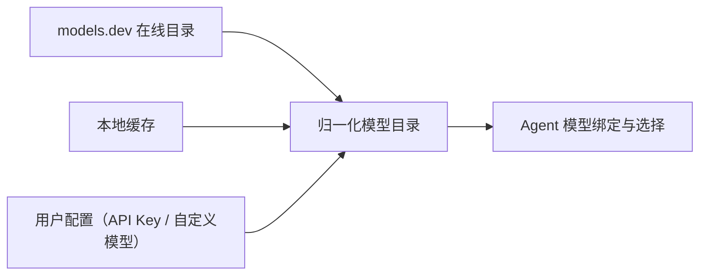

| 数据层 | 提供内容 | 生命周期 |
| --- | --- | --- |
| Preset catalog | 主流 provider/model 元数据、能力和默认 endpoint | 从 models.dev 同步并缓存 |
| User config | API Key、启用状态、自定义 provider/model | 用户在设置中维护 |
| 归一化目录 | 产品可展示、可校验、可绑定的模型集合 | Runtime 启动与刷新时合并 |

### 3.12 双层事件模型与可回放协作链路

AgentHub 将一次 Agent 执行视为可沉淀、可追踪、可回放的事件链路。Runtime 输出的 SSE 事件先以 raw payload 永久保存为事实来源，再由 HubServer 投影为消息、计划、工具、权限、任务、产物、Diff 和部署状态。

这种双层模型解决了两个产品问题：第一，实时聊天与刷新恢复必须一致；第二，未来新增事件类型时，不能因为结构化表暂时不认识就丢失原始事实。Raw 保留保证“不丢事实”，结构化投影保证“产品可用”。

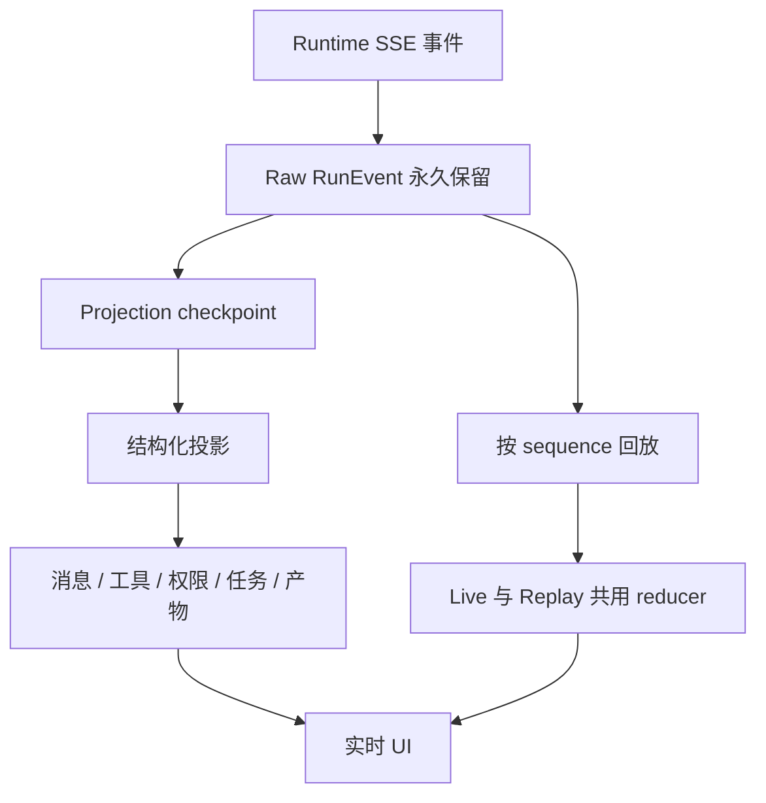

| 设计机制 | 价值 |
| --- | --- |
| Raw event 保存 | 未识别的新事件也不会丢失 |
| Sequence 顺序 | 会话恢复时能按执行顺序重建时间线 |
| Projection checkpoint | 允许结构化投影短暂落后，但可追赶 |
| Delta 合并 | 高频文本和推理增量减少写入压力 |
| Live / Replay 共用逻辑 | 用户刷新页面后看到的内容与实时流一致 |

### 3.13 对话式智能体创建（Instruct Agent）

AgentHub 不只提供表单式创建 Agent，还提供对话式智能体创建流程。Instruct Agent 通过聊天向用户收集名称、职责、系统提示词、能力标签和必要约束，并在信息足够时生成完整用户自定义 Agent。用户不需要先理解全部配置项，也可以从“我想要一个什么样的助手”开始。

该流程与普通 Orchestrator 调度隔离，不参与群聊任务委派，也不继承普通工作区执行权限。首版保持安全优先：通过受控问答收集信息，通过保存动作创建 AgentDefinition，并对高风险能力保持收敛。

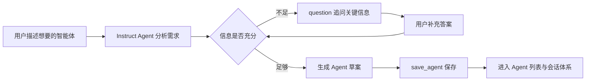

| 设计点 | 产品价值 |
| --- | --- |
| 对话式收集 | 降低新建 Agent 的配置门槛 |
| 独立执行路径 | 避免创建流程被普通任务编排干扰 |
| `question` 交互 | 信息不足时自然追问，而不是表单报错 |
| 安全收敛 | 首版不开放 Shell、网络、部署等高风险能力 |

### 3.14 生产级分发与 Bun Runtime 打包策略

AgentHub 的交付形态不是只面向开发环境的 Demo，而是围绕生产分发展开设计。用户只需要启动一个入口，就能同时获得 Web、HubServer 和 Agent Runtime；CLI 与 Desktop 共享同一套核心资源和生产行为，HubServer 统一托管 Web，并自动管理 Runtime Sidecar。

打包策略上，AgentHub 选择“服务 bundle + 内置 Bun runtime + 真实依赖目录”的组合，而不是追求单文件可执行。这是一个偏产品可靠性的选择：保留 native/dynamic 依赖所需的真实文件结构，降低发行包在不同平台上的运行风险。

| 分发设计 | 产品意义 |
| --- | --- |
| 单入口启动 | 用户不需要分别启动 Web、服务和 Runtime |
| CLI/Desktop 共享核心 | 两种入口行为一致，减少交付差异 |
| HubServer 托管 Web | 浏览器和桌面 WebView 都只面对同一后端入口 |
| Runtime Sidecar | AI 执行能力由 HubServer 自动拉起和管理 |
| Bundle + 真实依赖目录 | 兼顾启动便利与 native/dynamic 依赖可靠性 |
| 生产迁移链路 | 首次启动和版本升级时保持数据结构一致 |

### 3.15 高质感交互反馈与细腻动效体验

AgentHub 的动效设计不追求装饰性堆叠，而是服务于“多 Agent 协作过程可感知”。在智能体详情切换、加载骨架、空状态、头像交互、权限卡、工具执行、部署状态和右侧工作台切换中，动效承担的是状态过渡、注意力引导和执行反馈。

多 Agent 产品天然存在大量异步状态：Agent 是否可用、任务是否执行中、工具是否等待审批、部署是否连接、Diff 是否可查看、外部服务是否就绪。细腻动效可以降低用户对等待和切换的焦虑，让系统显得更连续、更有响应，也更接近真实协作空间。

| 场景 | 动效 / 状态反馈承担的作用 |
| --- | --- |
| 智能体详情切换 | 让用户感知正在查看的协作成员发生变化 |
| 空状态与引导 | 用轻量动态视觉表达“选择一个 Agent 开始” |
| 加载骨架 | 在数据加载前保持界面结构稳定 |
| 聊天流与工具状态 | 将执行中、等待审批、完成、失败区分开 |
| 部署与服务状态 | 用持续进度而非静态文本表达远程操作 |
| 工作台切换 | 让消息、Artifact、Diff、预览之间的跳转更自然 |

因此，AgentHub 的高质感不是单点视觉效果，而是让多 Agent 协作中的每一次状态变化都有合理的反馈。

## 4. 产品结构与主要页面

AgentHub 的产品结构围绕“IM 会话 + 多 Agent + 产物工作台”展开。页面并不是简单按功能菜单堆叠，而是通过模块化应用壳、聊天三栏工作台、右侧产物标签页、智能体管理和插件配置页，把会话、执行状态、权限审批、代码审查、部署预览和能力配置组织为连续体验。

| 结构层级 | 承载内容 | 设计目标 |
| --- | --- | --- |
| 应用壳 | 一级模块、服务状态、桌面标题栏 | 保持导航稳定，支持浏览器与桌面双形态 |
| 聊天工作台 | 会话列表、聊天区、产物工作台 | 在同一界面完成对话、协作和产物审查 |
| 消息 Timeline | 消息、工具、权限、任务、计划、部署事件 | 将复杂执行过程投影为用户可理解的聊天流 |
| 产物工作台 | 会话状态、Diff、部署、文件、终端、网页预览 | 让产物成为可查看、可恢复、可继续操作的对象 |
| 管理页面 | 智能体管理、插件配置、外部 SDK 设置 | 管理协作成员与可用能力边界 |

### 4.1 模块化应用壳与 Activity 状态保活

AgentHub 的应用壳采用模块化组织方式。聊天、智能体、插件配置等一级模块通过集中注册表接入，应用壳只关心模块身份、图标、标题和导航，不把各模块的内部逻辑复制到外层。这种设计让新增一级模块时保持入口一致，也避免导航层不断积累业务特例。

模块切换时，已访问模块通过 Activity 生命周期保持 UI 状态。用户从聊天切到智能体管理，再返回聊天时，输入草稿、选中会话、列表筛选、打开的产物标签页和面板布局仍然保留。Activity 在这里服务的是“工作现场延续”，而不是后台常驻执行；真正的 Run 事件消费和恢复仍由会话级运行链路处理。

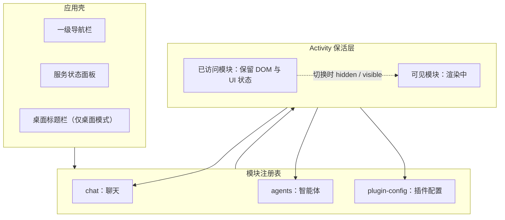

| 一级模块 | 主要职责 |
| --- | --- |
| 聊天 | 会话列表、消息流、Composer、产物工作台 |
| 智能体 | Agent 列表、详情、配置、模型绑定、外部 SDK 设置 |
| 插件配置 | Skill / MCP 能力发现、工作区分组、信任管理 |

### 4.2 聊天工作台三栏布局

聊天模块采用“会话列表 + 聊天区 + 产物工作台”的三栏布局。左栏负责会话导航与运行状态感知，中栏承载 IM 对话、消息流和输入，右栏承载代码审查、部署预览、文件浏览、终端、网页预览等产物操作。

这一布局的核心价值，是避免“聊天在一处、结果在另一处”的断裂。用户可以在同一个视野中提出需求、观察 Agent 执行、审批风险操作、打开 Diff、查看部署进度，并继续追问或迭代。

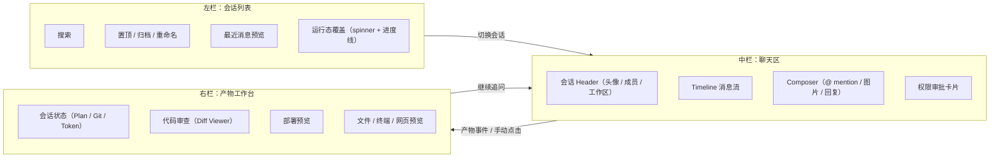

| 区域 | 设计重点 |
| --- | --- |
| 会话列表 | 快速切换任务，展示最近消息和已打开会话的运行态 |
| 聊天区 | 保留 IM 主体验，承载消息、引用、流式输出和审批卡片 |
| 产物工作台 | 以标签页承载不同产物，支持折叠、聚焦和状态保活 |

### 4.3 会话列表与运行态覆盖层

会话列表不是静态目录，而是多任务工作台的入口。它支持搜索、置顶、归档、重命名和最近消息预览，并通过本地运行态覆盖层显示当前已打开会话的执行状态。这样用户不用进入每个会话，也能看到哪些任务正在运行、等待审批或持续输出。

运行态覆盖层只对已经打开过的会话生效，避免用列表轮询模拟全局后台监控。列表仍以 HubServer 返回的会话事实为基础，本地覆盖只补充“当前浏览器已经感知到的运行状态”和最新 timeline 预览。

| 设计点 | 产品价值 |
| --- | --- |
| 置顶与归档 | 支持任务优先级和会话收纳 |
| 最近消息预览 | 快速识别会话进展 |
| 已打开会话运行态 | 用 spinner 与进度线提示仍在执行 |
| 本地预览覆盖 | 让 live timeline 更快反映到列表 |
| Hover 操作区 | 避免时间、置顶、编辑和归档按钮互相挤压 |

### 4.4 新建会话：Agent 选择与 Workspace 绑定

新建会话对话框把“选择协作成员”和“绑定工作区”合并在同一流程中。用户可以从已有会话和智能体列表中搜索、选择 Agent，并在创建前决定是否绑定本地 workspace。系统根据选中 Agent 数量推导单聊或群聊；当选择多个非 Orchestrator 智能体时，Orchestrator 会作为群聊编排入口自动加入。

Workspace 绑定是本地执行边界的重要提醒。没有绑定工作区时，Agent 仍可进行纯对话，但无法访问本地项目文件；因此创建流程会展示醒目提示，并在用户坚持无工作区创建时二次确认。

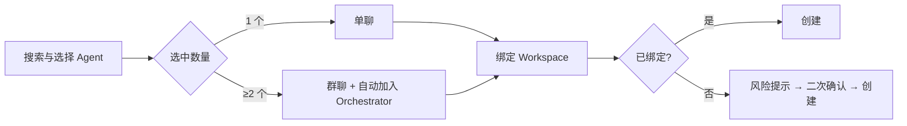

| 创建要素 | 设计逻辑 |
| --- | --- |
| Agent 选择 | 用户选择协作对象，而不是选择底层执行器 |
| Orchestrator 自动加入 | 群聊默认具备任务拆分和路由能力 |
| Workspace 绑定 | 明确本轮任务是否可以访问项目文件 |
| 无工作区确认 | 防止用户误以为 Agent 能读取本地项目 |

### 4.5 聊天消息区：Timeline 投影与消息分支模型

聊天消息区是 AgentHub 最核心的产品结构。它不是把数据库中的 Message 简单按时间排列，而是把 Runtime 执行事件投影为用户可阅读、可恢复、可继续操作的 Timeline。一次 Agent Run 中可能包含文本增量、推理块、工具调用、权限审批、任务委派、计划更新、Diff、部署事件和终态结果；这些事件需要按产品语义聚合，而不是逐条散落在聊天流中。

Timeline 的首要原则是：实时流式渲染和历史恢复必须一致。用户正在观看 live SSE 时看到的消息结构，刷新页面后应通过 replay 得到同样的结构。因此，Web 会先按 run 顺序插入触发用户消息，再按事件 sequence 重放产品 event envelopes，并与持久化消息记录合并兜底；live SSE 和历史 replay 共用同一套投影逻辑。

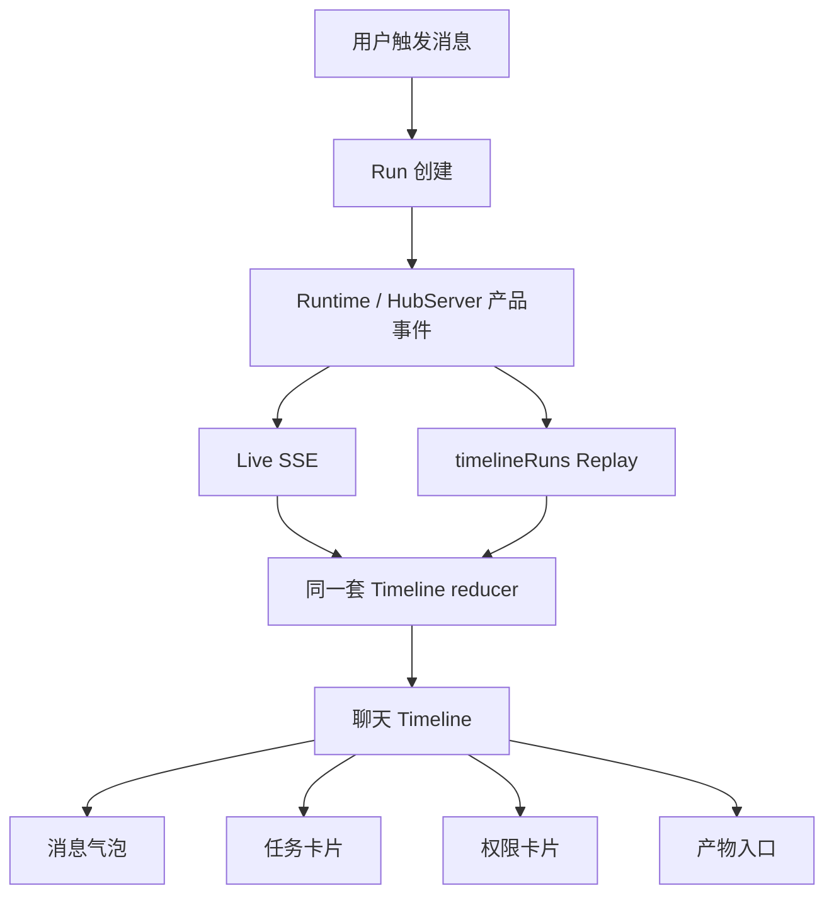

#### Timeline 聚合规则

同一条 assistant 回复往往不只有正文，还包括推理、工具、权限和生成元数据。AgentHub 使用 `messageId` 作为聚合主线：同一 `messageId` 下的 reasoning、tool、permission 和 message 事件进入同一个聊天气泡；缺少 `messageId` 的旧事件才回退到 run 内当前 speaker 聚合。这样用户看到的是“一条 Agent 回复的执行过程”，而不是一串难以理解的系统事件。

| 事件类型 | Timeline 表达 | 设计原因 |
| --- | --- | --- |
| `message.*` | 用户或 Agent 消息气泡 | 保持 IM 主体验 |
| `reasoning.*` | 消息内部推理块 | 让思考过程归属到对应回复 |
| 普通 `tool.*` | 消息或任务内部工具卡片 | 避免工具调用脱离语境 |
| `permission.*` | 消息或任务内部审批卡片 | 用户在具体上下文中做决定 |
| `task.*` | 任务卡片 | Orchestrator 委派结果独立呈现 |
| 子智能体输出 | 关联任务内部 transcript | 不创建独立聊天气泡，避免刷屏 |
| `run_task` 工具事件 | 保留原始事实，但不渲染普通工具卡 | 避免与任务卡片重复 |
| `write_plan` / plan event | 投影为 Plan，进入会话状态页 | 计划属于协作状态，不挤占聊天流 |
| `deployment.*` | 部署预览状态 | 部署过程由专门预览页恢复 |

#### 流式输出与完成态渲染

流式阶段优先保证轻量和稳定。assistant 消息在 streaming 状态下，即使已经有正文，也保留“正在生成”的稳定提示；正文先以轻量文本方式渲染，避免每个 delta 都触发完整 Markdown 解析。消息完成、历史恢复或非 streaming 消息再进入标准 Markdown 渲染。模型名、token 用量、耗时和结束原因等生成元数据进入消息 action 行，帮助用户理解不同 Agent 或外部平台的输出来源。

| 状态 | 展示策略 |
| --- | --- |
| streaming | 轻量文本渲染 + 稳定生成提示 |
| completed | 标准 Markdown 渲染 + action 行元信息 |
| tool / permission 嵌套 | 折叠在对应消息或任务内部 |
| replay 恢复 | 使用事件时间和持久化元数据恢复，而非重新计时 |

#### 回复与重新生成分支

消息回复和重新生成采用分支模型，而不是覆盖原消息。回复提交时只传递被回复消息 id，持久化后从元数据恢复引用摘要；引用快照不随父消息后续变化而漂移。重新生成时，系统复制源 Run 的用户触发事实创建新 Run，新 assistant 候选通过 `regeneratedFromId` 指向源回复；旧回复不删除，新候选折叠到源回复的分支分页中，默认展示最新候选。

| 能力 | Timeline 设计 |
| --- | --- |
| 回复 | 在气泡顶部显示紧凑引用摘要，刷新后仍可恢复 |
| 重新生成 | 新候选进入源 assistant 回复分支，不删除旧回复 |
| 用户触发消息折叠 | 原始用户消息仍在窗口内时显示“已请求重新生成 N 次” |
| 分支候选 | 保留历史回答，支持用户理解不同生成结果 |

### 4.6 Composer：结构化 @ 提及与图片消息

Composer 负责把用户意图转化为可路由、可持久化的会话输入。`@` 提及不是单纯文本匹配，而是结构化选择；当前阶段只允许从候选中选择一个目标 Agent，纯手打 `@Agent` 不改变路由。这样可以避免因为文本误识别导致任务发给错误 Agent。

图片消息也通过 HubServer 资产 API 进入会话。图片先上传并获得持久化 assetId，消息发送时只携带 assetId，不携带浏览器临时 URL、data URL 或本地路径。图片-only 消息合法，适合截图排障、界面反馈和视觉说明类任务。

| Composer 能力 | 设计边界 |
| --- | --- |
| 结构化 @ 提及 | 群聊候选排除 Orchestrator，目标明确进入发送请求 |
| 图片上传 | 先上传资产，再发送消息，失败则不创建聊天消息 |
| 图片类型与数量 | 支持常见图片类型，控制单条数量和单图大小 |
| 回复状态 | Composer header 展示引用摘要，可取消 |
| MCP / SSH 状态 | 输入区附近展示当前会话的能力和连接状态 |

### 4.7 权限审批卡片：高风险操作的安全上下文

权限审批卡片的目标不是“问用户是否允许一个工具”，而是让用户知道将要发生什么、发生在哪里、为什么需要执行。不同风险类型展示不同安全上下文：远程部署命令展示服务器、用户、命令、目录和原因；本机命令展示命令、工作目录、shell 和匹配规则；网络请求展示方法、脱敏 URL 和 host；工作区审批展示逻辑路径、访问模式、目标类型和原因。

| 审批类型 | 用户需要看到的关键信息 |
| --- | --- |
| 部署命令 | 服务器、用户、命令、cwd、执行原因 |
| Shell 命令 | 命令、cwd、shell、匹配规则 |
| 网络请求 | 方法、脱敏 URL、host |
| Workspace 访问 | 逻辑路径、访问模式、目标类型、原因 |
| 外部平台权限 | 外部 provider、权限类型、脱敏 metadata |

长命令、长 URL 和长路径必须在卡片内部换行或横向滚动，不能撑破聊天消息宽度。审批卡片本身也是聊天体验的一部分，应当既能被快速判断，也能承载足够风险信息。

### 4.8 右侧产物工作台：可折叠多标签协作空间

右侧产物工作台是 AgentHub 区别于普通 Chatbot 的关键页面结构。它将会话状态、代码审查、部署预览、文件浏览、终端和网页预览统一到标签页系统中，使 Agent 输出从“文本结果”升级为“可查看、可交互、可恢复的产物对象”。

产物工作台支持折叠和展开。部分标签是单例，例如会话状态、代码审查、部署预览和文件浏览；部分标签是多实例，例如终端和网页预览。标签页内容可以保持 UI 状态，用户在不同产物间切换时，不会轻易丢失滚动位置、打开文件或预览上下文。

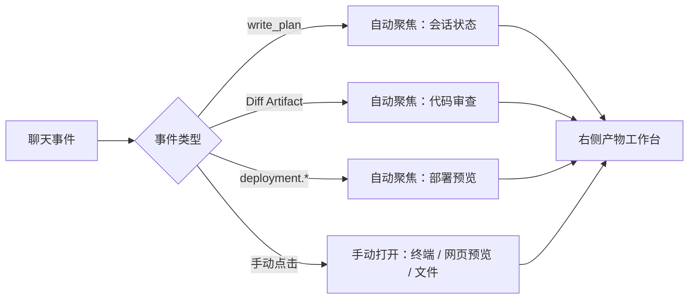

| 标签类型 | 示例 | 设计方式 |
| --- | --- | --- |
| 单例标签 | 会话状态、代码审查、部署预览、文件浏览 | 重复打开时更新内容和焦点 |
| 多实例标签 | 终端、网页预览 | 支持多个上下文并存 |
| 自动聚焦 | 新 Plan、新 Diff、live 部署事件 | 从聊天事件跳转到对应产物 |

### 4.9 产物工作台标签页设计

产物工作台的标签页将 Agent 输出从"文本结果"升级为"可查看、可交互、可恢复的产物对象"。标签分为单例和多实例两类：单例标签重复打开时更新内容和焦点，多实例标签支持多个上下文并存。标签页内容保持 UI 状态，用户切换时不会丢失滚动位置或预览上下文。

| 标签页 | 类型 | 承载内容 | 关键设计点 |
| --- | --- | --- | --- |
| 会话状态 | 单例 | Plan 任务队列、Git 摘要、Token 统计 | Orchestrator 计划不挤占聊天流；无对应事实时显示空状态 |
| 代码审查 | 单例 | Diff Viewer、ChangeSet 归因、Run 级撤销 | 只读查看；dirty baseline 明确提示并禁用撤销；撤销先预览再确认 |
| 部署预览 | 单例 | SSH 连接状态、远程命令日志、部署进度、健康检查 | live 事件自动聚焦；历史 replay 标记 stale，不自动打开外部链接 |
| 文件浏览 | 单例 | 绑定 workspace 文件树 | 以 workspace 为边界，服务于审查和预览 |
| 终端 | 多实例 | PTY 会话 | 不与 Agent Runtime 权限混淆 |
| 网页预览 | 多实例 | iframe 页面 | 链接新开标签，标题优先使用页面标题 |

### 4.10 智能体管理页：配置、模型绑定与外部 SDK 设置

智能体管理页把 Agent 作为长期协作成员管理。用户可以查看系统预设、外部 Agent 和用户自定义 Agent，理解其职责、能力标签、执行方式、入口策略、委派策略和权限范围。用户自定义 Agent 支持配置名称、描述、系统提示词、能力标签、工具、子智能体、Skill 引用和文件权限。

外部 Agent 的设置不等同于管理外部平台全局配置。页面只提供 AgentHub 发起运行时的轻量覆盖，例如 OpenCode 执行模式和模型目录、Claude Code 的 allowlisted 权限模式与可选模型、Codex 的可选模型。浏览器只通过 HubServer 代理访问这些能力，不直接触碰 Runtime 或 workspace root。

| 管理对象 | 页面表达 |
| --- | --- |
| 系统预设 Agent | 只读展示职责、能力和权限边界 |
| 用户自定义 Agent | 可编辑身份、提示词、工具、Skill 和文件权限 |
| 外部 Agent | 展示 Adapter 边界和轻量 SDK 运行覆盖 |
| 模型绑定 | 内部主智能体可绑定模型，外部 Agent 保持自身平台语义 |

### 4.11 插件配置页：Skill / MCP 发现、信任与工作区能力

插件配置页聚焦 Skill / MCP 能力，而不是传统插件市场。它展示 Runtime Capability Discovery 返回的全局和工作区能力摘要，按 workspace 分组呈现 Skill 与 MCP，并提供工作区 Skill / MCP 的信任、撤销和恢复入口。

页面不自行解析 rootPath，不直接读取配置文件，也不连接 MCP server。浏览器只提交 conversationId、能力 ref 和信任决策，HubServer 负责解析会话工作区并代理 Runtime。这样，插件配置页既能让用户理解当前项目可用能力，又不会越过工作区和 Runtime 边界。

| 能力范围 | 页面行为 |
| --- | --- |
| 全局能力 | 展示只读发现结果和来源信息 |
| 工作区能力 | 按 workspace 分组展示，可显式撤销或恢复信任 |
| Skill | 展示上下文能力 metadata，不展示正文 |
| MCP | 展示 server 摘要、来源、状态与信任语义 |

### 4.12 全局事件流、服务状态与状态分层

AgentHub 同时存在两类实时信息：Run 内的高频执行事件，以及全局低频产品状态事件。Run SSE 服务于当前会话 Timeline；全局事件流服务于会话标题、最近消息、Run 状态和服务状态刷新。二者职责分离，避免把所有状态都塞进聊天事件流。

前端状态也采用分层设计：服务端事实由查询层管理，例如会话列表、会话详情、消息 replay、智能体列表和 Artifact detail；客户端运行态由本地状态承载，例如当前会话、草稿、Timeline items、Run 状态、SSE 连接状态、产物工作台标签和折叠状态。这样可以减少不必要重渲染，让 streaming delta、输入草稿和工作台状态互不拖累。

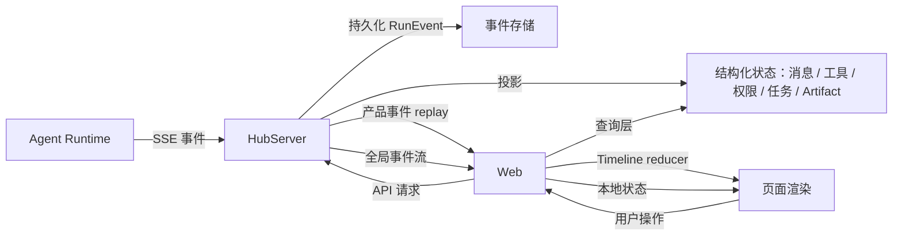

| 状态类型 | 用途 |
| --- | --- |
| 服务端事实 | 可持久化、可刷新、可跨端恢复 |
| 本地运行态 | 当前浏览器工作现场和 UI overlay |
| Run SSE | 当前会话执行过程和 Timeline 投影 |
| 全局事件流 | 低频通知、服务状态、列表刷新 |
| 服务状态面板 | 展示 Agent Runtime、外部 Agent、Capability Discovery、MCP Runtime 等状态 |

### 4.13 桌面运行时适配

AgentHub 的 Web 应用可以运行在浏览器，也可以运行在 Electrobun 桌面壳中。桌面模式检测运行时注入的窗口信息后渲染自定义标题栏，提供品牌展示和窗口控制；浏览器模式不显示桌面标题栏，保持纯 Web 布局。

桌面适配的边界同样保守：前端仍只访问 HubServer 业务 API，不通过桌面桥接暴露文件、Shell、网络、Runtime 或 LLM 能力。Desktop 主进程负责启动 HubServer，WebView 打开 HubServer 托管的本地 URL，因此 Web 继续使用相对 API 路径。Windows 场景下，桌面壳负责 DPI awareness，避免高缩放屏幕上内容模糊。

| 适配点 | 设计边界 |
| --- | --- |
| DesktopTitleBar | 桌面模式显示品牌和窗口控制，浏览器不显示 |
| 拖拽区域 | 标记可拖拽与不可拖拽交互区域 |
| 最小 RPC | 仅窗口控制和受限通知能力 |
| WebView 加载 | 加载 HubServer 托管的本地 Web |
| 安全边界 | 不通过桌面桥接访问文件、Shell、Runtime 或模型能力 |

## 5. 核心功能设计

### 5.1 会话与消息管理

会话是 AgentHub 协作的基本容器。每个会话包含标题、模式（单聊/群聊）、参与者列表和工作区绑定。消息是会话内的原子通信单元，区分用户发言、Agent 回复和系统消息。

会话管理支持创建、重命名、置顶、归档和搜索。置顶会话始终排在列表最前；未置顶会话按最近消息时间倒序。列表卡片显示最近一条文本消息的预览，已打开会话实时显示运行状态。用户手动重命名后，自动标题不再覆盖该会话。

消息遵循"事实保留 + 结构化投影"的双层模型：Agent 执行过程中产生的所有事件先以原始形式永久保存，再投影为用户可阅读的消息、工具、权限、任务等结构化记录。投影允许短暂落后于原始事件，但读取历史前必须补齐，保证刷新后看到的内容与实时流一致。

| 功能 | 设计规则 |
| --- | --- |
| 会话创建 | 需选择至少一个 Agent；群聊自动加入 Orchestrator；可选绑定工作区 |
| 会话重命名 | 用户手动命名优先于系统自动标题 |
| 消息置顶 | 每条置顶消息可附加备注，用于长期上下文输入 |
| 会话归档 | 归档后从活跃列表移除，不删除数据 |
| 自动标题 | 首次对话时系统自动生成短标题；标题未赶上时使用用户首条消息的摘要兜底 |

### 5.2 单 Agent 对话

单聊用于用户与一个明确 Agent 直接对话。创建单聊时，用户从可见 Agent 列表中选择一个作为协作对象；Orchestrator 不出现在单聊候选中，它只在群聊场景下发挥作用。

模型选择遵循优先级：Agent 有独立绑定时使用绑定模型；系统预设 Agent 缺少绑定时使用系统默认模型；用户自定义 Agent 必须显式绑定模型，否则无法使用。当绑定模型不可用且尚未产生用户可见输出时，系统可自动降级到默认模型重试一次。

流式输出阶段，Agent 回复以轻量方式渲染，底部保留"正在生成"的状态提示；回复完成后切换为完整渲染。每条回复附带生成元数据——模型名称、token 用量和耗时——帮助用户理解不同 Agent 的输出来源和成本。

| 设计点 | 规则 |
| --- | --- |
| 入口 | 单聊参与者恰好一个，不能是 Orchestrator |
| 模型选择 | 系统预设 Agent 可绑定覆盖；用户自定义 Agent 必须显式绑定 |
| 降级策略 | 绑定模型失败且无可见输出时，可降级到系统默认模型一次 |
| 子智能体模型 | 隐藏子智能体继承调用方的模型，不继承工具、权限或身份 |
| 流式渲染 | 生成中轻量渲染 + 状态提示；完成后完整渲染 + 元信息 |

### 5.3 多 Agent 群聊

群聊用于多个 Agent 协作完成复杂任务。创建群聊时，用户选择多个 Agent，系统自动加入 Orchestrator 作为编排入口；用户不需要手动选择 Orchestrator。

群聊运行时，入口解析遵循以下规则：用户没有显式 `@` 任何 Agent 时，由 Orchestrator 接管并理解意图；用户显式 `@` 一个 Agent 时，该 Agent 直接回复，不经过 Orchestrator 转述。`@` 采用结构化选择而非文本匹配，避免误识别导致任务发给错误 Agent。

被 `@` 的 Agent 回复以普通聊天发言进入消息流。隐藏子智能体不作为聊天参与者暴露，它们的输出归入任务卡片，避免刷屏。

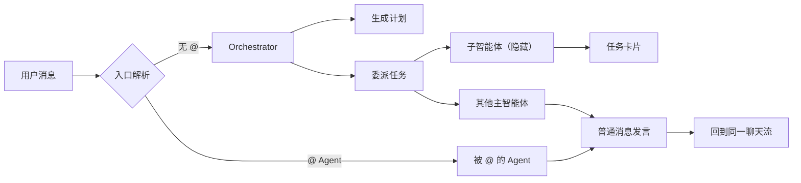

| 群聊规则 | 设计逻辑 |
| --- | --- |
| Orchestrator 自动加入 | 群聊默认具备任务拆分和路由能力 |
| `@` 结构化选择 | 避免文本误识别，确保意图明确 |
| 子智能体不进入聊天 | 避免内部能力单元刷屏，输出归入任务卡片 |
| 外部 Agent 可参与 | 外部平台 Agent 作为可见成员加入群聊 |

### 5.4 Orchestrator 计划与任务委派

Orchestrator 是群聊的默认入口和核心调度器。它不是隐藏在后台的流程引擎，而是一个参与会话的特殊 Agent，拥有"写计划"和"派任务"两个专属能力。

"写计划"将当前执行计划写为结构化对象，包含意图、任务列表、依赖关系和风险等级。同一轮对话中可以多次更新计划，最新计划在右侧"会话状态"标签页以任务队列方式展示，不直接挤在聊天流中。

"派任务"表示一次委派：一个目标 Agent + 一个明确任务。目标可以是群聊中的其他 Agent，也可以是 Orchestrator 专属的隐藏子智能体。任务之间可表达依赖关系，无依赖的任务可并行执行。当多个并行任务可能写入同一文件时，可通过声明式文件锁降低冲突概率。

Orchestrator 与 Planner 的边界清晰：Orchestrator 负责运行时路由、任务拆分和结果衔接；Planner 负责生成人类可读方案和风险建议，不参与运行时委派。

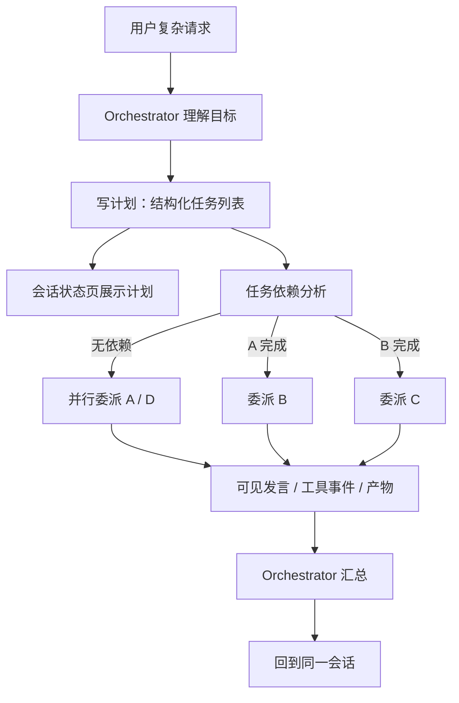

| 角色 | 职责边界 |
| --- | --- |
| Orchestrator | 运行时路由、任务拆分、委派执行、结果衔接 |
| Planner | 生成可读方案、风险分析、验收建议，不参与调度 |
| 被委派 Agent | 完成单个任务，输出作为可见消息或产物回到会话 |

| 设计约束 | 规则 |
| --- | --- |
| 计划来源 | 结构化工具输出，不是自然语言解析 |
| 任务粒度 | 一次委派 = 一个 Agent + 一个任务 |
| 并发控制 | 支持并行执行；文件锁防止写入冲突 |
| 委派深度 | 默认最大 2 层，防止无限嵌套 |
| 结果汇总 | Orchestrator 可引用结果，但不复述已可见的完整回复 |

### 5.5 消息回复、引用与重新生成

消息回复和重新生成采用分支模型，而不是覆盖原消息。

**回复**：用户可以回复会话中的任意可见消息。回复在气泡顶部显示紧凑引用摘要，包含被回复消息的发送者、时间和内容片段。引用快照创建后不随原消息后续变化而漂移，即使原消息不在当前可见窗口内，引用仍可从持久化数据恢复。回复引用进入 Agent 上下文时，Agent 能理解"用户在回应哪条消息"。

**重新生成**：用户可以对已完成的 Agent 回复触发重新生成。系统基于原始用户请求创建新一轮执行，新回复折叠到原回复的分支分页中，默认展示最新候选；旧回复不删除，保留历史回答供用户对比。原始用户消息仍在窗口内时，折叠显示"已请求重新生成 N 次"。

| 能力 | 设计规则 |
| --- | --- |
| 回复引用 | 气泡顶部显示紧凑摘要，刷新后仍可恢复 |
| 重新生成 | 新候选进入原回复分支，不删除旧回复 |
| 用户消息折叠 | 原始消息在窗口内时显示重新生成次数 |
| 分支候选 | 保留历史回答，支持用户理解不同生成结果 |

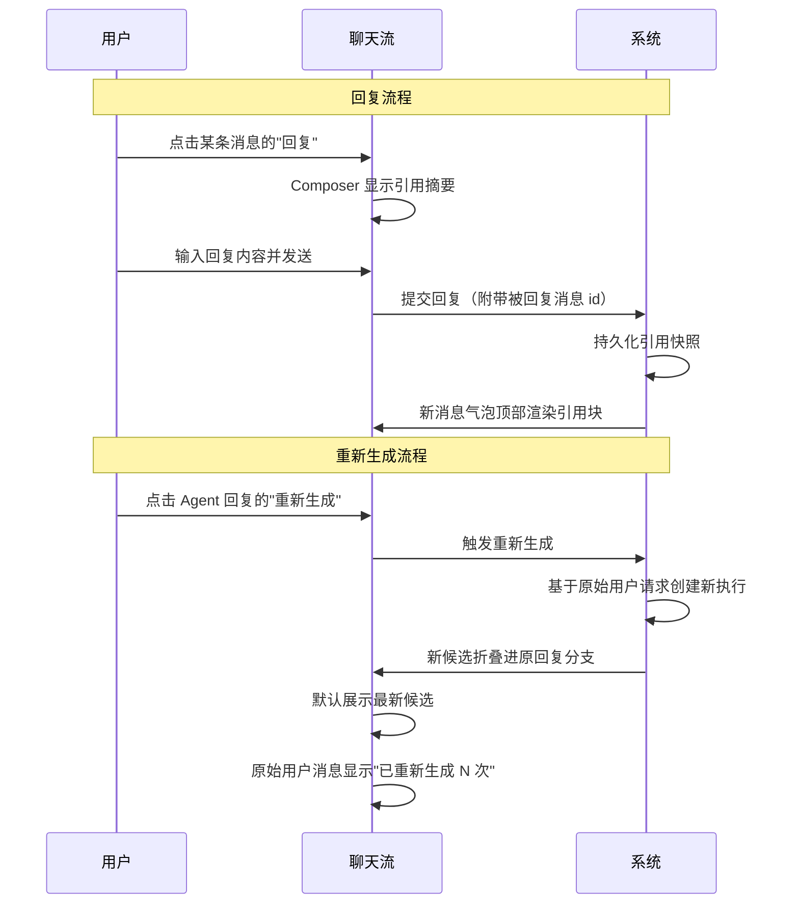

### 5.6 图片与多模态消息

图片通过资产上传流程进入会话。用户在输入区选择图片后，系统先上传并获得持久化标识，再将标识引用附带在消息中发送。上传失败的图片不会进入聊天消息。

图片支持常见格式（PNG、JPEG、WebP、GIF），单条消息最多 8 张，单图最大 10 MB。纯图片消息（无文字正文）合法，适合截图排障、界面反馈和视觉说明类任务。图片按用户提交顺序保存，进入 Agent 上下文时保持原始排列。

| 约束 | 规则 |
| --- | --- |
| 图片格式 | 支持 PNG、JPEG、WebP、GIF；拒绝 SVG |
| 数量限制 | 单条消息最多 8 张 |
| 大小限制 | 单图最大 10 MB |
| 上传失败 | 任一图片上传失败则不创建消息 |
| 模型可见 | 图片以结构化方式进入 Agent 上下文 |

### 5.7 产物卡片与工作台联动

Agent 输出不只是文本，还包括代码、Diff、文件、网页预览和部署状态等结构化产物。这些产物在聊天流中以卡片形式出现，点击后在右侧产物工作台中展开为完整视图。

产物卡片与工作台标签页之间存在自动聚焦关系：新的计划到达时自动展开"会话状态"标签；Diff 卡片点击后打开"代码审查"标签；部署事件到达时自动展开"部署预览"标签。历史恢复不触发自动聚焦，避免刷新后产生意外操作。

工具调用在聊天流中以工具卡片展示，包含输入摘要和输出结果。任务委派以任务卡片展示，包含标题、状态和结果。外部 Agent 的原生工具复用通用工具 UI，但保留来源边界——即使外部工具名与内部工具同名，也不进入内部工具的专属渲染器。

| 产物类型 | 聊天流表达 | 工作台标签 |
| --- | --- | --- |
| 计划 | 不在聊天流渲染 | 会话状态 |
| Diff | 摘要卡片，整卡可点击 | 代码审查 |
| 部署事件 | 部署状态卡片 | 部署预览 |
| 工具调用 | 工具卡片 | — |
| 任务委派 | 任务卡片 | — |
| 外部工具 | 复用通用工具 UI | — |

```mermaid
sequenceDiagram
  participant A as Agent 执行
  participant C as 聊天流
  participant W as 产物工作台

  Note over A,C: 产物产生
  A->>C: 输出文本回复
  A->>C: 输出工具调用 → 工具卡片
  A->>C: 输出任务委派 → 任务卡片
  A->>C: 产出 Diff → Diff 摘要卡片
  A->>C: 触发部署 → 部署状态卡片

  Note over C,W: 自动聚焦（仅 live 事件）
  C->>W: 新 Plan 到达 → 自动展开"会话状态"
  C->>W: live 部署事件 → 自动展开"部署预览"

  Note over C,W: 手动交互
  U->>C: 点击 Diff 卡片
  C->>W: 打开"代码审查"标签
  W->>W: 展示 Diff Viewer / 归因 / 撤销
```

### 5.8 Diff 查看与工作区撤销

AgentHub 将文件变更归因设计为平台级能力。无论变更来自内部 Agent 还是外部平台，只要作用于绑定工作区，系统都在任务执行前后捕获工作区快照并计算变更摘要。

变更摘要包含：修改文件列表、增删行数、脏状态标记和补丁内容。每个变更文件可归因到具体来源——是哪个工具、哪个任务、哪个 Agent 产生的修改。当归因不唯一时（同一文件被多个工具修改），系统保守标记为"整次 Run 归因"。

代码审查页围绕 Diff 产物展开，提供只读查看器：文件列表、代码差异、行数统计和归因信息。

可靠的 Diff 支持完整 Run 级撤销。可靠性条件包括：补丁完整未截断、非二进制文件、执行前工作区干净。撤销流程为：先预览受影响文件和风险，用户确认后执行反向应用。撤销本身也产生记录，让审查链路仍可追溯。

| 阶段 | 设计重点 |
| --- | --- |
| 执行开始 | 记录工作区、分支、脏状态和文件指纹 |
| 执行结束 | 计算变更文件、行数统计和补丁内容 |
| 脏基线处理 | 尽量过滤本轮未变化的既有脏文件，明确标记可靠性限制 |
| 归因 | 工具 / 任务 / Agent / 整次 Run 四级归因 |
| 撤销 | 仅在可靠条件下开放；撤销记录不支持二次撤销 |

```mermaid
sequenceDiagram
  participant A as Agent 执行
  participant S as 系统
  participant C as 代码审查页
  participant U as 用户

  Note over A,S: 执行前
  A->>S: Run 开始
  S->>S: 捕获工作区快照（分支/脏状态/文件指纹）

  Note over A,S: 执行中
  A->>S: 文件读写操作

  Note over A,S: 执行结束
  S->>S: 计算变更摘要（文件/行数/补丁）
  S->>S: 归因（工具/任务/Agent/整次 Run）
  S->>C: 生成 Diff Artifact

  Note over C,U: 审查与撤销
  U->>C: 打开 Diff 卡片
  C->>C: 展示文件列表 / 差异 / 归因
  U->>C: 点击"撤销本次变更"
  C->>S: 预览受影响文件和风险
  S-->>U: 展示预览结果
  U->>S: 确认撤销
  S->>S: 反向应用补丁
  S->>C: 生成撤销记录 Artifact
```

### 5.9 权限审批与用户问答

AgentHub 把高风险操作设计成一等产品交互。权限控制由三个维度共同决定：Agent 能否看到某个工具、Agent 能力上限是否覆盖、当前操作是否需要用户批准。

需要审批时，系统暂停当前执行分支，在聊天流中展示权限卡片。不同审批类型展示不同安全上下文：部署命令展示服务器、用户、命令和原因；本机命令展示命令、工作目录和匹配规则；网络请求展示方法和目标地址。用户批准后，系统在同一执行分支上恢复，不重新发起丢失上下文的新任务。

用户问答与权限审批共享"暂停后恢复"的节奏，但语义不同。当 Agent 需要向用户补充信息时，系统暂停执行并展示问题卡片；用户回答后，同一分支继续完成任务。

外部平台的权限请求统一桥接到 AgentHub 的审批体验中，用户在同一聊天界面中处理所有高风险操作。

| 审批类型 | 用户看到的关键信息 | 审批后行为 |
| --- | --- | --- |
| 部署命令 | 服务器、用户、命令、目录、原因 | 恢复远程命令执行 |
| 本机命令 | 命令、工作目录、匹配规则 | 恢复命令执行 |
| 网络请求 | 方法、目标地址 | 恢复网络请求 |
| 工作区访问 | 路径、访问模式、原因 | 恢复文件操作 |
| 用户问答 | Agent 提出的问题和选项 | 继续任务执行 |

```mermaid
sequenceDiagram
  participant A as Agent
  participant S as 系统
  participant U as 用户

  Note over A,U: 权限审批流程
  A->>S: 请求执行高风险操作
  S->>S: 判断是否需要审批
  S->>U: 展示权限卡片（安全上下文）
  S->>S: 暂停当前执行分支
  U->>S: 批准 / 拒绝 / 取消
  alt 批准
    S->>A: 恢复同一执行分支
    A->>A: 继续执行
  else 拒绝
    S->>A: 结构化失败回到 Agent 语境
  else 取消
    S->>S: 取消等待与相关分支
  end

  Note over A,U: 用户问答流程
  A->>S: 需要用户补充信息
  S->>U: 展示问题卡片
  S->>S: 暂停当前执行分支
  U->>S: 提交答案
  S->>A: 恢复同一执行分支
  A->>A: 基于答案继续完成任务
```

### 5.10 外部 Agent 接入

AgentHub 通过统一适配器体系接入外部 Agent 平台。外部 Agent 在产品中以可见 Agent 身份出现，用户可以像选择内部 Agent 一样选择它们参与任务。

核心设计原则是"聊天对象而非配置面板"——AgentHub 不在内部管理外部平台的模型、插件或私有配置，而是把外部平台整体视为可对话、可被委派、可产生消息和产物的协作对象。适配器的职责是屏蔽平台私有协议，让不同外部 Agent 进入同一套会话、事件、权限和产物投影链路。

Session 管理区分两种作用域：直接对话 Session 面向用户与 Agent 的直接交流，维护可见对话记忆；委派任务 Session 面向 Orchestrator 的任务委派，每个任务使用独立上下文，不污染直接对话。任务完成后生成交接摘要，后续直接对话可通过该摘要感知先前任务结果。

上下文桥接由系统自动组装，包含可见聊天历史、置顶消息、产物摘要和交接摘要，注入外部平台时只包含用户可见事实，不包含内部执行细节。

| 设计维度 | 统一规则 |
| --- | --- |
| 身份 | 外部平台统一表现为可见 Agent |
| Session | 区分直接对话与委派任务 |
| 上下文 | 可见历史、置顶消息、产物摘要自动注入 |
| 任务交接 | 委派完成后生成摘要，供后续对话使用 |
| 权限桥接 | 外部权限请求映射为统一审批体验 |
| 事件投影 | 外部输出统一转为稳定事件流 |
| 变更归因 | 文件变化交给平台级 Diff 统一计算 |

```mermaid
sequenceDiagram
  participant U as 用户
  participant H as AgentHub 会话
  participant A as 外部 Agent Adapter
  participant X as 外部平台

  Note over U,X: 直接对话
  U->>H: @ 外部 Agent 发送消息
  H->>A: 组装上下文（可见历史 + 置顶 + 摘要）
  A->>X: 格式化为 prompt 前缀 + 用户请求
  X-->>A: 流式输出（文本/工具/权限）
  A-->>H: 统一事件投影
  H-->>U: 聊天流展示回复

  Note over U,X: Orchestrator 委派
  H->>A: 委派任务（任务指令 + 窄上下文）
  A->>X: 创建独立任务 Session
  X-->>A: 执行结果
  A-->>H: 可见发言 + 任务卡片
  A->>A: 生成交接摘要
  Note over H: 后续直接对话可感知任务结果
```

### 5.11 用户自定义 Agent

用户自定义 Agent 通过表单式创建和对话式创建两种方式产生。

表单式创建支持配置名称、描述、系统提示词、能力标签、可用工具、可委派子智能体和文件权限。工具配置遵循安全收敛：用户可选择文件读写工具，但 Shell、网络和部署工具暂不开放。Orchestrator 的专属能力（计划和委派）不能授予用户自定义 Agent。

对话式创建通过 Instruct Agent 实现。用户用自然语言描述想要的 Agent，系统通过追问收集关键信息（名称、职责、提示词），信息足够时自动生成完整配置。该流程与普通任务调度隔离，不参与群聊协作。

```mermaid
flowchart LR
  U["用户描述想要的 Agent"] --> Q["Instruct Agent 分析需求"]
  Q --> J{"信息是否充分"}
  J -->|不足| Ask["追问关键信息"]
  Ask --> Ans["用户补充"]
  Ans --> J
  J -->|足够| D["生成 Agent 配置草案"]
  D --> S["保存为用户自定义 Agent"]
  S --> L["进入 Agent 列表与会话体系"]
```

| 配置项 | 用户可配置 | 约束 |
| --- | --- | --- |
| 名称 / 描述 | 是 | — |
| 系统提示词 | 是 | — |
| 能力标签 | 是 | — |
| 可用工具 | 是 | 文件工具可选；写工具需显式声明写权限 |
| 可委派子智能体 | 是 | 只能引用已注册的隐藏子智能体 |
| Skill 引用 | 是 | 全局 Skill 可点选；工作区 Skill 按信任状态决定 |
| Shell / 网络 / 部署 | 否 | 首版不开放 |
| 模型绑定 | 是 | 必须显式绑定，否则无法使用 |

### 5.12 Skill 与 MCP 能力管理

Skill 是上下文能力——让 Agent 获得特定工作方法、知识或规范；MCP 是工具能力——让 Agent 获得外部工具调用。系统可以只读发现来自多个来源的 Skill/MCP 配置，按来源优先级去重，同组只注入一个有效能力。

工作区能力的信任管理通过插件配置页进行。自动发现的工作区能力默认可用，用户可显式撤销；撤销后该能力不会进入 Agent 执行上下文。信任记录按工作区隔离，不暴露真实文件路径。

MCP 工具注入发生在 Agent 执行开始时：系统连接可用的工作区 MCP 服务、枚举工具，并注入当前 Agent 的可用工具集。注入的工具通过统一的工具体系执行和事件化，与内部工具享有相同的审计和追踪能力。

| 能力类型 | 运行边界 | 隐私约束 |
| --- | --- | --- |
| Skill | 作为受控上下文注入内部 Agent | 不暴露正文；按来源去重 |
| MCP | 连接、枚举并动态注入工具 | 凭据和配置不进入产品层 |
| 外部 Agent 原生 | 不接管外部平台的 Skill/MCP 配置 | — |

```mermaid
flowchart LR
  subgraph 来源发现
    A1[".agents 目录"]
    A2["Codex 配置"]
    A3["Claude Code 配置"]
    A4["OpenCode 配置"]
  end

  subgraph 信任与去重
    D["按来源优先级去重"]
    T["Workspace Trust 判断"]
  end

  subgraph 运行时注入
    SK["Skill → 受控上下文注入"]
    MC["MCP → 连接 / 枚举 / 动态工具注入"]
  end

  A1 --> D
  A2 --> D
  A3 --> D
  A4 --> D
  D --> T
  T -->|trusted| SK
  T -->|trusted| MC
  T -->|撤销| X["不注入"]
```

### 5.13 Deploy 智能体与远程部署

Deploy 是可见系统 Agent，用户可以在单聊或群聊中邀请它参与会话。Deploy 拥有专用部署工具集，其他 Agent 和用户自定义 Agent 无法使用部署工具。

部署工具涵盖完整发布生命周期：查看可用服务器、建立连接、执行远程命令、上传产物、更新部署进度、健康检查和关闭连接。

远程命令采用独立的审批语义。用户批准的是"在某台服务器、某个目录下执行这条命令"，审批卡片展示服务器、用户、命令、目录和执行原因。审批通过前不启动远程执行。

凭据安全是强约束：服务器密码、私钥、连接令牌等敏感材料只在系统内部短暂持有，不进入提示词、工具结果、事件流或前端状态。用户和 Agent 只看到脱敏后的服务器展示信息、连接状态和部署进度。

Deploy 的行为规范：先检查项目文件和文档理解部署策略；信息不足时主动追问；每个阶段主动更新进度和发布说明；部署完成后可执行 URL 健康检查。

| 部署阶段 | 传统体验 | AgentHub 体验 |
| --- | --- | --- |
| 部署准备 | 用户手动判断如何发布 | Deploy 分析项目结构与部署策略 |
| 信息缺失 | 命令失败后排查 | Deploy 主动追问缺失信息 |
| 远程执行 | 用户在终端直接操作 | 高风险命令进入结构化审批 |
| 状态同步 | 日志散落在终端 | 进度、发布说明和预览进入聊天流 |
| 交付确认 | 用户自己验证 | Deploy 执行健康检查并请求预览 |

```mermaid
sequenceDiagram
  participant U as 用户 / 群聊
  participant D as Deploy Agent
  participant S as SSH 运行时
  participant R as 远程服务器

  U->>D: 邀请 Deploy 参与会话
  D->>D: 分析项目文件与部署策略
  D->>U: 追问缺失信息（如有）
  U-->>D: 补充答案

  D->>S: 请求连接服务器
  S->>S: 解析凭据（内部持有，不外泄）
  S->>R: 建立 SSH 连接
  R-->>S: 连接成功
  S-->>D: 返回连接状态

  D->>U: 请求审批远程命令
  U->>D: 批准
  D->>S: 执行远程命令
  S->>R: 发送命令
  R-->>S: 返回输出
  S->>S: 截断与脱敏
  S-->>D: 脱敏后的结果
  D-->>U: 更新部署进度

  D->>R: URL 健康检查
  R-->>D: 状态码与耗时
  D-->>U: 部署完成 + 预览链接

  D->>S: 关闭连接
```

### 5.14 模型配置与 Provider 管理

AgentHub 的模型配置不是静态清单，而是以在线模型目录作为基线，叠加本地缓存和用户配置。目录提供供应商、模型能力、上下文长度、价格等元数据；用户配置负责 API Key、启用状态和自定义供应商。

模型选择器只展示已连接、已启用且支持工具调用的模型。系统默认模型是系统预设 Agent 缺少绑定时的兜底来源，也是绑定模型不可用时的一次性降级选项。

Agent 模型绑定独立于 Agent 创建流程管理。内部 Agent 可绑定模型；外部 Agent 使用各自平台的原生模型配置，AgentHub 只保存轻量运行覆盖（例如选择模型），不写入外部平台全局配置。

| 配置层级 | 提供内容 | 管理方式 |
| --- | --- | --- |
| 在线目录 | 主流供应商/模型元数据和能力 | 自动同步并缓存 |
| 用户配置 | API Key、启用状态、自定义供应商 | 用户在设置中维护 |
| Agent 绑定 | 内部 Agent 绑定的模型 | 独立管理，支持覆盖 |
| 外部覆盖 | AgentHub 发起运行时的轻量选择 | 不写入外部平台配置 |
| 系统默认 | 系统预设 Agent 的兜底模型 | 独立设置，保存时校验可用性 |

## 6. 总结

AgentHub 的产品设计围绕一个核心判断展开：**多 Agent 协作不应该是工具拼接，而应该是产品化的工作流。**

从项目背景看，AI 辅助开发正在从单轮问答进入持续协作阶段。用户需要同时完成需求理解、方案设计、代码实现、审查、预览和发布，单一工具或单一命令行难以承载完整链路。AgentHub 的回应是：把多种 Agent 能力组织到一个统一的 IM 界面中，让用户像管理团队一样管理协作对象。

从产品定位看，AgentHub 不是聊天机器人，不是 AI IDE，也不是 CLI 工具的图形化。它是一个以会话为中心、以 Agent 为参与者、以产物为结果、以权限为交互、以本地优先为边界的任务工作台。这五个设计原则贯穿了从会话创建到部署交付的每一个环节。

从创新点看，AgentHub 的差异来自一组一致的设计判断：

| 维度 | 核心主张 |
| --- | --- |
| 协作范式 | Agent 是聊天参与者，不是工具入口 |
| 能力接入 | 外部平台是协作对象，不是配置面板 |
| 执行边界 | 状态、执行、工作区和权限清晰分层 |
| 交付闭环 | Diff、部署、事件回放成为一等对象 |
| 体验质感 | 动效和状态反馈让协作过程可感知 |

从产品结构看，聊天工作台的三栏布局、产物工作台的标签页系统、模块化应用壳和 Activity 保活，共同支撑了"在同一视野中完成对话、协作和产物审查"的体验目标。

从核心功能看，会话管理、单聊/群聊、Orchestrator 编排、消息分支、产物联动、Diff 归因与撤销、权限审批、外部 Agent 接入、用户自定义 Agent、Skill/MCP 能力、Deploy 发布和模型配置，构成了从任务发起到交付闭环的完整功能链路。

AgentHub 的产品设计始终遵循一个原则：**把复杂留给系统，把简单留给用户。** 用户不需要理解 Sidecar 架构、事件投影模型、Session 作用域或权限续跑机制——他们只需要在会话中提出需求、选择协作成员、审查结果、批准或拒绝高风险操作。系统内部的复杂性被层层边界自然屏蔽，最终呈现为用户熟悉的聊天体验。
