# AgentHub 技术设计文档

## 1. 技术背景与设计目标

AgentHub 面向的不是单轮问答场景，而是**“持续会话、多 Agent 协作、工作区执行、产物审查和部署交付”**组成的完整任务流程。在这一类系统中，技术难点不只在于如何调用大模型，而在于如何让多个智能体、外部 Agent 平台、本地工作区、权限审批、事件回放和产物展示共同形成可恢复、可审计、可扩展的工程体系。

因此，AgentHub 的技术设计从一开始就避免将所有能力堆叠在单个 Web 应用或单个后端进程中，而是围绕三个核心问题展开：

1. **状态如何可靠沉淀**：会话、消息、Run、Artifact、权限请求和部署记录需要作为产品事实保存，而不能只存在于流式日志中。
2. **执行如何安全隔离**：LLM 调用、外部 Agent SDK、Shell、文件写入、网络访问和 SSH 部署都属于高风险能力，需要集中在受控执行层。
3. **过程如何被用户理解**：Agent 的思考、工具调用、权限等待、任务委派、Diff 和部署状态都需要被事件化，并投影为用户可见的聊天与工作台状态。

从技术背景看，常见 AI 应用容易陷入两类架构局限：一类是“聊天应用 + 模型调用”，缺少工作区、权限和产物闭环；另一类是“CLI Agent + 日志输出”，执行能力强但状态沉淀、协作体验和可回放性不足。AgentHub 的目标是在两者之间建立一条产品化路径：用 IM 体验组织协作，用 Sidecar Runtime 承载执行，用事件投影连接实时过程和历史恢复。

| 技术挑战 | 传统处理方式 | AgentHub 的设计目标 |
| --- | --- | --- |
| 多 Agent 协作 | 多个工具或窗口间手动切换 | 统一为会话成员、`@` 提及和 Orchestrator 委派 |
| 外部 Agent 接入 | 逐平台写 UI 或拆成模型供应商配置 | 通过 Adapter 抽象为可编排聊天对象 |
| 执行与状态管理 | 同进程内混合业务数据和执行逻辑 | HubServer 管理状态，Agent Runtime 专注执行 |
| 流式输出恢复 | 实时可见但刷新后丢失细节 | Raw RunEvent 保留，结构化投影可追赶 |
| 高风险操作 | CLI 中隐式执行或日志提示 | 权限事件、审批卡片和 Continuation 续跑 |
| 文件变更审查 | 由各工具各自生成 Diff | 平台级 Workspace Diff 与 ChangeSet 归因 |
| 生产交付 | 开发态可运行，分发态不稳定 | Bun bundle 与真实依赖目录混合分发 |

本技术文档的设计目标包括：

- **边界清晰**：Web、HubServer、Agent Runtime、CLI/Desktop 各层职责明确，避免浏览器直接持有敏感执行能力。
- **协议统一**：内部 Agent、Orchestrator、外部 Agent Adapter 和测试执行器都以 RunEvent 作为统一执行事实。
- **状态可恢复**：实时 SSE 与历史 replay 共享事件投影逻辑，使刷新、切换会话和应用重启后仍能恢复关键协作过程。
- **执行可审计**：工具调用、权限审批、部署命令、文件变更和撤销结果都进入结构化记录。
- **能力可扩展**：Provider/Model、Skill/MCP、外部 Agent、Deploy Runtime 和生产分发均以可扩展模块组织。
- **本地优先**：面向桌面和本地开发工作流，优先支持本地工作区、SQLite 持久化和 Sidecar 执行。

## 2. 总体架构

AgentHub 的总体架构采用三层核心链路：

```text
Web -> HubServer -> Agent Runtime
```

其中，Web 是用户体验层，HubServer 是产品状态面，Agent Runtime 是智能体执行面。CLI 和 Desktop 则作为生产入口，负责启动或承载这一套本地服务体系。

### 2.1 架构总览

系统整体结构如下：

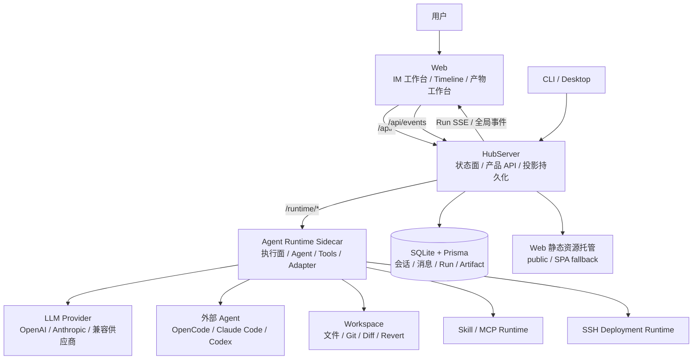

其中 HubServer 到 Web 存在两条事件通道：

- **Run SSE**（`/api/runs/:runId/events`）：当前会话的执行过程事件，用于聊天 Timeline 实时渲染和断线续订。Web 使用 `afterSequence` 参数续订，HubServer 持久化后才发布。
- **全局事件流**（`/api/events`）：best-effort 低频通知，用于会话标题更新、最近消息预览、Run 状态变更和服务状态变更。该通道不进入 Timeline 投影，不支持 replay，不补偿断线期间的漏事件。

这一架构的关键不是简单拆成多个目录，而是明确“状态面”和“执行面”的工程边界：

| 层级 | 主要职责 | 不承担的职责 |
| --- | --- | --- |
| Web | 会话列表、聊天 Timeline、消息输入、权限卡片、产物工作台、服务状态展示 | 不保存 LLM 凭据，不直接访问 Runtime、Shell、文件系统或 SSH |
| HubServer | 产品 API、业务数据持久化、Runtime 事件消费、结构化投影、全局事件、静态资源托管 | 不直接调用模型，不执行工具，不直接操作外部 Agent SDK |
| Agent Runtime | LLM 调用、Orchestrator、外部 Adapter、工具执行、权限判断、Workspace Diff、Skill/MCP、部署运行时 | 不直接管理产品数据库，不面向浏览器暴露 API |
| CLI/Desktop | 生产入口、启动 HubServer、承载本地 Web 体验 | 不绕过 HubServer 直接调用 Runtime 能力 |

一次典型用户请求的链路如下：

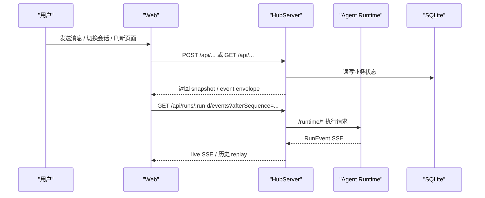

在该链路中，Runtime 只输出执行事实，HubServer 才是产品事实源。这个设计使实时执行、刷新恢复、历史回放和产物审查可以共享同一套数据基础。

### 2.2 Web 层职责

Web 层是 AgentHub 的主要用户界面，负责把复杂的 Agent 执行过程组织为用户熟悉的 IM 工作台体验。它只调用 HubServer 暴露的产品 API 和事件接口，不直接调用 Agent Runtime，也不保存或使用 LLM Provider 凭据。

Web 层的核心职责包括：

- 会话列表、单聊、多 Agent 群聊和会话导航；
- 消息输入、结构化 `@` 提及、图片上传和消息发送；
- 基于 RunEvent 产品 envelope 的聊天 Timeline 投影；
- 权限审批卡片、工具卡片、任务卡片、推理块和流式消息展示；
- 右侧产物工作台，包括会话状态、代码审查、文件浏览、部署预览、终端和网页预览；
- 全局服务状态面板和会话运行态覆盖层；
- 浏览器与 Electrobun Desktop WebView 的统一适配。

Web 层的数据职责被刻意拆分为两类：服务端事实由 TanStack Query 管理，客户端运行态由 Zustand 管理。这种分层使会话详情、消息快照、Runtime agents 等稳定数据与 active conversation、draft、Timeline items、SSE 连接状态和工作台 tab 等 UI 运行态互不污染。

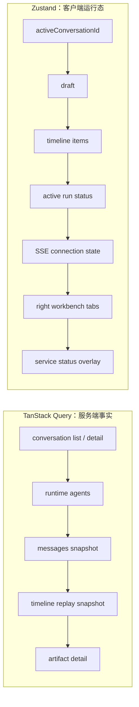

Web 层的技术重点不在于“展示一条模型回复”，而在于将流式执行过程投影成稳定、可恢复、可交互的产品界面。例如，同一条 assistant 消息下可以同时聚合正文增量、reasoning、工具调用、权限等待和 token 统计；部署事件可以驱动右侧部署预览；Diff Artifact 卡片可以打开代码审查页并支持可靠撤销。

前端 Timeline 投影（`timeline-projection.ts`）是聊天流渲染的核心。它将 RunEvent 产品 envelope 转换为用户可读的 `WorkbenchTimelineItem`，并遵循以下聚合规则：

- **`messageId` 作为聚合主线**：同一 `messageId` 下的 `message.*`、`reasoning.*`、`tool.*`、`permission.*` 事件进入同一个聊天气泡，用户看到的是一条 Agent 回复的执行过程，而不是散落的系统事件。
- **子智能体输出归入任务卡片**：非 chat speaker 的子智能体输出进入关联 `task` item，不创建独立聊天气泡，避免刷屏。
- **`run_task` 不重复渲染**：`run_task` 工具事件保留在原始 event log，但不投影为普通工具卡片，避免与任务卡片重复展示。
- **Plan 进入会话状态页**：`write_plan` 工具结果投影为 Plan，不在聊天流中渲染，而在右侧会话状态标签页以任务队列方式展示。
- **外部工具保留来源边界**：外部 Agent 原生工具复用通用 Tool UI，但通过 `data.externalProvider` 保留来源边界，即使工具名与内部工具同名，也不进入内部工具专属渲染器。
- **live 与 replay 共用 reducer**：实时 SSE 与历史 replay 共用同一套 `RuntimeRunEvent -> WorkbenchTimelineItem` 投影逻辑，保证刷新后看到的内容与实时流一致。

### 2.3 HubServer 层职责

HubServer 是 AgentHub 的产品状态面，也是 Web 的唯一后端入口。它负责管理会话、消息、Agent 配置、Artifact、Run、权限请求、WorkspaceChangeSet 和部署记录等业务数据。

HubServer 的关键职责包括：

- 提供 `/api/*` 产品 API，供 Web 创建会话、发送消息、上传图片、读取消息和打开 Artifact；
- 创建本地 Run，并将执行请求转发给 Agent Runtime；
- 消费 Runtime SSE 事件，将 raw payload 持久化为 RunEvent；
- 按 sequence 投影 Message、MessagePart、Artifact、PermissionRequest、Deployment 和 WorkspaceChangeSet；
- 提供 run-level SSE replay，使 Web 可以在切换会话或刷新后恢复事件；
- 发布全局 best-effort 事件，用于会话标题、最近消息、Run 状态和服务状态更新；
- 生产环境托管 Web 静态资源，并作为 CLI/Desktop 的本地服务入口。

HubServer 的事件持久化采用“先保存 raw event，再进行结构化投影”的方式。简化后的产品 event envelope 可以理解为：

```ts
type ProductRunEventEnvelope = {
  sequence: number
  event: {
    id: string
    type: string
    runId: string
    runtimeRunId: string
    data?: unknown
  }
}
```

这里的 `sequence` 是 HubServer 本地分配的连续顺序号，用于 replay 和断线续订；`event` 保留 Runtime 事件事实，并补充产品侧 Run 标识。完整 raw payload 仍保存在数据库中，未知事件类型不会丢失。

HubServer 消费 Runtime SSE 的核心机制由 `RunPersistenceService`实现：

- **微批量落库**：默认约 50ms 或 50 条事件 flush 一次，将 Runtime SSE 以 per-run micro-batch 持久化为 `RunEvent`。`sequence` 在 flush 时按到达顺序连续分配，重复 Runtime event id 在分配 sequence 前跳过，不产生空洞。
- **双指针追踪**：`Run.lastEventSequence` 记录已消费到的最新 raw event 序号；`Run.lastProjectedSequence` 记录结构化投影已追平到的序号。投影允许短暂落后于 raw event。
- **投影追赶**：读取历史消息或组装 Runtime history 前，HubServer 通过 `ensureConversationProjectionCaughtUp` 从 raw `RunEvent` 补投影，保证结构化状态与 raw 事实一致。
- **高频 delta 合并**：`message.delta` / `reasoning.delta` 在内存中合并后再更新 `MessagePart` / `RunReasoningBlock`，降低 SQLite 写入频率。`message.completed`、`reasoning.completed` 和 terminal event 强制 flush pending 投影。
- **终态保证**：terminal event（`run.completed` / `run.failed` / `run.cancelled`）强制 flush raw batch 和投影，保证终态前事件不丢失。run-level live SSE 只在 raw event 成功落库后发布，避免 Web 收到无法 replay 的事件。

这一层的设计价值在于：Runtime 可以专注执行，Web 可以专注体验，而 HubServer 负责把二者之间的不稳定流式过程转化为可查询、可回放、可审计的产品状态。

### 2.4 Agent Runtime 层职责

Agent Runtime 是 AgentHub 的智能体执行面，以 HubServer 的 Sidecar 进程形式运行。它接收 HubServer 发来的 Runtime Run 请求，负责完成具体 Agent 执行，并以 RunEvent 流的形式输出执行过程。

Runtime 承担的核心能力包括：

- 内部 LLM 主智能体和用户自定义智能体执行；
- Orchestrator 计划生成、任务委派、依赖调度和并行执行；
- OpenCode、Claude Code、Codex 等外部 Agent Adapter；
- Runtime Tool Registry、Workspace Tools、Bash、Web Fetch、Question 和 Deployment Tools；
- 权限策略判断、审批请求生成和 Continuation Frame 续跑；
- Workspace 绑定、文件读写、Git baseline 捕获、Diff 计算和可靠撤销；
- Skill/MCP 发现、信任判断、去重和运行时注入；
- SSH 部署连接、远程命令审批、上传、健康检查和部署事件输出。

Runtime 的统一输出是 RunEvent。无论执行来自内部 LLM、Orchestrator、外部 Adapter 还是测试执行器，上层看到的都是同构事件流。这使 HubServer 的持久化与投影不需要为每个执行来源维护一套私有逻辑。

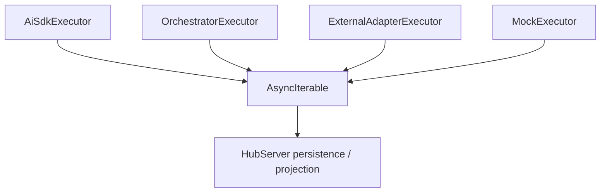

Runtime 不直接写 HubServer 的业务数据库，也不关心 Web 如何渲染卡片、气泡或工作台。它只负责将执行过程表达为结构化事实，并在必要时等待 HubServer/Web 完成审批或用户问答后恢复原执行分支。

### 2.5 CLI 与 Desktop 入口

生产形态下，CLI 与 Desktop 都不是 Runtime 的直接调用方，而是 AgentHub 本地服务体系的入口。它们启动或承载 HubServer，由 HubServer 托管 Web 静态资源，并自动管理 Agent Runtime Sidecar。

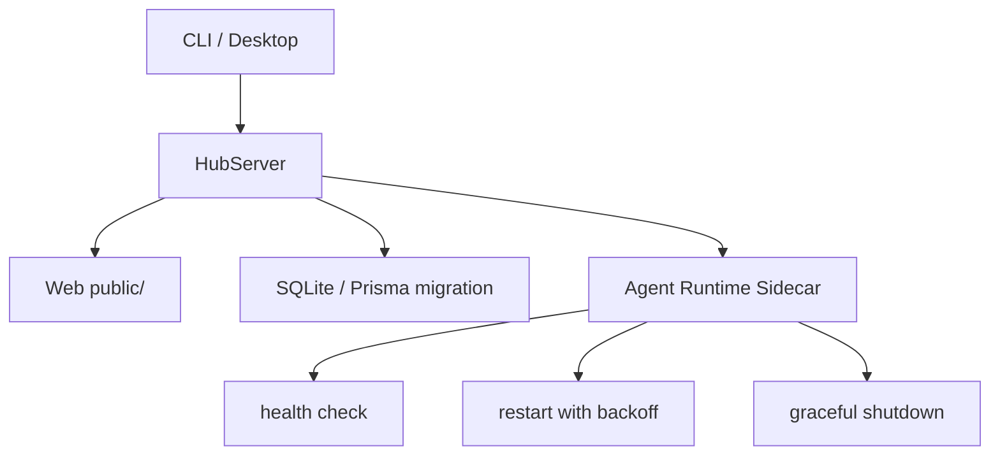

这种入口设计带来三点收益：

1. **浏览器与桌面体验统一**：Web 始终通过相对路径访问 `/api/*` 与 `/api/events`，不需要区分浏览器模式或桌面 WebView。
2. **敏感能力不进入桌面桥接层**：Desktop 只暴露最小窗口控制和受限通知能力，不通过桌面 RPC 暴露文件、Shell、网络、Runtime 或 LLM。
3. **生产依赖集中管理**：CLI/Desktop 共享 Bun runtime、HubServer bundle、Agent Runtime bundle、Web public 资源、真实依赖目录和 migration manifest。

在该模型中，用户只需要启动一个入口，系统内部自动完成 HubServer、数据库、Web 静态资源和 Runtime Sidecar 的装配。

### 2.6 技术选型

AgentHub 的技术选型以 **Bun 全栈** 为统一工程底座。根目录 `package.json` 中的 `dev:web`、`dev:server`、`dev:runtime`、`build:web`、`build:runtime`、`build:hub`、`build:cli` 和 `package` 脚本均以 `bun` 作为入口，前端、后端、AI Runtime、CLI 与 Desktop 的开发、构建和分发流程保持同一套运行时与包管理心智。

```text
Bun 全栈工程基座
  ├─ web：React + Vite + Bun scripts
  ├─ hub-server：Bun + Hono + Prisma
  ├─ agent-runtime：Bun + Hono + AI SDK / 外部 Agent SDK
  ├─ cli：Bun 启动 HubServer 发行资源
  └─ desktop：Electrobun 启动 HubServer + WebView
```

选择 Bun 全栈的原因主要有三点：

- 第一，Bun 同时承担包管理、开发启动、测试和构建入口，降低多运行时协作成本；
- 第二，HubServer 与 Agent Runtime 都运行在 Bun/Node 兼容环境中，便于共享 TypeScript、Hono、Zod、Pino 等后端基础设施；
- 第三，生产分发可以围绕 Bun runtime、service bundle、真实 `node_modules` 和 Web public 资源形成统一打包策略。

#### 2.6.1 前端（Web/Desktop）技术选型

前端技术选型来自 `web/package.json`。整体方向是：以 React + Vite 承载主应用，以 TanStack Query 和 Zustand 分离服务端事实与客户端运行态，以富交互组件支撑聊天工作台、产物工作台和桌面适配。

| 领域 | 选型 | package.json 依据 | 选择理由 |
| --- | --- | --- | --- |
| 应用框架 | React / React DOM | `react`、`react-dom` | 适合复杂状态 UI、组件化聊天流、工作台标签页和桌面 WebView 复用 |
| 构建工具 | Vite | `vite`、`@vitejs/plugin-react` | 开发启动快，适合 Bun 脚本驱动的前端开发与构建 |
| 类型系统 | TypeScript | `typescript` | 前后端契约、Timeline item、Artifact、权限卡片等结构复杂，必须依赖类型约束 |
| 样式体系 | Tailwind CSS | `tailwindcss`、`@tailwindcss/vite` | 适合高密度工作台界面快速构建，便于统一间距、状态色和响应式布局 |
| 服务端事实状态 | TanStack Query | `@tanstack/react-query` | 管理 conversation、messages、runtime agents、artifact detail 等可缓存服务端事实 |
| 客户端运行态 | Zustand | `zustand` | 管理 active conversation、draft、Timeline、SSE 状态和右侧工作台 tab，避免全量 Query 化 |
| 基础交互组件 | Radix UI / cmdk | `radix-ui`、`cmdk` | 支撑弹窗、菜单、命令选择、智能体选择和结构化输入体验 |
| 图标与样式工具 | lucide / CVA / clsx / tailwind-merge | `lucide-react`、`class-variance-authority`、`clsx`、`tailwind-merge` | 统一按钮、状态、工具图标和组件变体表达 |
| 动效与视觉反馈 | motion / Rive | `motion`、`@rive-app/react-webgl2` | 支撑产品设计中的细腻动效、状态反馈和品牌化视觉体验 |
| 代码与终端产物 | Monaco / xterm | `@monaco-editor/react`、`monaco-editor`、`xterm`、`@xterm/addon-fit` | 支撑代码审查、文件查看、终端标签页和部署日志等开发者工作台能力 |
| Markdown 与富文本 | Streamdown / Mermaid / CJK / Math | `streamdown`、`@streamdown/mermaid`、`@streamdown/cjk`、`@streamdown/math` | 适合渲染 Agent 回复中的 Markdown、代码块、图表、中文内容和公式 |
| 文件预览 | PDF / DOCX / PPTX 渲染 | `pdfjs-dist`、`docx-preview`、`@aiden0z/pptx-renderer` | 为文件 Artifact 与产物工作台预览能力预留多格式基础 |
| 桌面适配 | Electrobun 前端桥接 | `electrobun` | Web 能检测桌面运行时，并通过最小 RPC 调用窗口控制和受限通知 |

前端选型服务于一个核心目标：**把 Agent 执行过程产品化，而不是只展示模型文本**。React/Vite 提供应用基础，TanStack Query/Zustand 提供状态分层，Monaco/xterm/Streamdown/PDF/DOCX/PPTX 等能力让代码、终端、文档、Diff 和部署状态都能进入同一个工作台。

#### 2.6.2 后端（HubServer）技术选型

后端技术选型来自 `hub-server/package.json`。HubServer 的定位是产品状态面，因此选型重点是轻量 API、结构化校验、本地持久化、事件消费、静态资源托管和生产分发。

| 领域 | 选型 | package.json 依据 | 选择理由 |
| --- | --- | --- | --- |
| 运行时 | Bun | `dev: bun run dev:migrate && bun run --hot src/index.ts`、`test: bun test` | 开发、测试、构建和生产启动统一使用 Bun，减少 Node/Bun 混用成本 |
| HTTP 框架 | Hono | `hono` | 轻量、适合 Bun，便于组织 `/api/*`、`/health`、SSE 和静态资源托管 |
| ORM 与数据模型 | Prisma | `prisma`、`@prisma/client` | 会话、消息、Run、Artifact、权限和 ChangeSet 等复杂模型需要稳定 ORM 与迁移体系 |
| SQLite 适配 | Prisma LibSQL Adapter | `@prisma/adapter-libsql` | 支撑本地优先的 SQLite 存储形态，适合桌面和单机分发 |
| 运行时校验 | Zod | `zod` | API 请求、配置、事件 payload 和内部边界需要结构化校验，避免弱类型数据进入业务层 |
| 结构化日志 | Pino | `pino` | 适合服务端请求日志、Sidecar 管理日志和生产环境 JSON 日志 |
| 标识生成 | nanoid | `nanoid` | 用于轻量生成业务标识，适合会话、产物或事件相关 ID |
| 终端能力 | node-pty | `node-pty` | 支撑右侧工作台终端会话能力，是开发者工作台的重要基础 |
| 图片处理 | sharp | `sharp` | 支撑用户上传图片、附件处理或后续预览缩略图能力 |
| 内容安全 | sanitize-html | `sanitize-html` | 对富文本或外部内容进行安全处理，降低前端渲染风险 |
| 远程连接 | ssh2 | `ssh2` | Deploy Runtime 的 SSH 连接、远程命令和上传能力的核心依赖；HubServer 侧用于解析服务器连接材料并转发给 Runtime |
| 表格处理 | xlsx | `xlsx` | 为文件预览、导入导出或表格类 Artifact 处理预留能力 |

HubServer 选择 Bun + Hono + Prisma/SQLite 的组合，是为了贴合 AgentHub 的本地优先产品形态：用户无需单独部署数据库，HubServer 可以在本机管理完整产品状态；同时，Hono 保持 API 层足够轻量，方便作为 Web、CLI 和 Desktop 共同访问的唯一后端入口。

#### 2.6.3 AI 运行时（AgentRuntime）技术选型

AI 运行时技术选型来自 `agent-runtime/package.json`。Agent Runtime 的定位是执行面，因此选型重点是模型调用、外部 Agent SDK、工具执行、MCP 接入、SSH 部署和结构化事件输出。

| 领域 | 选型 | package.json 依据 | 选择理由 |
| --- | --- | --- | --- |
| 运行时 | Bun | `dev: bun run --hot src/index.ts`、`build: bun run scripts/build.ts`、`start: bun dist/index.js` | Runtime 与 HubServer 使用同一运行时和构建心智，便于 Sidecar 打包和生产启动 |
| HTTP 框架 | Hono | `hono` | Runtime 内部 API 轻量，适合 `/runtime/*`、`/health`、服务状态和工具运行接口 |
| AI 编排基础 | AI SDK | `ai` | 统一内部 LLM Agent 的流式输出、工具调用、reasoning 和多模型适配；核心 API 包括 `streamText`（流式 + tool calling）、`generateText`（单次调用）、`convertToModelMessages`（消息转换）和 `LanguageModel` 统一接口 |
| OpenAI 能力 | OpenAI SDK Provider | `@ai-sdk/openai` | 支撑 OpenAI 模型调用及工具调用能力 |
| Anthropic 能力 | Anthropic SDK Provider | `@ai-sdk/anthropic` | 支撑 Anthropic 模型与 Claude 相关能力；`@anthropic-ai/claude-agent-sdk` 间接依赖 |
| 兼容供应商 | OpenAI Compatible Provider | `@ai-sdk/openai-compatible` | 支撑 OpenAI 兼容接口，便于扩展自定义 Provider |
| Claude Code Adapter | Claude Agent SDK | `@anthropic-ai/claude-agent-sdk` | 接入 Claude Code 外部 Agent，通过 `query()` async generator 流式输出，并桥接工具权限和用户问答 |
| Codex Adapter | Codex SDK | `@openai/codex-sdk` | 接入 Codex 外部 Agent，支持 thread start/resume 等会话能力 |
| OpenCode Adapter | OpenCode SDK | `@opencode-ai/sdk` | 接入 OpenCode 外部 Agent，复用其原生项目和会话能力 |
| MCP Runtime | MCP SDK | `@modelcontextprotocol/sdk` | 支撑 MCP server 连接、tool 枚举和动态工具注入 |
| 进程执行 | execa | `execa` | 用于受控执行外部命令或子进程，便于标准化输出、错误和取消语义 |
| 部署连接 | ssh2 | `ssh2` | 支撑 Deploy Runtime 的 SSH 连接、远程命令和上传能力 |
| 运行时校验 | Zod | `zod` | Runtime API、工具参数、Adapter payload 和事件数据需要稳定 schema 校验 |
| 日志 | Pino / pino-pretty | `pino`、`pino-pretty` | 生产结构化日志与开发可读日志兼顾 |

AI Runtime 的技术选型体现了 AgentHub 的核心差异：内部 Agent 使用 AI SDK 统一模型与工具调用；外部 Agent 不被拆成模型供应商，而是通过 Claude Code、Codex、OpenCode 的官方或原生 SDK 作为完整聊天对象接入；MCP 作为动态工具能力进入 Runtime Tool Registry；SSH 部署运行时则独立承载发布交付链路。

从整体上看，AgentHub 的技术栈不是“前端一个栈、后端一个栈、AI 执行另一个栈”的松散拼接，而是以 Bun 为共同运行基座，以 TypeScript 贯穿 Web、HubServer、Runtime、CLI 和 Desktop，以 Hono/Zod/Pino 统一服务端基础设施，以 AI SDK 和外部 Agent SDK 承载智能体执行生态。

## 3. 进程与运行时边界

AgentHub 的运行时边界遵循一个简单但严格的原则：**浏览器只消费产品 API，HubServer 只管理状态与投影，Agent Runtime 只负责执行，CLI/Desktop 只负责装配入口。** 这不是普通微服务拆分，而是把“看得见的产品体验”和“看不见的高风险执行”分到不同层。

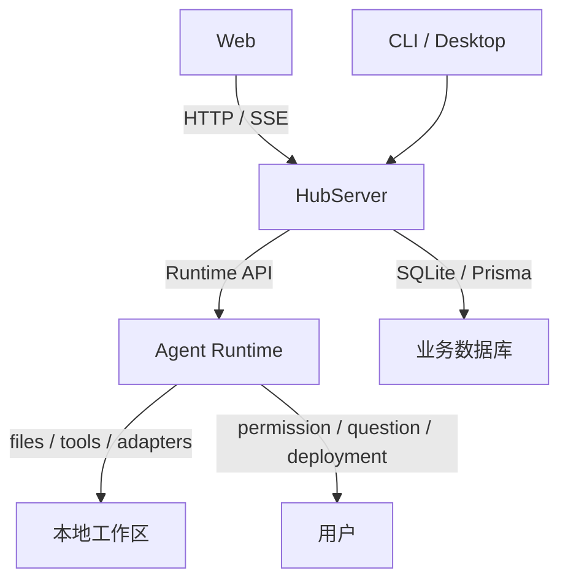

### 3.1 Web 到 HubServer

Web 永远只把 HubServer 视为唯一后端入口。它访问的是产品 API 和产品级事件通道，而不是 Runtime 的内部执行 API。

核心路径包括：

- 会话列表与会话详情：`GET /api/conversations`、`GET /api/conversations/:conversationId`
- 消息发送与重生成：`POST /api/conversations/:conversationId/messages/send`、`POST /api/conversations/:conversationId/messages/:messageId/regenerate`
- 消息快照与 Artifact 查询：`GET /api/conversations/:conversationId/messages`、`GET /api/conversations/:conversationId/artifacts/:artifactId`
- Run 事件回放：`GET /api/runs/:runId/events?afterSequence=...`
- 全局低频通知：`GET /api/events`

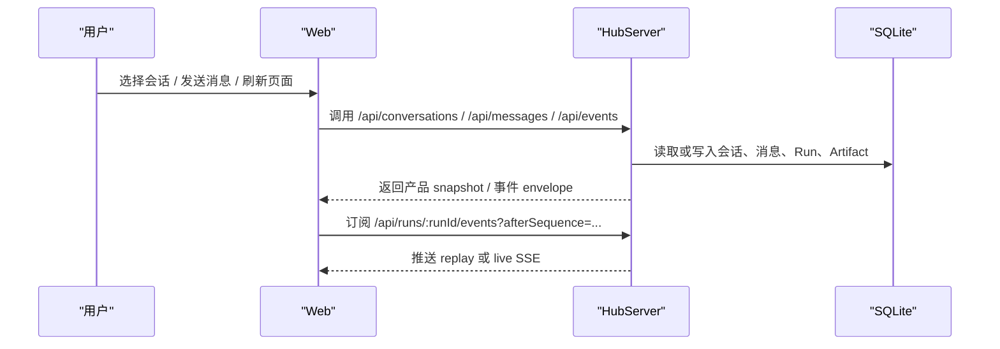

Web 侧的边界规则是：

- 不直接访问 Agent Runtime；
- 不保存 LLM 凭据；
- 不访问本地文件系统或 SSH；
- 不自己解析 Runtime raw event，只消费 HubServer 投影后的产品事件。

### 3.2 HubServer 到 Agent Runtime

HubServer 负责把一次产品请求装配成 Runtime 执行请求，并通过受控 Runtime API 发给 Sidecar。代码中 `createRuntimeClient()` 会在生产模式下生成内部 token，`SidecarManager` 拉起 Runtime 子进程后再回写可用 endpoint，HubServer 随后把产品请求转发给 Runtime。

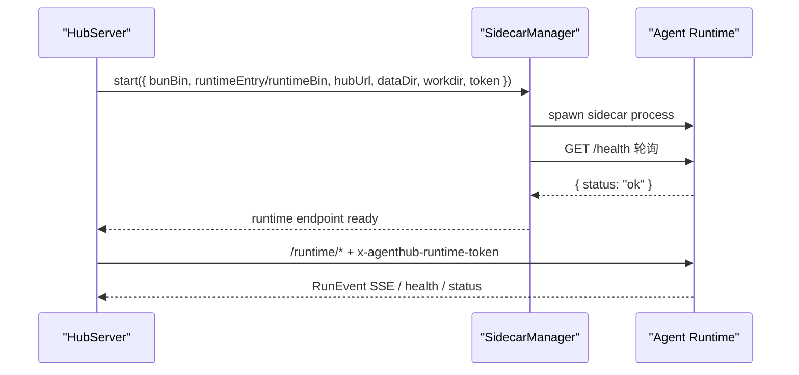

HubServer 只承担以下职责：

- 创建本地 Run；
- 将持久化消息组装成 Runtime 输入；
- 转发 `/runtime/*` 请求；
- 接收并持久化 RunEvent；
- 将事件投影为消息、Artifact、权限和部署状态。

它不直接调用模型，也不直接执行工具。

### 3.3 Agent Runtime Sidecar

Agent Runtime 在生产模式下以 Sidecar 进程运行，由 HubServer 管理其生命周期。`sidecar-manager.ts` 中的实现已经明确了启动、健康检查、重试和关闭策略。

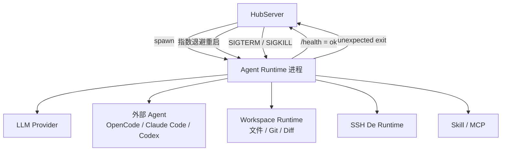

Sidecar 的关键特征：

- 生产环境由 HubServer 自动拉起；
- 开发环境可以手动独立启动；
- 启动参数包含 `--port`、`--hostname`、`--hub-callback`、`--data-dir`、`--workdir` 和 `--log-level`；
- 通过 `AGENTHUB_RUNTIME_TOKEN` 和 `x-agenthub-runtime-token` 保护内部 API；
- 异常退出后最多重试 3 次，采用指数退避；
- Runtime 崩溃不会破坏 HubServer 的业务状态。

### 3.4 本地优先数据与工作区

AgentHub 的本地数据边界围绕 `config.dataDir` 展开。HubServer 的数据库、Runtime 的运行数据、workspace 工作目录和聊天图片资产都以本地目录组织，而不是依赖外部数据库或对象存储。

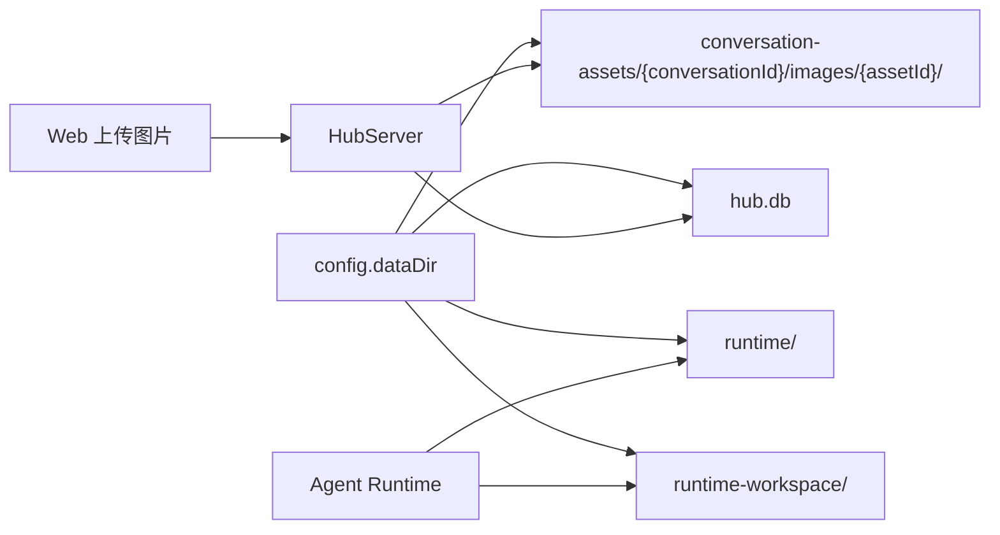

目录职责如下：

| 目录 / 文件 | 职责 |
| --- | --- |
| `hub.db` | 会话、消息、Run、Artifact、ChangeSet 等产品事实 |
| `runtime/` | Runtime 自身数据目录 |
| `runtime-workspace/` | Runtime 的默认工作目录 |
| `conversation-assets/{conversationId}/images/{assetId}/` | 聊天图片资产的持久化副本 |

代码层面，HubServer 启动时会确保数据目录存在，生产模式下会在初始化数据库前执行迁移检查。Runtime 在执行文件工具、Diff 与撤销时，只围绕绑定 workspace 运作，不会回落为浏览器可见的临时路径。

### 3.5 凭据与高风险能力边界

AgentHub 把敏感能力集中在 Runtime 边界内，并通过权限事件把执行风险暴露给用户，而不是把风险隐藏在后台日志里。

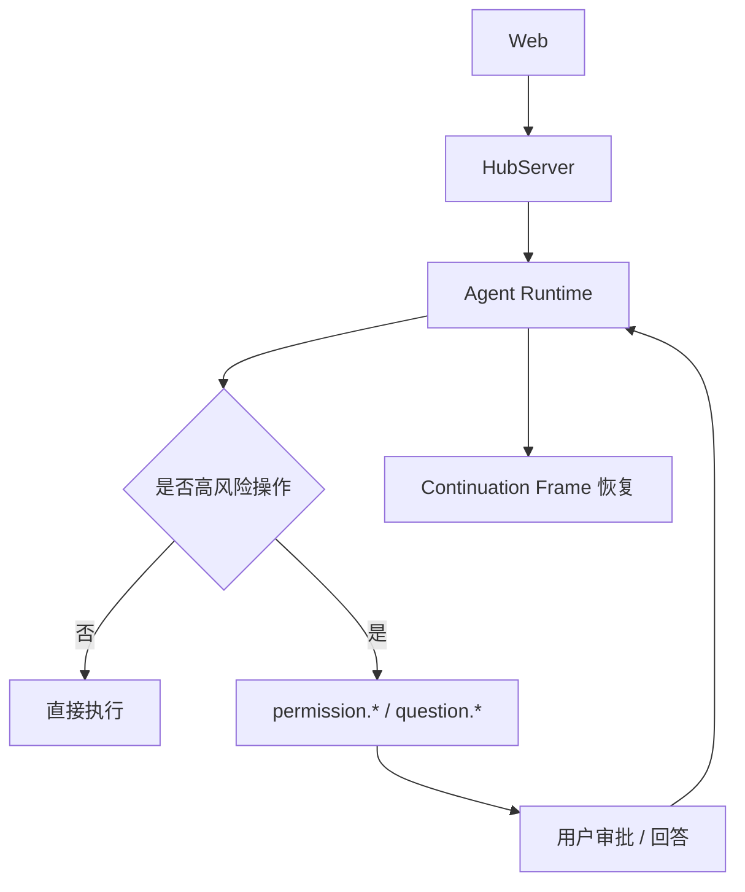

边界原则如下：

- 浏览器不持有 LLM API Key、SSH 凭据、MCP secret 或外部 Agent 凭据；
- 本机文件读写、Shell、网络、部署和 SSH 都由 Runtime 工具承载；
- 高风险操作先形成权限请求，再由用户审批或回答；
- 批准后通过 Continuation Frame 恢复原执行分支；
- 外部 Agent 的权限请求最终也要进入同一套 `permission.*` 语义。

这套边界让 AgentHub 既能保留聊天产品的轻量体验，又能承载真正的执行型工作流。

## 4. 核心数据模型

本节依据 `docs/architecture/DATA_MODEL.md`、`hub-server/prisma/schema.prisma`、`docs/architecture/RUN_EVENT_SCHEMA_AND_PROJECTION.md`、`docs/contracts/RUNTIME_SSE_EVENTS.md` 以及 Runtime 智能体定义相关实现编写。AgentHub 的核心数据模型并不是单纯的“聊天消息表”，而是围绕一次协作任务形成的产品事实层：会话承载上下文，消息承载用户可见表达，Run 与 RunEvent 承载执行过程，Artifact、PermissionRequest、WorkspaceChangeSet 和部署事件承载可审查、可审批、可恢复的执行结果。

从设计上看，AgentHub 采用“业务实体 + Raw Event + 结构化投影”的组合模型：业务实体负责产品查询和页面恢复，Raw RunEvent 保存执行事实，结构化投影则把事件转换为消息、任务、工具、权限、产物和工作区变更等可交互状态。

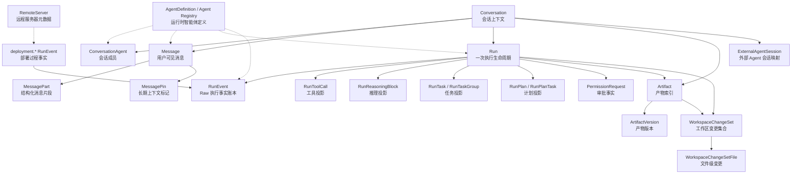

图中的虚线表示产品状态通过 `agentId` 引用 Runtime 侧的智能体定义，而不是在 HubServer 数据库中复制一份完整 Agent 能力模型。

| 模型族 | 代表实体 | 核心职责 | 技术特色 |
| --- | --- | --- | --- |
| 会话与成员 | `Conversation`、`ConversationAgent`、`MessagePin` | 管理 IM 会话、成员、置顶、归档和上下文入口 | 将多 Agent 协作锚定为用户熟悉的会话容器 |
| 消息与片段 | `Message`、`MessagePart` | 保存用户、助手、系统消息及有序结构化内容 | 对齐 AI SDK `UIMessage` 思路，支持文本、图片、引用、分支和产物聚合 |
| 执行与事件 | `Run`、`RunEvent`、Run 投影表 | 记录一次执行的生命周期、原始事件和结构化投影 | Raw 保留与投影 checkpoint 分离，支持 replay 与幂等恢复 |
| 产物与版本 | `Artifact`、`ArtifactVersion` | 管理 Diff、文件、网页预览等可打开产物 | 将 Agent 输出从文本回复升级为可审查、可关联工作台的协作对象 |
| 审批与安全 | `PermissionRequest` | 保存高风险操作审批事实 | 权限卡片、用户决策和执行续跑拥有统一数据锚点 |
| 工作区变更 | `WorkspaceChangeSet`、`WorkspaceChangeSetFile` | 记录 Run 级和文件级变更、统计、归因与可靠性 | 平台级 Diff 能力不依赖某个外部 Adapter 私有事件 |
| 外部与部署 | `ExternalAgentSession`、`RemoteServer`、`deployment.*` 事件 | 连接外部 Agent session 与 SSH 部署目标 | 外部会话、远程服务器和部署过程都以受控元数据进入平台 |

### 4.1 Conversation

`Conversation` 是 AgentHub 的产品上下文根实体。它保存会话标题、会话模式、状态、最近消息、置顶/归档时间和轻量元数据，并通过关联表连接成员、消息、Run、Artifact、权限请求、外部 Agent session 和工作区变更。

在 IM 范式下，Conversation 的价值不只是“聊天记录分组”，而是把一次持续任务的上下文、参与 Agent、执行链路和产物结果聚合在同一个产品空间中。用户看到的是一个会话，系统内部则可以围绕这个会话恢复消息、重放事件、展示产物、追踪权限和审查 Diff。

| 字段/关系 | 设计含义 |
| --- | --- |
| `mode` | 区分单聊与群聊，影响 Runtime 入口解析和 Orchestrator 是否参与 |
| `orchestratorAgentId` | 标记群聊编排入口，支撑默认 Orchestrator 路由 |
| `lastMessageId` / `lastMessageAt` | 支撑会话列表排序和最近消息展示 |
| `pinnedAt` / `archivedAt` / `status` | 支撑置顶、归档和会话生命周期管理 |
| `metadataJson` | 保存轻量派生状态，例如标题来源等非强结构字段 |
| `ConversationAgent[]` | 保存当前会话参与的主智能体成员 |
| `runs` / `artifacts` / `permissions` | 把执行、产物、审批都锚定到同一会话上下文 |

`ConversationAgent` 使用 `conversationId + agentId` 唯一约束，保证一个会话内同一智能体只出现一次。这里的 `agentId` 指向 Runtime Agent Registry 中的运行时智能体定义，而不是 Prisma 中的独立 Agent 表；这种设计让会话成员关系归 HubServer 管理，同时保持智能体能力定义由 Runtime 注册体系统一维护。

### 4.2 Message 与 Message Part

AgentHub 的消息模型遵循 `docs/architecture/DATA_MODEL.md` 中的方向：应用侧以 `UIMessage` 语义作为事实来源，模型输入则由消息历史推导生成。落库时，HubServer 将消息拆为 `Message` 和 `MessagePart` 两层：前者描述一条产品消息的身份、发送者、运行时来源和生命周期，后者保存这条消息内部的有序结构化内容。

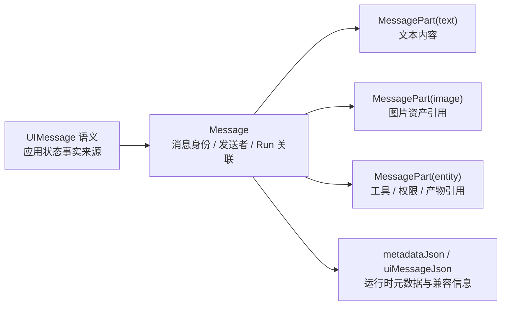

`Message` 负责回答“这是谁在什么上下文中说的一句话”。核心字段包括 `conversationId`、`runId`、`role`、`senderType`、`senderId`、`agentId`、`taskId`、`groupId`、`surface`、`status`、`finishReason`、`runtimeMessageId`、`runtimeRunId`、`messageIndex` 以及事件序号范围。它还通过 `parentMessageId` 支持回复引用，通过 `regeneratedFromId` 支持 assistant 消息重新生成分支。

`MessagePart` 负责回答“这条消息里面有哪些有序内容”。它保存 `partKey`、`partIndex`、`type`、`state`、`text`、`payloadJson`、`entityType`、`entityId` 和事件序号范围。文本、图片、权限卡片、产物引用等都可以作为 part 进入同一条消息，从而让聊天气泡在流式输出、刷新恢复和历史回放时保持一致。

| 能力 | 数据设计 |
| --- | --- |
| 流式文本 | `message.delta` 累积更新 text part，完成后推进 `lastEventSequence` |
| 图片消息 | 文本 part 之后按用户提交顺序保存 image part，图片-only 消息合法 |
| 回复引用 | `parentMessageId` 保存关系，`metadataJson.replyTo` 保存稳定快照 |
| 重新生成 | 新 assistant message 使用 `regeneratedFromId` 指向源回复，旧回复不删除 |
| 子任务输出 | 可通过 `taskId`、`groupId` 归入任务上下文，避免拆成无归属日志 |
| 历史恢复 | `firstEventSequence` / `lastEventSequence` 为查询、调试和非聊天 UI 提供稳定序号 |

这种拆分让消息既能保持 IM 产品的直观性，又能承载 Agent 执行中的复杂结构，避免把工具、权限、图片和产物散落到不可恢复的临时状态中。

### 4.3 Agent

AgentHub 中的 Agent 不是单一 Prompt，也不是数据库中的一张普通业务表，而是 Runtime 侧的可执行定义。`agent-runtime/src/agents/types.ts` 中的 `AgentDefinition` 将身份、来源、可见性、入口策略、委派策略、执行器类型、模型绑定、工具集合、Skill 引用、权限策略和外部 Adapter 配置组合为一个运行时实体。

核心设计可以概括为三层：

| 层级 | 代表字段/关系 | 设计作用 |
| --- | --- | --- |
| 产品身份 | `id`、`name`、`description`、`tier`、`origin`、`visibility` | 决定 Agent 是否作为聊天对象出现，以及属于系统、用户还是外部来源 |
| 执行能力 | `executorType`、`modelRef`、`allowedTools`、`allowedSubagents`、`allowedSkills` | 决定 Agent 使用哪类执行器、模型、工具和能力注入 |
| 安全边界 | `entryPolicy`、`delegationPolicy`、`permissionPolicy`、`toolPermissionRules`、`external` | 决定是否可被用户调用、是否可被委派、能做哪些高风险操作 |

```ts
type AgentDefinition = {
  id: string
  name: string
  description: string
  tier: "primary" | "subagent"
  origin: "system" | "user" | "external"
  visibility: "visible" | "hidden"
  entryPolicy: "default" | "callable" | "not-callable"
  delegationPolicy: "can-delegate" | "delegated-only" | "terminal"
  executorType: "orchestrator" | "ai-sdk" | "mock" | "external-adapter"
  systemPrompt?: string
  modelRef?: { providerId: string; modelId: string }
  capabilities: string[]
  allowedSubagents: string[]
  allowedTools: string[]
  allowedSkills: string[]
  permissionPolicy: {
    filesystem: "none" | "read" | "write"
    shell: "none" | "limited" | "full"
    network: "none" | "limited" | "full"
    deploy: "none" | "preview" | "publish"
  }
  toolPermissionRules?: { bash?: Record<string, "allow" | "ask" | "deny"> }
  external?: {
    provider: "opencode" | "claude-code" | "codex"
    command?: string
    args?: string[]
    workingDirectoryPolicy: "runtime-workspace" | "user-workspace"
    configDirectoryPolicy: "runtime-managed" | "user-global"
    outputFormat: "text" | "json" | "event-stream"
  }
  externalSettings?: ExternalAgentSettings
  enabled: boolean
  readonly: boolean
  createdAt?: string
  updatedAt?: string
}
```

运行时预设 Agent 包含 `orchestrator`、`coder`、`reviewer`、`writer`、`planner`、`deploy` 以及 `opencode`、`claude-code`、`codex` 等外部 Agent。用户自定义 Agent 通过 Runtime Agent Store 管理；外部 Agent 的模型、执行模式和平台配置通过对应 settings store 管理。

HubServer 的业务数据通过 `agentId` 引用运行时定义，例如 `ConversationAgent.agentId` 表示会话成员，`Message.agentId` 表示消息所属智能体，`RunEvent.agentId` 表示事件来源。这种“产品状态引用 + Runtime 定义解析”的方式避免了把 Agent 能力固化在产品数据库中，也使外部 Agent、系统 Agent 和用户 Agent 可以在产品层统一表现为聊天参与者。

### 4.4 Run 与 RunEvent

`Run` 表示一次由用户消息触发的执行生命周期。它关联触发消息、会话、运行模式、状态、Runtime run id、Orchestrator、输入快照、计划结果、错误信息以及事件消费/投影进度。`RunEvent` 则是执行事实的原始账本，保存 Runtime SSE 中每一条事件的 id、type、sequence、agent/task/tool/message 归属和完整 `payloadJson`。

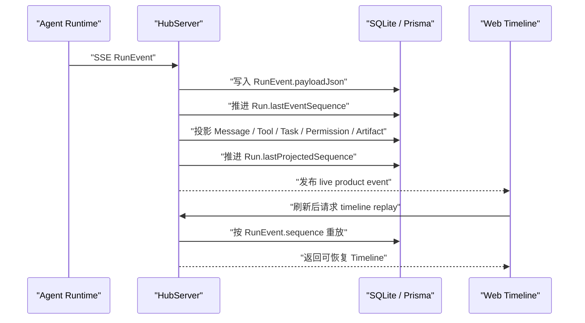

Run 与 RunEvent 的关键设计点如下：

| 设计点 | 说明 |
| --- | --- |
| 原始事件永久保留 | `RunEvent.payloadJson` 保存 raw SSE 事实，新事件类型无需立即改表 |
| 顺序真相明确 | `RunEvent.sequence` 是 run 内 replay 的顺序真相 |
| 投影允许追赶 | `Run.lastProjectedSequence` 允许结构化投影短暂落后 raw event |
| 幂等恢复 | 通过 Runtime event id、`runId + sequence`、`runId + runtimeMessageId` 等约束降低重复投影风险 |
| 执行与 UI 解耦 | Web 读取产品 envelope 和结构化投影，不直接依赖 Runtime 私有实现 |
| 统一事件协议 | 内部 LLM、Orchestrator、外部 Adapter、部署工具都向同一 RunEvent 流输出事实 |

稳定事件类型覆盖 `run.*`、`agent.*`、`message.*`、`reasoning.*`、`tool.*`、`task.*`、`permission.*`、`question.*`、`deployment.*` 和 `system_agent.completed`。其中 `deployment.*` 作为部署预览的主事实，`system_agent.completed` 用于自动标题等后台系统智能体结果。

Run 还拥有一组结构化投影表，例如 `RunToolCall`、`RunReasoningBlock`、`RunTaskGroup`、`RunTask`、`RunPlan` 和 `RunPlanTask`。这些表不是替代 Raw RunEvent，而是为查询、统计、Timeline 组件、计划队列和任务状态提供更高效的产品状态。

### 4.5 Artifact 与 ArtifactVersion

`Artifact` 将 Agent 输出从聊天文本提升为可审查、可打开、可关联工作台的结构化产物。它通过 `conversationId`、`runId`、`messageId` 和 `createdByAgentId` 绑定上下文，通过 `type`、`title`、`status` 和 `currentVersionId` 描述产物状态。`ArtifactVersion` 则保存产物内容、版本号、来源、语言、摘要和可选 `diffJson`。

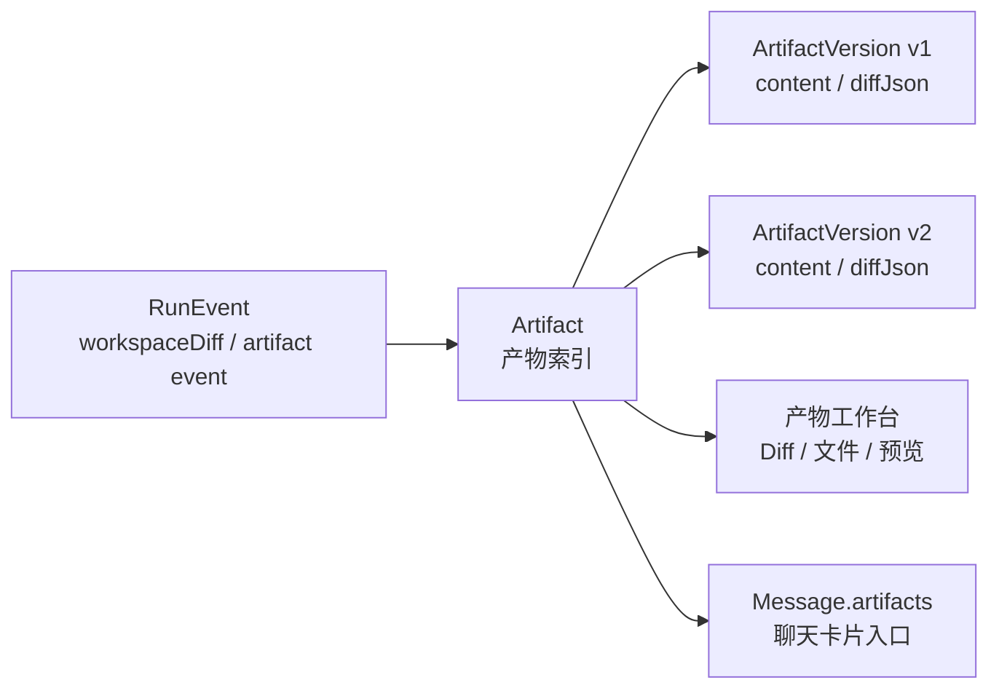

在当前实现中，Diff Artifact 是最关键的产物类型之一。Runtime 在 terminal run event 中携带 `workspaceDiff`，HubServer 投影为 `Artifact(type="diff")` 和 `ArtifactVersion`：`content` 可保存 bounded patch 或摘要文本，`diffJson` 保存完整 `WorkspaceDiffSummary`。Web 可通过 Artifact Detail API 恢复文件列表、统计、可靠性提示和归因信息。

Artifact 的设计价值在于把“Agent 做了什么”变成可被产品继续操作的对象：

| 能力 | Artifact 承载方式 |
| --- | --- |
| 聊天内联展示 | `messageId` 让产物卡片挂到对应消息 |
| 工作台打开 | `conversationId` 和 `type` 支撑右侧工作台按类型展示 |
| 版本管理 | `ArtifactVersion.version` 和 `currentVersionId` 支撑多版本演进 |
| Diff 审查 | `diffJson` 保存结构化 diff summary，`content` 保存可展示 patch |
| 变更归因 | Diff Artifact 可关联 `WorkspaceChangeSet` |
| 撤销记录 | 撤销操作可以生成新的 Diff Artifact 表示 reverse-applied 结果 |

这种模型避免将重要产物埋在消息正文中，也为后续代码审查、部署预览、文件预览和历史版本提供统一入口。

### 4.6 PermissionRequest

`PermissionRequest` 保存高风险操作的审批事实，覆盖 Runtime 工具、外部 Agent 权限桥接、文件访问、Shell、网络请求和部署命令等场景。它关联 `conversationId`、`runId`、`agentId`、`messageId`、`taskId`、`groupId`、`toolCallId` 和 `toolName`，同时保存权限类型、目标、说明、风险等级、审批状态、用户决策和原始 payload。

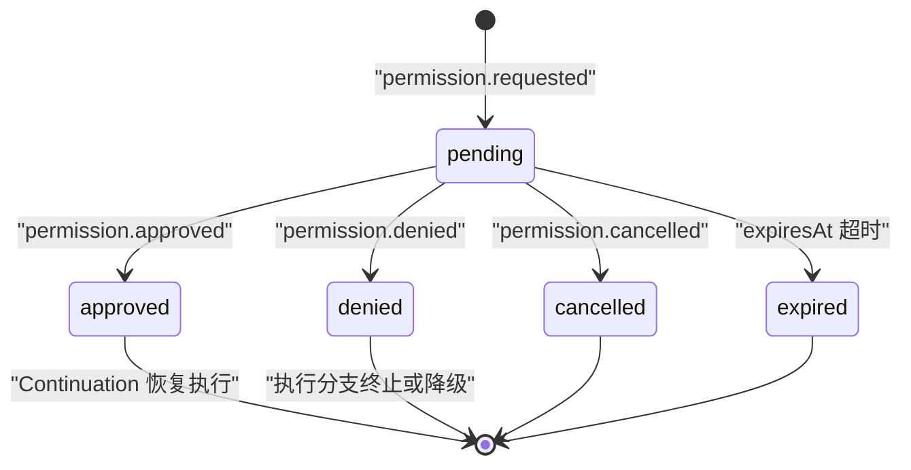

| 字段 | 作用 |
| --- | --- |
| `permissionType` | 描述风险类型，例如命令执行、网络访问、部署命令等 |
| `target` / `description` | 给用户和审计记录展示审批目标与原因 |
| `status` | 记录 pending、approved、denied、cancelled 等审批状态 |
| `runtimeRequestId` | 对应 Runtime 内部权限请求 id，便于续跑 |
| `toolCallId` / `toolName` | 关联触发审批的工具调用 |
| `grantJson` | 保存批准后的授权结果或范围 |
| `dataJson` / `payloadJson` | 保存脱敏后的审批详情和原始事件数据 |
| `firstEventSequence` / `lastEventSequence` | 支撑 replay 后审批卡片恢复与排序 |

该模型的重点不是“拦截一次按钮点击”，而是让审批成为可持久化、可回放、可审计的执行事实。Web 中的权限卡片可以在刷新后恢复完整安全上下文；Runtime 则可以在用户批准后通过 Continuation Frame 回到原执行分支继续运行。

### 4.7 WorkspaceChangeSet

`WorkspaceChangeSet` 将一次 Run 造成的工作区文件变化固化为平台级变更记录。它由 Runtime 在 Run 开始和结束时捕获 git baseline 并计算 diff summary，HubServer 在 terminal event 中投影生成。该模型通过 `conversationId`、`runId`、`artifactId` 和 `sourceEventId` 关联会话、执行、Diff Artifact 和原始终态事件。

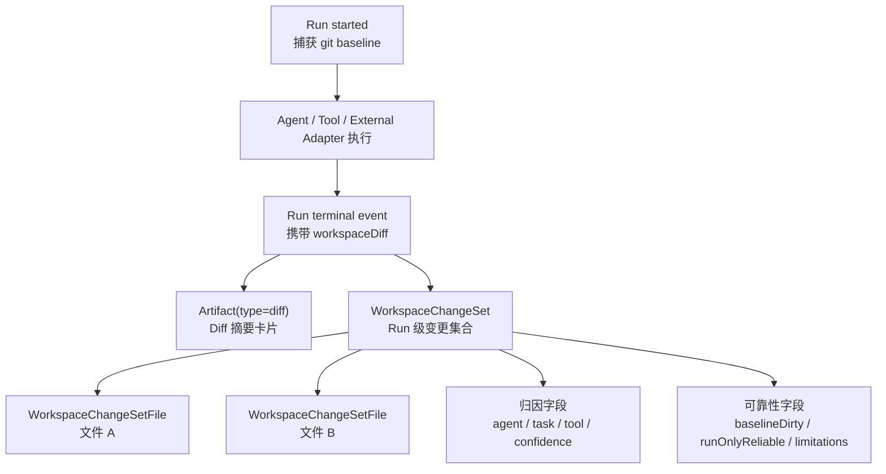

`WorkspaceChangeSet` 保存变更状态、dirty baseline、Run 级可靠性、摘要、统计、限制信息和归因置信度；`WorkspaceChangeSetFile` 则保存每个文件的路径、旧路径、前后状态、来源、增删行、binary/truncated 标记和文件级归因。

| 设计能力 | 数据字段 |
| --- | --- |
| 幂等投影 | `sourceEventId` 唯一，避免 replay / catch-up 重复创建 |
| Artifact 关联 | `artifactId` 唯一关联对应 Diff Artifact |
| 可靠性判断 | `baselineDirty`、`runOnlyReliable`、`limitationsJson` |
| 文件级统计 | `additions`、`deletions`、`binary`、`truncated` |
| 归因表达 | `attributionKind`、`attributionConfidence`、`agentId`、`taskId`、`toolCallId` |
| 撤销约束 | 可靠、完整、非截断、非 binary、非 dirty baseline 的 diff 才能安全撤销 |

该设计的关键优势是“平台级 Diff”，而不是“某个工具返回了 diff”。内部工具、Orchestrator 委派任务和外部 Agent Adapter 都可以被统一纳入 Run 前后 diff 计算；即使外部平台没有提供私有 diff 事件，AgentHub 仍能以保守归因方式生成工作区变更记录。

### 4.8 RemoteServer 与 Deployment

`RemoteServer` 是 HubServer 侧保存远程部署目标的受控元数据模型，字段包括 `hostname`、`host`、`username`、`port` 和可选 `identityFilePath`。它对应的是“用户可选择的部署服务器”，而不是一次部署执行的完整记录。当前仓库中没有独立 Prisma `Deployment` 表；部署过程主要通过 Runtime deployment tools、SSH 连接运行时和 `deployment.*` RunEvent 形成可回放事实。

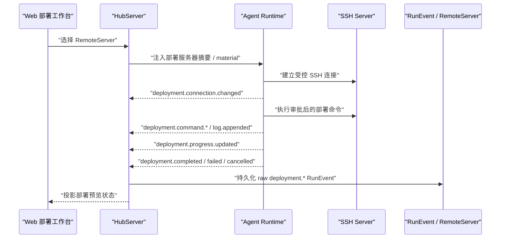

部署数据链路分为三类事实：

| 数据 | 承载位置 | 说明 |
| --- | --- | --- |
| 部署目标元数据 | `RemoteServer` | 保存可选择服务器的 host、user、port 和 key path 等受控信息 |
| 部署执行过程 | `deployment.*` RunEvent | 保存连接状态、命令、日志、进度、release note、预览 URL、终态 |
| 部署审批 | `PermissionRequest` | `run_deploy_command` 等高风险远程命令进入统一审批模型 |

`deployment.*` 事件包含 `deploymentId`、服务器展示摘要、连接状态、命令结果、日志、健康检查和部署 URL 等信息，并要求 payload 脱敏：不能包含私钥内容、密码、token、secret env、SSH agent 细节、远程 root path 或未截断的大输出。Runtime 重启后，历史事件可以恢复部署事实，但旧 SSH 长连接必须视为 disconnected 或 stale，不能被当作仍然可用的连接状态。

因此，RemoteServer 与 Deployment 的关系不是“服务器表 + 部署表”的传统 CRUD 模型，而是“受控部署目标 + 事件化部署过程”。这与 AgentHub 的整体事件模型保持一致：高风险执行由 Runtime 发生，HubServer 保存可回放事实，Web 将其投影为部署预览工作台。

## 5. Agent Runtime 设计

本节依据 `docs/architecture/AGENT_RUNTIME.md`、`docs/architecture/AGENT_ARCHITECTURE.md`、`agent-runtime/src/agents/`、`agent-runtime/src/runtime/run-manager.ts`、`agent-runtime/src/runtime/*executor*.ts` 与 `agent-runtime/src/instruct-runtime/` 的当前实现编写。Agent Runtime 的设计重点不是“调用一个模型并返回文本”，而是把系统预设智能体、用户自定义智能体、外部智能体、隐藏子智能体、系统维护型智能体和对话式创建智能体统一纳入可执行、可校验、可恢复的运行体系。

在 AgentHub 中，Web 和 HubServer 看到的是“会话成员”“聊天消息”“RunEvent”和“产物投影”；Agent Runtime 内部则需要稳定回答四个问题：

1. **谁可以参与执行**：Agent 来自系统、用户还是外部平台，是否可见，是否能作为入口。
2. **以什么能力执行**：Agent 可使用哪些工具、子智能体、Skill、MCP tool、模型与权限上限。
3. **由谁承载执行**：同一套 Agent 定义可以被 Orchestrator、AI SDK、外部 Adapter、Mock 或 Instruct 专用执行链路承载。
4. **如何恢复过程**：执行中的消息、工具、权限、问题、部署、系统标题和工作区变更都必须以 RunEvent 进入统一事件流。

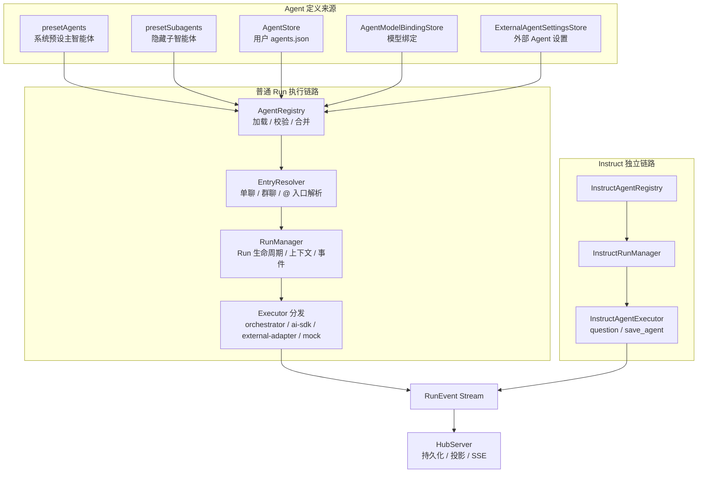

这张图体现了 Runtime 的核心边界：普通会话执行由 `AgentRegistry -> EntryResolver -> RunManager -> Executor` 串联；对话式创建智能体由 `InstructAgentRegistry -> InstructRunManager -> InstructAgentExecutor` 独立承载。两条链路最终都输出 RunEvent，但前者服务普通 IM 协作，后者服务自定义 Agent 创建，避免把“创建 Agent 的元流程”混入 Orchestrator 调度。

### 5.1 Agent Registry

`AgentRegistry` 是 Runtime 的智能体目录层，负责把不同来源的 Agent 合并为一份运行时可查询、可执行、可配置的目录。它不是静态配置数组，而是带加载、校验、覆盖合并、持久化和写入串行化能力的注册中心。

当前实现中，Registry 构造时加载 `presetAgents` 与 `presetSubagents`；`initialize()` 阶段加载用户自定义 Agent、模型绑定和外部 Agent 设置，然后依次完成模型绑定合并、外部设置合并与默认入口校验。若用户 Agent 与系统预设 id 冲突，Registry 会忽略该用户定义，避免覆盖系统能力边界。

| 来源 | 实现位置 | 进入 Registry 的方式 | 说明 |
| --- | --- | --- | --- |
| 系统预设主智能体 | `preset-agents.ts` | 构造时加载 | 包含 `orchestrator`、`coder`、`reviewer`、`writer`、`planner`、`deploy`、外部 Agent 占位定义 |
| 隐藏子智能体 | `preset-subagents.ts` | 构造时加载 | 包含 `explore`、`general`、`file` |
| 用户自定义智能体 | `AgentStore` | 初始化时读取 `agents.json` | 只允许编辑非只读、用户来源、可见主智能体 |
| 模型绑定 | `AgentModelBindingStore` | 初始化时读取 `agent-model-bindings.json` | 仅允许绑定内部可见主智能体，不作用于外部 Agent 或隐藏子智能体 |
| 外部 Agent 设置 | `ExternalAgentSettingsStore` | 初始化时读取 versioned JSON | 仅允许写入与 provider 匹配的 OpenCode、Claude Code、Codex 设置 |

Registry 对外提供的能力可以概括为四类：

| 能力 | 代表方法 | 设计意义 |
| --- | --- | --- |
| 查询 | `listAgents`、`getAgent`、`listCallablePrimaryAgents`、`getDefaultEntryAgent` | 为 HubServer、入口解析、设置页和运行时执行提供稳定目录 |
| 用户 Agent 变更 | `createUserAgent`、`updateUserAgent`、`deleteUserAgent` | 支持用户自定义 Agent，同时保持校验与持久化一致 |
| 模型绑定 | `setAgentModelBinding`、`clearAgentModelBinding` | 允许内部主智能体绑定具体模型 |
| 外部设置 | `setExternalAgentSettings`、`getExternalAgentSettings` | 管理 OpenCode、Claude Code、Codex 的 SDK 运行覆盖项 |

Registry 内部使用 `writeQueue` 串行化用户 Agent、模型绑定和外部设置的写入，降低 JSON 配置文件并发写入造成状态损坏的风险。它还会给内部 `ai-sdk` 与 `orchestrator` 智能体隐式加入 `question` 工具，但不会给外部 Agent 注入 Runtime Tool，从源头上保持“AgentHub 工具体系”和“外部平台原生能力”的边界。

### 5.2 Agent Definition 与运行时身份

`AgentDefinition` 是 Runtime 智能体体系的核心数据结构。它把“产品身份”“执行方式”“能力集合”和“安全边界”合并为机器可读配置。入口解析、执行器选择、模型解析、工具过滤、权限检查、Skill 注入、MCP tool 注入和外部 Adapter 调用都依赖这一结构。

核心字段可以简化为以下形态：

```ts
type AgentDefinition = {
  id: string
  name: string
  tier: "primary" | "subagent"
  origin: "system" | "user" | "external"
  visibility: "visible" | "hidden"
  entryPolicy: "default" | "callable" | "not-callable"
  delegationPolicy: "can-delegate" | "delegated-only" | "terminal"
  executorType: "orchestrator" | "ai-sdk" | "mock" | "external-adapter"
  modelRef?: { providerId: string; modelId: string }
  allowedSubagents: string[]
  allowedTools: string[]
  allowedSkills: string[]
  permissionPolicy: AgentPermissionPolicy
  toolPermissionRules?: AgentToolPermissionRules
  external?: ExternalAgentConfig
}
```

| 字段组 | 字段 | 说明 |
| --- | --- | --- |
| 身份与来源 | `id`、`name`、`description`、`origin` | 决定 Agent 在产品中的命名、来源和解释 |
| 分层与可见性 | `tier`、`visibility` | 区分用户可见主智能体与隐藏子智能体 |
| 入口与委派 | `entryPolicy`、`delegationPolicy`、`allowedSubagents` | 决定能否被用户调用、能否委派、能委派给谁 |
| 执行器 | `executorType`、`external` | 决定走 Orchestrator、AI SDK、外部 Adapter 还是 Mock |
| 模型与能力 | `modelRef`、`capabilities`、`allowedSkills` | 决定模型绑定、展示能力和 Skill 注入 |
| 工具与权限 | `allowedTools`、`permissionPolicy`、`toolPermissionRules` | 决定工具可见性、能力上限和命令级规则 |

这里最重要的设计不是字段数量，而是把能力拆成两层约束：

| 约束层 | 代表字段 | 作用 |
| --- | --- | --- |
| 可见工具层 | `allowedTools`、`allowedSkills`、`allowedSubagents` | 决定模型在当前执行中能看到和选择哪些能力 |
| 能力上限层 | `permissionPolicy`、`toolPermissionRules`、工具自身审批策略 | 决定工具即使被看见后，是否真正允许执行以及是否需要审批 |

`permissionPolicy` 使用 `filesystem`、`shell`、`network`、`deploy` 四个维度表达能力上限。Runtime Tool Registry 在执行工具前会同时检查工具是否在 `allowedTools` 中、Agent 权限是否满足工具最低要求、输入是否合法，以及是否触发审批。这样可以避免“工具出现在列表里”被误解为“可以无条件执行”。

### 5.3 Primary Agent、Subagent 与 System Agent

Runtime 将智能体拆成四类边界：面向用户协作的 Primary Agent，面向内部专业能力的 Subagent，围绕系统维护任务运行的 System Agent，以及用于创建用户自定义 Agent 的 Instruct Agent。它们共享事件和执行基础设施，但入口规则、可见性和授权方式不同。

| 类型 | 产品可见性 | 入口规则 | 当前示例 | 设计边界 |
| --- | --- | --- | --- | --- |
| Primary Agent | 可见 | `default` 或 `callable` | `orchestrator`、`coder`、`reviewer`、`writer`、`planner`、`deploy`、`opencode`、`claude-code`、`codex` | 可作为会话成员和聊天对象 |
| Subagent | 隐藏 | `not-callable` | `explore`、`general`、`file` | 只能由允许的主智能体委派 |
| System Agent | 不作为普通会话成员 | Runtime 内部触发 | `title` 系统智能体 | 只输出系统事件，由 HubServer 条件落库 |
| Instruct Agent | 可见但独立流程 | `callable` | `instruct-agent` | 用于创建用户自定义 Agent，不参与普通 Orchestrator 调度 |

子智能体的设计不是为了增加产品复杂度，而是为了把内部能力拆成可控单元。`explore` 只读探索上下文，`general` 做轻量推理和总结，`file` 负责文件读写与 diff 相关任务。它们可以输出 RunEvent，但不应该成为聊天中的独立联系人。

`deploy` 是当前设计里需要特别强调的边界：它是系统预设主智能体，不是隐藏子智能体。用户可以显式选择 Deploy 执行发布任务，但部署能力必须通过 Runtime Tool Registry、部署权限和审批流进入，不能通过普通 Shell 或外部 Adapter 旁路获得。

入口解析由 `EntryResolver` 负责，它基于 HubServer 传入的执行态会话信息判断本次 Run 的入口 Agent。核心输入不是一张 Runtime 会话表，而是每次 Run 携带的 `mode`、`participantAgentIds` 和 `addressedAgentIds`。

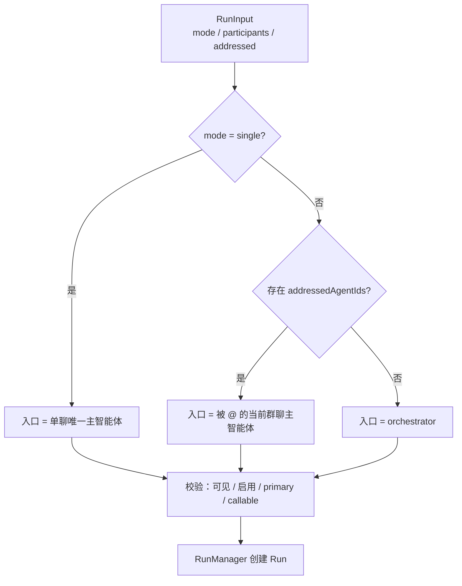

这种设计让会话成员关系归 HubServer 管理，而 Runtime 只接收本次执行所需的快照并校验合法性。由此，Runtime 不需要持久化 IM 成员表，也不会把产品状态和执行状态混在一起。

### 5.4 Preset Agent 与 User Agent

Preset Agent 提供平台内置能力，保证用户不需要先配置复杂 Agent 就能使用核心协作流。当前预设主智能体覆盖调度、编码、审查、写作、规划、部署和外部平台接入。

| 预设 Agent | `executorType` | 主要能力 | 权限边界 |
| --- | --- | --- | --- |
| `orchestrator` | `orchestrator` | 路由、规划、委派、汇总 | 无文件权限，Shell limited，Network full，Deploy none |
| `coder` | `ai-sdk` | 实现、重构、测试 | Filesystem write，Shell limited，Network full |
| `reviewer` | `ai-sdk` | 代码审查、风险分析、测试缺口 | Filesystem read，Shell limited，Network full |
| `writer` | `ai-sdk` | 文档、文案、总结 | Filesystem write，Shell limited，Network full |
| `planner` | `ai-sdk` | 人类可读计划与风险分析 | Delegation terminal，不参与运行时调度 |
| `deploy` | `ai-sdk` | SSH 部署、进度同步、健康检查 | Deploy publish，Shell none，部署命令走专用审批 |
| `opencode` / `claude-code` / `codex` | `external-adapter` | 外部编码 Agent | 保留外部平台原生能力，通过 Adapter 统一事件 |

User Agent 通过 `AgentStore` 持久化到 Runtime 数据目录下的 `agents.json`。创建或更新用户 Agent 时，Registry 会校验 id、系统提示词、可选工具、Skill 引用、子智能体和权限策略。当前 CRUD 版本对用户自定义 Agent 保持保守：不允许用户 Agent 申请 Shell、Network 或 Deploy 权限；如果选择文件工具，`permissionPolicy.filesystem` 必须覆盖工具所需的最低权限。

这套约束让用户自定义 Agent 能扩展协作体验，但不会绕过 Runtime 对高风险能力的集中治理。

### 5.5 RunManager 执行生命周期

`RunManager` 是 Agent Runtime 的执行编排容器。它不负责长期产品数据落库，而是负责一次 Runtime Run 从创建、执行、等待、恢复到终态事件输出的全过程。HubServer 将用户消息、会话模式、会话成员、历史消息、workspace snapshot、诊断开关和外部 session hints 传入 Runtime；Runtime 则把这些输入转化为执行上下文与事件流。

```mermaid
sequenceDiagram
  participant H as "HubServer"
  participant RM as "RunManager"
  participant ER as "EntryResolver"
  participant WS as "WorkspaceService"
  participant EX as "AgentExecutor"
  participant EV as "RunEvent Stream"

  H->>RM: "createRun(RunInput)"
  RM->>ER: "resolve(mode, participants, addressed)"
  ER-->>RM: "entryAgentIds / entryReason"
  RM->>WS: "create workspace session"
  RM->>RM: "build environment snapshot promise"
  RM->>RM: "capture workspace diff baseline promise"
  RM->>RM: "create RuntimePermissionService"
  RM-->>H: "queued RunRecord"
  RM->>EV: "run.started"
  RM->>EV: "agent.entry.resolved"
  RM->>EX: "execute(context)"
  EX-->>EV: "agent / message / tool / permission / question events"
  RM->>RM: "flush title system agent"
  RM->>RM: "summarize workspace diff"
  RM-->>EV: "run.completed / run.failed / run.cancelled"
```

`RunManager` 在创建 Run 时会立即建立几类执行态资源：

| 执行态资源 | 作用 |
| --- | --- |
| `AbortController` | 支持取消当前 Run，并取消等待中的审批或问题 |
| `WorkspaceService` | 将 Run 绑定到显式 workspace snapshot，文件工具和 diff 都通过该会话访问 |
| `RuntimeEnvironmentSnapshot` | 在 Run 开始时捕获时间、OS、Shell、workspace 和 Git 摘要，并复用到委派/续跑 |
| `WorkspaceDiffBaseline` | Run 开始前捕获 git baseline，终态时计算本轮变更摘要 |
| `RuntimePermissionService` | 管理工具审批、外部权限请求和 approval continuation |
| `continuations` / `questionRequests` | 保存审批等待、`question` 等延迟交互的续跑帧 |
| `messageIndexById` | 为流式消息、工具事件和 replay 提供稳定消息序号 |

执行过程中的一个关键设计是 Continuation Frame。审批或 `question` 不会简单让 Run 失败，而是把当前执行分支挂起，等待 HubServer/Web 返回用户决策；用户批准或回答后，Runtime 使用同一个 `runId`、同一执行上下文和合成后的 tool-result message 恢复执行。这样，长任务中的安全拦截和用户补充信息都不会破坏原始模型上下文。

### 5.6 Agent Executor

`executorType` 决定 Agent 的实际执行路径。Runtime 使用统一执行器体系把不同来源的智能体封装为同构事件流，使 HubServer 不需要关心事件来自内部模型、Orchestrator、外部 SDK、Instruct 创建流程还是测试执行器。

```mermaid
flowchart TB
  DEF["AgentDefinition.executorType"] --> SEL["RunManager.resolveExecutor"]
  SEL --> ORCH["orchestrator<br/>OrchestratorExecutor"]
  SEL --> SDK["ai-sdk<br/>AiSdkExecutor"]
  SEL --> EXT["external-adapter<br/>ExternalAdapterExecutor"]
  SEL --> MOCK["mock<br/>MockExecutor"]

  ORCH --> CTX["AgentExecutionContext"]
  SDK --> CTX
  EXT --> CTX
  MOCK --> CTX
  CTX --> EV["统一 RunEvent"]

  IDEF["instruct-agent"] --> IRM["InstructRunManager"]
  IRM --> IEX["InstructAgentExecutor"]
  IEX --> EV

  EV --> HUB["HubServer<br/>Raw 保存 / 结构化投影"]
```

| 执行器 | 适用 Agent | 关键职责 |
| --- | --- | --- |
| `OrchestratorExecutor` | `orchestrator` | 调用 AI SDK，显式开启内部工具，支撑计划生成和任务委派 |
| `AiSdkExecutor` | 内部主智能体、隐藏子智能体、用户 Agent、Deploy | 调用模型，装配工具、Skill、MCP、环境快照、权限和 `question` |
| `ExternalAdapterExecutor` | OpenCode、Claude Code、Codex | 校验 workspace，选择外部 Adapter，区分 `conversation-visible` 与 `delegated-task` session scope |
| `MockExecutor` | 测试或演示路径 | 输出可控事件，验证上层持久化和投影 |
| `InstructAgentExecutor` | `instruct-agent` 专用链路 | 通过 `question` 与 `save_agent` 收集信息并创建用户 Agent |

`AiSdkExecutor` 与 `OrchestratorExecutor` 都使用首包前降级策略：如果绑定模型解析失败、provider/model 不可用，或者模型在首个用户可见事件前失败，Runtime 可以切换到系统默认模型重试一次。降级边界以是否已经对外发出 `message.*`、`tool.*`、`reasoning.*`、`permission.*` 或 `question.*` 为准；一旦已有可见事件，Runtime 不再悄悄换模型，避免用户看到前后不一致的执行过程。

执行器的共同产物是 RunEvent，而不是最终字符串。这样 HubServer 可以统一保存 raw payload、投影 Message/Artifact/Permission/Task/Deployment，Web 则统一消费 Timeline 和工作台状态。

### 5.7 上下文装配：模型、工具、Skill/MCP 与权限

每次执行前，Runtime 会把 `AgentDefinition`、Run 输入和执行态资源装配为 `AgentExecutionContext`。这个上下文是执行器、工具系统、权限服务、工作区服务和外部 Adapter 的共同边界。

```mermaid
flowchart LR
  DEF["AgentDefinition"] --> CTX["AgentExecutionContext"]
  IN["RunInput<br/>history / userMessage / workspace"] --> CTX
  SNAP["RuntimeEnvironmentSnapshot"] --> CTX
  WS["WorkspaceService"] --> CTX
  PERM["RuntimePermissionService"] --> CTX
  SKILL["Skill Content Resolution"] --> CTX
  MCP["MCP Runtime Context"] --> CTX
  TOOL["RuntimeToolRegistry"] --> CTX

  CTX --> PROMPT["Prompt Assembly<br/>system / messages / task / pinned / env"]
  CTX --> TOOLS["AI SDK ToolSet<br/>declared tools + dynamic MCP tools"]
  CTX --> EVENTS["RunEvent 输出"]
```

上下文装配体现了 Agent Runtime 的几个重要工程判断：

| 机制 | 设计作用 |
| --- | --- |
| 模型解析 | 内部主智能体使用自身绑定或系统默认模型；隐藏子智能体继承直接调用方模型来源；外部 Agent 不进入该模型策略 |
| Prompt assembly | 系统提示词、Agent 描述、委派任务、父 Agent、环境快照、置顶消息、Skill、MCP 上下文共同组成模型可见背景 |
| 工具构建 | `RuntimeToolRegistry` 只把 Agent 声明可见且权限满足的工具暴露给 AI SDK；Orchestrator 才开启内部工具 |
| 动态 MCP tool | trusted workspace MCP tool 只注入内部可见主智能体和 Orchestrator，不注入隐藏子智能体或外部 Agent |
| 权限续跑 | 工具审批进入 `RuntimePermissionService`，通过 continuation frame 回到同一执行分支 |
| Question 续跑 | `question` 是 deferred interaction tool，模型调用后由 Runtime 等待用户回答并合成 tool-result 恢复 |

这些机制让 Runtime 可以把“模型调用”“工具执行”“权限审批”“用户补充信息”和“外部能力注入”放在同一条执行上下文中处理，同时仍然保持后续章节中 Provider、Tool、Skill/MCP 和安全体系的独立边界。

### 5.8 Runtime Environment Snapshot

Runtime Environment Snapshot 是 Run 开始时捕获的一份执行环境切片。它会进入内部 AI SDK 与 Orchestrator 的 system prompt，用于让模型理解当前运行时间、宿主环境、工作区状态、Shell 工具语义和 Git 摘要。它不作为浏览器 API 直接暴露，也不替代 Workspace Diff；它服务的是模型执行稳定性。

| 快照维度 | 作用 |
| --- | --- |
| 时间与时区 | 让模型理解当前执行时间，而不是依赖提示词外部上下文 |
| OS 与 Shell | 明确 `bash` 工具实际运行环境和命令约束 |
| Workspace | 标记是否绑定工作区、当前 cwd、工作区绝对路径和 root label |
| Git 状态 | 标记是否为 Git 仓库、分支、dirty 状态、ahead/behind 和变更统计 |
| 工具提示 | 提醒内部智能体优先使用 workspace tools，仅在必要时使用 Shell |

测试中已经覆盖无工作区、非 Git 工作区、真实 Git 工作区、Prompt 注入，以及委派任务/审批恢复共享同一快照等场景。这个设计的价值在于降低长链路执行中的环境漂移：一个 Run 即使经历审批等待、用户问答、Orchestrator 委派或恢复执行，也应基于同一份运行时事实继续，而不是在中途重新推断当前环境。

### 5.9 Instruct Agent 独立创建链路

Instruct Agent 是 AgentHub 的对话式智能体创建能力。它使用 `instruct-agent` 作为可见系统 Agent，但执行链路不进入普通 `RunManager`，而是由 `InstructRunManager`、`InstructAgentExecutor` 和 `InstructToolRegistry` 独立承载。

```mermaid
sequenceDiagram
  participant W as "Web"
  participant R as "InstructRunManager"
  participant E as "InstructAgentExecutor"
  participant Q as "question tool"
  participant S as "save_agent tool"
  participant A as "AgentRegistry / AgentStore"

  W->>R: "create instruct run"
  R->>E: "execute instruct-agent"
  E-->>Q: "信息不足时请求用户回答"
  Q-->>W: "question.requested"
  W->>R: "answer question"
  R->>E: "resume with tool-result"
  E-->>S: "信息完整后保存 Agent"
  S->>A: "创建用户自定义 Agent"
  A-->>S: "AgentDefinition"
  E-->>W: "message.completed / run.completed"
```

Instruct 链路的安全策略比普通用户 Agent CRUD 更保守。`save_agent` 只允许创建内部 `ai-sdk` 用户主智能体；工具白名单限制在 workspace 文件工具范围内；Shell、Network、Deploy 权限均不可由首版 Instruct 流程授予；系统预设 id 与 `instruct-agent` 自身 id 也被保留，不能被用户覆盖。

| 设计点 | 说明 |
| --- | --- |
| 独立注册表 | `InstructAgentRegistry` 只维护 `instruct-agent`，不混入普通 Agent 列表调度 |
| 独立 Run 管理 | `InstructRunManager` 管理 instruct run、事件订阅、问题续跑和取消 |
| 专用工具注册 | `InstructToolRegistry` 仅暴露 `question` 与 `save_agent` 所需能力 |
| 保守授权 | 创建出的用户 Agent 不能申请 Shell、Network、Deploy 权限，也不能配置 bash 规则 |
| 统一事件 | 虽然链路独立，仍使用 `run.*`、`message.*`、`tool.*`、`question.*` 等 RunEvent 类型 |

通过这种设计，AgentHub 能把“创建一个新 Agent”也做成对话体验，同时避免让创建流程变成普通 Orchestrator 可委派任务，降低权限扩散和上下文污染风险。

## 6. Orchestrator 编排设计

本节依据 `docs/architecture/AGENT_ARCHITECTURE.md`、`docs/architecture/AGENT_TOOLS.md`、`agent-runtime/src/runtime/orchestrator-executor.ts`、`agent-runtime/src/runtime/entry-resolver.ts`、`agent-runtime/src/runtime/tools/write-plan-tool.ts`、`agent-runtime/src/runtime/tools/run-task-tool.ts`、`agent-runtime/src/runtime/run-manager.ts` 与 `task-file-lock-manager.ts` 编写。

AgentHub 的 Orchestrator 不是独立于 Agent 体系之外的“超级控制层”，而是一个特殊的系统预设主智能体：它拥有默认群聊入口语义，使用 `OrchestratorExecutor` 执行，并通过 `write_plan` 与 `run_task` 两个内部工具把“计划生成”和“任务委派”显式事件化。这样既保留了 IM 群聊体验，又避免把多 Agent 编排变成不可追踪的模型内部推理。

```mermaid
flowchart TB
  U["用户消息"] --> ER["EntryResolver<br/>解析本轮入口"]
  ER --> ORCH["orchestrator<br/>OrchestratorExecutor"]
  ORCH --> PLAN["write_plan<br/>结构化计划"]
  ORCH --> TASK["run_task<br/>单任务委派"]

  TASK --> RM["RunManager.executeTask"]
  RM --> LOCK["TaskFileLockManager<br/>可选文件锁"]
  RM --> TARGET["目标 Agent<br/>群聊主智能体 / 隐藏子智能体"]
  TARGET --> EVENTS["message / tool / task RunEvent"]

  PLAN --> HUB["HubServer 投影<br/>RunPlan / 会话状态"]
  EVENTS --> HUB
```

该设计的核心是：计划是可渲染数据，委派是内部工具调用，任务执行是 RunEvent 事实链路。Orchestrator 的自然语言回复只负责补充协调价值，不承担隐藏状态存储。

### 6.1 入口解析

Orchestrator 是否参与一次 Run，首先由 `EntryResolver` 根据 `RunInput` 决定。HubServer 传入当前会话模式、参与智能体和用户显式 `@` 的目标；Runtime 只对这份执行态快照做合法性校验，不持久化会话成员关系。

| 场景 | 入口解析结果 | 关键约束 |
| --- | --- | --- |
| 单聊 | 单聊唯一主智能体 | 参与者必须唯一，不能是 `orchestrator`，显式 addressed 只能指向该参与者 |
| 群聊未 `@` | `orchestrator` | 群聊必须包含 `orchestrator` |
| 群聊显式 `@` | 被 `@` 的主智能体 | 当前阶段只支持一个 addressed agent，且目标必须属于当前群聊 |
| 非法成员 | 拒绝创建 Run | 成员必须是 enabled、visible、primary，且 `entryPolicy != "not-callable"` |

```mermaid
flowchart TD
  RI["RunInput"] --> M{"mode"}
  M -->|"single"| S["校验唯一参与者"]
  S --> SOK["entryReason = single_participant"]
  M -->|"group"| G{"addressedAgentIds 为空?"}
  G -->|"是"| O["entryReason = group_default_orchestrator"]
  G -->|"否"| A["entryReason = group_addressed_agent"]
  O --> RUN["创建 Runtime Run"]
  A --> RUN
  SOK --> RUN
```

这种入口解析使“用户直接找某个 Agent”与“让 Orchestrator 组织协作”成为同一套运行协议下的两种路由结果。Orchestrator 只在群聊默认入口或用户明确选中它时介入，避免用户显式 `@ coder`、`@ reviewer` 或外部 Agent 时仍被强行绕回总控。

### 6.2 `write_plan`

`write_plan` 是 Orchestrator 的结构化计划写入工具。它不执行任务，也不改变工作区；它的价值是把“模型打算怎么协作”变成 HubServer 与 Web 可以直接投影和渲染的数据，而不是要求前端从自然语言中解析计划。

当前工具输入由 `intent`、`summaryInstruction` 和 `tasks` 组成；每个 task 包含目标 Agent、指令、期望输出、风险等级、依赖关系和当前状态。

```ts
type WritePlanInput = {
  intent: string
  summaryInstruction: string
  tasks: Array<{
    taskId: string
    title: string
    targetAgentId: string
    instruction: string
    expectedOutput: string
    riskLevel: "low" | "medium" | "high"
    dependsOn: string[]
    status: "pending" | "in_progress" | "completed" | "failed" | "cancelled"
  }>
}
```

`write_plan` 的执行结果进入 `tool.completed(toolName="write_plan")`，其中 `data.plan` 是当前计划事实。设计上同一 Run 可以多次调用 `write_plan`：第一次生成计划，后续在委派完成、失败或取消后使用相同 `taskId` 更新状态。HubServer 与 Web 应以最后一个成功的 `write_plan` 结果作为当前计划，而不是依赖私有事件或对 assistant 文本做解析。

```mermaid
sequenceDiagram
  participant O as "Orchestrator"
  participant T as "write_plan"
  participant H as "HubServer"
  participant W as "会话状态工作台"

  O->>T: "写入 intent / tasks / dependsOn / status"
  T-->>H: "tool.completed(data.plan)"
  H->>H: "投影 RunPlan / RunPlanTask"
  H-->>W: "渲染任务队列和状态"
  O->>T: "任务完成后用相同 taskId 更新 status"
```

### 6.3 `run_task`

`run_task` 是 Orchestrator 的内部任务委派原语。一个 `run_task` 调用只表示“让一个目标 Agent 执行一项明确任务”，不表示整张 DAG，也不是可被前端直接调用的 RPC。

当前输入包含 `targetAgentId`、`title`、`instruction`、`expectedOutput`、`requiredCapabilities`、`riskLevel`、`dependsOn`、`lockPaths` 与可选上下文。`dependsOn` 用于表达计划和任务之间的依赖关系；`lockPaths` 用于在可能写同一文件时声明精确文件锁。

```mermaid
flowchart LR
  A["task_a<br/>explore<br/>只读发现"] --> C["task_c<br/>coder<br/>实现修改"]
  B["task_b<br/>reviewer<br/>风险检查"] --> D["task_d<br/>writer<br/>更新文档"]
  C --> E["task_e<br/>reviewer<br/>复核变更"]
  D --> E
```

上图展示的是 `dependsOn` 表达的任务关系。需要注意的是，当前实现没有引入独立外置 DAG 调度器；依赖关系主要由 Orchestrator 在提示词约束下决定调用顺序，并由 Runtime 写入任务输入、任务事件和计划投影。Runtime 负责校验目标、执行目标 Agent、记录任务事件、处理取消和文件锁冲突，为后续更强 DAG 调度保留结构化基础。

目标 Agent 的选择也有明确边界：

| 目标类型 | 允许条件 |
| --- | --- |
| 群聊可见主智能体 | 只能由 `orchestrator` 委派，目标必须属于当前 `participantAgentIds`，且可见、启用、可调用 |
| 隐藏子智能体 | 必须在源 Agent 的 `allowedSubagents` 中，且目标为 `delegated-only` |
| 源 Agent 自身 | 不允许自委派 |
| 非参与主智能体 | 不允许跨会话临时拉入 |

### 6.4 任务生命周期事件

`run_task` 工具事件和任务生命周期事件是两层不同事实：工具事件说明 Orchestrator 调用了内部工具，任务事件说明目标 Agent 的真实执行状态。`RunManager.executeTask` 负责后者，它会先发出 `task.started`，再解析目标、申请锁、执行目标 Agent，最后根据结果发出 `task.completed` 或 `task.failed`。

```mermaid
sequenceDiagram
  participant O as "Orchestrator"
  participant RT as "run_task tool"
  participant RM as "RunManager.executeTask"
  participant L as "TaskFileLockManager"
  participant A as "Target Agent"
  participant E as "RunEvent"

  O->>RT: "run_task(input)"
  RT-->>E: "tool.started"
  RT->>RM: "executeTask(task)"
  RM-->>E: "task.started"
  RM->>L: "tryAcquire(lockPaths)"
  RM->>A: "execute AgentExecutionContext"
  A-->>E: "message / tool / permission events"
  RM-->>E: "task.completed 或 task.failed"
  RT-->>E: "tool.completed 或 tool.failed"
```

任务事件携带 `taskId`、`targetAgentId`、`dependsOn`、`parentTaskId`、`groupId` 与 task 详情。子任务内部产生的消息、工具、权限或外部 Adapter 事件会继承任务上下文，使前端可以把它们聚合到任务卡片或对应 Agent 气泡中，而不是把内部执行过程渲染成无归属日志。

### 6.5 并行调度

Orchestrator 的并行能力来自两个层面：模型可以在一次工具调用阶段发起多个 `run_task`，Runtime 工具执行层可以处理并发工具调用；同时，计划中的 `dependsOn` 为哪些任务可并行、哪些任务需串行提供结构化依据。

当前实现的设计取舍是轻量而可审计：Orchestrator 负责根据 `dependsOn` 和任务风险组织调用顺序，Runtime 负责在每个 `run_task` 进入执行时校验目标、记录事件、应用文件锁和响应取消。这样避免首版引入复杂调度器，同时保留计划、任务和事件上的依赖表达。

| 并行场景 | 处理方式 |
| --- | --- |
| 只读探索与独立总结 | 可以并行委派，通常无需 `lockPaths` |
| 已知不同文件写入 | 可以并行委派，但应声明各自 `lockPaths` |
| 写同一文件或强耦合接口 | 应通过 `dependsOn` 串行，或先委派只读探索再确定写入边界 |
| 文件锁冲突 | Runtime 返回 `TASK_FILE_LOCK_CONFLICT`，Orchestrator 应更新计划并改为串行或解释阻塞 |

这种方式让并行不依赖“模型自觉不冲突”。即使 Orchestrator 发起了不合理并行，Runtime 的文件锁也能在已知写入路径上给出结构化失败。

### 6.6 声明式文件锁

声明式文件锁是 Orchestrator 并行委派的风险控制底座。`run_task.lockPaths` 必须是 workspace-relative 精确文件路径，不能是绝对路径，不能包含 `..` 越界段，最多 100 个路径，并会统一规范化为 `/` 分隔形式。

`TaskFileLockManager` 使用 `{ workspaceId, path }` 作为锁键，在单 Runtime 进程内记录活跃任务持有的文件锁。目标 Agent 真正启动前，`RunManager.executeTask` 会先申请锁；如果任一路径已被其他活跃 delegated task 锁定，则本次任务不会启动，并返回结构化错误。

```mermaid
flowchart TD
  T["run_task.lockPaths"] --> V["路径校验<br/>relative / no .. / 去重"]
  V --> W{"Run 绑定 workspace?"}
  W -->|"否"| E1["TASK_FILE_LOCK_WORKSPACE_NOT_BOUND"]
  W -->|"是"| A["tryAcquire(workspaceId, paths)"]
  A --> C{"存在冲突?"}
  C -->|"是"| E2["TASK_FILE_LOCK_CONFLICT"]
  C -->|"否"| X["执行目标 Agent"]
  X --> R["finally releaseByTask"]
```

该文件锁是本地优先场景下的 advisory lock：它保护 Orchestrator 明确声明的 delegated task 写入边界，不拦截普通单聊 Agent 的文件工具调用，也不强行拦截外部 Agent 对未声明文件的真实写入。因此，Orchestrator 的提示词明确要求：未知写入文件时先委派只读探索，拿到文件列表后再发起带 `lockPaths` 的写入任务。

### 6.7 失败处理

失败处理以结构化事件和任务状态为中心，而不是把错误吞进自然语言回复里。`executeTask` 会把目标不存在、目标不可委派、目标禁用、自委派、文件锁缺失 workspace、文件锁冲突、执行取消和普通执行异常统一转换为 `TaskExecutionError`，再输出 `task.failed` 和 `TaskExecutionResult`。

| 失败类别 | 代表错误码 | Runtime 行为 | Orchestrator 后续动作 |
| --- | --- | --- | --- |
| 委派边界错误 | `TASK_TARGET_NOT_ALLOWED`、`TASK_SOURCE_CANNOT_DELEGATE` | 不启动目标 Agent，输出 `task.failed` | 更新计划，选择合法目标或解释无法委派 |
| 文件锁错误 | `TASK_FILE_LOCK_WORKSPACE_NOT_BOUND`、`TASK_FILE_LOCK_CONFLICT` | 不启动目标 Agent，返回冲突详情 | 改为串行、等待、重试或拆分任务 |
| 执行取消 | `TASK_EXECUTION_ABORTED` | 返回 `cancelled` 状态 | 结束当前编排或提示用户已取消 |
| 工具/权限/模型失败 | 由子执行事件携带 | 保留子事件并生成失败摘要 | 根据错误继续降级、提问或给出风险说明 |

由于可见主智能体的回复会作为自己的消息进入聊天流，Orchestrator 在汇总时不应复述这些可见输出。它只需要补充协调状态、未解决风险、下一步建议或极短完成确认；隐藏子智能体的输出才需要由 Orchestrator 摘要给用户。

## 7. Provider 与 Model 系统

本节依据 `docs/architecture/PROVIDER_MODEL_DESIGN.md`、`agent-runtime/src/provider/`、`agent-runtime/src/runtime/model-resolver.ts`、`agent-runtime/src/runtime/system-model-settings.ts`、`agent-runtime/src/routers/providers.ts`、`agent-runtime/src/routers/settings.ts` 与 Agent 模型绑定路由实现编写。Provider/Model 系统的目标，是把 models.dev 的供应商与模型目录、本地用户配置、系统默认模型、Agent 模型绑定和 AI SDK 实例化连接成一条可校验的模型解析链。

```mermaid
flowchart TB
  MD["models.dev /api.json"] --> CM["CatalogManager<br/>缓存目录"]
  CM --> PS["ProviderService<br/>标准化 provider/model"]
  UC["providers.json<br/>用户 overlay"] --> PS
  PS --> PI["ProviderInfo / ProviderModel"]

  PI --> SYS["SystemModelSettings<br/>系统默认模型"]
  PI --> AB["AgentModelBinding<br/>Agent 模型绑定"]
  SYS --> MR["model-resolver"]
  AB --> MR
  MR --> SDK["AI SDK Provider Instance<br/>OpenAI / Anthropic / Compatible"]
  SDK --> EX["AiSdkExecutor / OrchestratorExecutor"]
```

这套设计让模型选择不再只是“字符串配置”。每个模型都有 provider、协议、上游模型 id、上下文长度、输出长度、工具能力、视觉能力、推理能力、temperature 支持、启用状态和来源信息，Runtime 可以据此决定某个 Agent 是否能安全进入工具调用或编排路径。

### 7.1 models.dev 目录接入

AgentHub 以 models.dev 作为预设 Provider/Model 元数据基线。`CatalogManager` 拉取并缓存 `https://models.dev/api.json`，`ProviderService` 再将原始目录转换为内部 `ProviderInfo` 与 `ProviderModel`。

| models.dev 字段 | 内部字段 | 设计用途 |
| --- | --- | --- |
| provider `id` / `name` | `ProviderInfo.id` / `name` | 供应商身份与展示名称 |
| provider `api` | `ProviderInfo.api_base` | 默认 API endpoint |
| provider `npm` | `ProviderInfo.api_protocol` | 推导 OpenAI、Anthropic 或 OpenAI Compatible 协议 |
| model `id` | `ProviderModel.upstream_id` | 真正传给上游 API 的模型名 |
| model `limit.context/output` | `context_length` / `output_length` | Prompt 与输出预算依据 |
| model `tool_call` | `supports_tools` | 判断 Orchestrator、工具调用和系统默认模型是否合法 |
| model `reasoning` | `supports_reasoning` | 支撑推理能力展示与后续策略选择 |
| model `attachment` / `modalities.input` | `supports_vision` | 判断是否支持图片等多模态输入 |
| model `cost` | `ModelCost` | 为后续成本展示和统计预留 |

当前实现会过滤 `npm` 无法映射到受支持协议的 Provider；缺少 `npm` 时按 OpenAI Compatible 处理。这使目录既能覆盖主流原生供应商，也能兼容大量 OpenAI 协议兼容服务。

### 7.2 CatalogManager

`CatalogManager` 负责 models.dev 目录的缓存、刷新和回退。它使用 Runtime 数据目录下的 `catalog.json` 保存原始目录，不在保存时提前转换结构；这样上游目录变化仍可被后续标准化逻辑统一处理。

```mermaid
flowchart TD
  GET["catalog.get(forceRefresh?)"] --> MEM{"内存缓存有效?"}
  MEM -->|"是"| OK["返回 memoryCache"]
  MEM -->|"否"| FILE{"catalog.json 存在且 TTL 未过期?"}
  FILE -->|"是"| LOAD["读取并校验本地文件"]
  FILE -->|"否"| NET["fetch models.dev/api.json"]
  LOAD --> OK
  NET -->|"成功"| SAVE["写入 catalog.json 并返回"]
  NET -->|"失败"| EMPTY["返回空目录 {}"]
```

缓存策略体现了本地优先应用的取舍：正常情况下模型目录可以从本地缓存快速恢复；目录过期或用户手动刷新时再访问网络；首次启动且网络不可用时返回空预设目录，用户仍可通过自定义 Provider 使用兼容模型。

### 7.3 ProviderService

`ProviderService` 是 Runtime 内部的 Provider/Model 事实视图。初始化时，它先从 `CatalogManager` 获取目录，再将 models.dev Provider 标准化为内部结构，最后加载 `providers.json` 用户配置并执行 overlay 合并。

```mermaid
sequenceDiagram
  participant C as "CatalogManager"
  participant P as "ProviderService"
  participant F as "providers.json"
  participant R as "Runtime API"

  P->>C: "catalog.get()"
  C-->>P: "ModelsDevCatalog"
  P->>P: "fromModelsDevProvider / fromModelsDevModel"
  P->>F: "loadUserConfig()"
  F-->>P: "UserConfig"
  P->>P: "applyUserConfig"
  R->>P: "listProviders / getModel / update config"
```

ProviderService 对外提供的主要能力如下：

| 能力 | 代表接口 | 作用 |
| --- | --- | --- |
| 目录查询 | `listProviders`、`getProvider`、`getModel`、`getAvailableModels` | 为设置页、模型选择器和模型解析提供统一视图 |
| Provider 配置 | `updateProviderConfig` | 保存 API key、启用状态和 endpoint override |
| 模型配置 | `updateModelConfig` | 启用或禁用某个模型 |
| 自定义 Provider | `addCustomProvider`、`updateCustomProvider`、`removeCustomProvider` | 接入目录外或私有 OpenAI Compatible 服务 |
| 目录刷新 | `refreshCatalog` | 强制重新拉取 models.dev 并重新应用用户配置 |

这里的关键设计是“目录基线”和“用户可用性”分离：models.dev 提供能力元数据，用户配置决定哪些 Provider/Model 在本机可调用。

### 7.4 用户配置 Overlay

用户配置保存在 Runtime 数据目录下的 `providers.json`。对预设 Provider，overlay 只保存 API key、启用状态、API base override 和模型启用状态；对自定义 Provider，overlay 同时保存名称、endpoint、API key、启用状态和自定义模型。

```json
{
  "openai": {
    "api_key": "sk-...",
    "enabled": true,
    "models": {
      "gpt-4o": { "enabled": true }
    }
  },
  "my-compatible": {
    "name": "My Compatible Provider",
    "api_base": "https://example.com/v1",
    "api_key": "key",
    "enabled": true,
    "models": {
      "my-model": {
        "upstream_id": "my-model",
        "supports_tools": true
      }
    }
  }
}
```

保存时，`ProviderService` 会从当前内存视图重新生成用户配置文件：预设 Provider 只保存用户覆盖项，自定义 Provider 保存完整必要配置。这样目录更新不会直接修改用户文件，用户配置也不会污染上游目录缓存。

### 7.5 自定义 Provider

自定义 Provider 用于接入目录外供应商、自建代理或私有推理服务。当前实现将自定义 Provider 统一视为 `openai_compatible` 协议，并允许用户声明模型名、上游模型 id、上下文长度、工具能力和视觉能力。

| 字段 | 说明 |
| --- | --- |
| `id` / `name` | 本地唯一 Provider 标识与展示名称 |
| `api_base` | OpenAI Compatible endpoint |
| `api_key` | 本地调用凭据，可为空但不可用模型解析会失败 |
| `models` | 自定义模型集合 |
| `supports_tools` / `supports_vision` | 影响 Agent 工具调用与多模态能力判断 |

自定义 Provider 的价值在于扩展性：它不要求 AgentHub 为每个供应商写一套新协议适配，只要该服务兼容 OpenAI 风格接口，就能复用同一套模型选择、系统默认模型校验、Agent 绑定和 AI SDK 调用链路。

### 7.6 模型能力元数据

模型能力元数据直接影响 Runtime 能否安全执行某类 Agent。当前 `ProviderModel.capabilities` 包含 `supports_tools`、`supports_vision`、`supports_reasoning` 和 `temperature`。

| 能力 | 影响范围 |
| --- | --- |
| `supports_tools` | Orchestrator 必须使用支持 tools 的模型；系统默认模型保存时也要求支持 tools |
| `supports_vision` | 判断用户图片消息是否适合传给该模型 |
| `supports_reasoning` | 支撑推理能力展示、模型选择和后续诊断 |
| `temperature` | 决定执行器调用 AI SDK 时是否传入 temperature |
| `context_length` / `output_length` | 控制模型上下文容量和 max output token |

因此，模型选择不是简单下拉框选择字符串，而是参与 Runtime 执行路径判断的能力契约。模型元数据越稳定，Orchestrator、工具调用、Instruct 和系统智能体的执行就越可控。

### 7.7 系统默认模型

系统默认模型保存在 `system-model-settings.json`，用于系统预设主智能体缺少独立模型绑定时的默认来源，也用于首个用户可见事件前的降级尝试。`SystemModelSettingsService` 保存模型前会做严格校验：

| 校验项 | 不满足时的含义 |
| --- | --- |
| Provider 存在 | 不能指向不存在的供应商 |
| Provider enabled | 不能使用被用户禁用的供应商 |
| Provider 有 API key | 不能保存不可调用的默认模型 |
| Model 存在 | 不能指向目录中不存在的模型 |
| Model enabled | 不能使用被禁用的模型 |
| Model supports tools | 默认模型必须能支撑 Orchestrator 与工具型系统能力 |

系统默认模型的设计让系统预设 Agent 可以开箱使用，但又不牺牲安全校验。用户自定义 Agent 缺少绑定时仍会返回 `MODEL_BINDING_MISSING`，不会自动继承系统默认模型，避免用户 Agent 在未明确配置时获得隐式模型能力。

### 7.8 Agent 模型绑定

Agent 模型绑定由 `AgentModelBindingStore` 保存，并在 `AgentRegistry.initialize()` 阶段合并到 Agent 定义。绑定只允许作用于 enabled、visible、primary、非 external，且 `executorType` 为 `ai-sdk` 或 `orchestrator` 的内部主智能体；外部 Agent 与隐藏子智能体不参与这套绑定层。

模型解析链路如下：

```mermaid
flowchart TD
  AG["AgentDefinition"] --> SUB{"agent.tier = subagent?"}
  SUB -->|"否"| SELF["使用自身 modelRef"]
  SUB -->|"是"| SRC["使用直接调用方 modelRef"]
  SELF --> BOUND{"有绑定?"}
  SRC --> BOUND
  BOUND -->|"有"| VALID["校验 provider / model enabled"]
  BOUND -->|"无"| SYS{"系统预设主智能体可用系统默认?"}
  SYS -->|"是"| SD["使用 systemDefaultModel"]
  SYS -->|"否"| ERR["MODEL_BINDING_MISSING"]
  VALID --> SDK["创建 AI SDK LanguageModel"]
  SD --> SDK
```

隐藏子智能体继承直接调用方模型来源，但只继承模型选择，不继承调用方工具、权限、系统提示词或身份。系统预设主智能体缺少绑定时可以使用系统默认模型；用户自定义 Agent 缺少绑定则要求用户显式配置。

`AiSdkExecutor`、`OrchestratorExecutor` 与 `InstructAgentExecutor` 还支持首包前降级：如果绑定模型解析失败、provider/model 不可用，或者 stream 在首个用户可见事件前失败，可以用系统默认模型重试一次。用户已经看到 `message.*`、`tool.*`、`reasoning.*`、`permission.*` 或 `question.*` 后，不再切换模型，避免输出过程发生语义断裂。

### 7.9 外部 Agent SDK 模型配置

外部 Agent 的模型配置不进入内部 `ProviderService` 模型解析链。OpenCode、Claude Code 和 Codex 作为外部 Agent，通过 `ExternalAgentSettingsStore` 保存轻量覆盖项，并由对应 Adapter 在调用外部 SDK 时使用。

| 外部 Agent | 配置项 | 设计边界 |
| --- | --- | --- |
| OpenCode | provider/model、executionAgent | 由 OpenCode Adapter 使用，不拆成 AgentHub 内部 Provider/Model |
| Claude Code | model、permissionMode | 保留 Claude Code 原生能力与权限模式 |
| Codex | model | 只作为 Codex SDK thread start/resume 的运行参数 |

这种设计避免 AgentHub 接管外部平台的全局配置。外部平台在产品中是聊天参与者，在执行层是 Adapter；内部 Provider/Model 系统只服务 AgentHub 自有 AI SDK 执行器和系统默认模型链路。

## 8. 外部 Agent Adapter

本节依据 `docs/external_agents/EXTERNAL_AGENT_ADAPTERS.md`、`OPENCODE_ADAPTER.md`、`CLAUDE_CODE_ADAPTER.md`、`CODEX_ADAPTER.md`，以及 `agent-runtime/src/runtime/external-adapters/` 下的 Adapter 实现编写。外部 Agent Adapter 是 AgentHub 区别于普通“模型供应商配置平台”的核心能力：它不是把 OpenCode、Claude Code、Codex 拆成模型、工具、Skill、MCP 的配置碎片，而是把这些已经具备完整工作流能力的外部平台封装为 AgentHub 中可对话、可编排、可审计的“聊天参与者”。

```mermaid
flowchart TB
  Web["Web 群聊 / 单聊"] --> Hub["HubServer<br/>会话、成员、上下文与 Session 映射"]
  Hub --> Runtime["Agent Runtime<br/>ExternalAdapterExecutor"]

  Runtime --> Registry["ExternalAdapterRegistry"]
  Registry --> OC["OpenCodeAdapter"]
  Registry --> CC["ClaudeCodeAdapter"]
  Registry --> CX["CodexAdapter"]

  OC --> OCP["OpenCode SDK / Server"]
  CC --> CCP["Claude Code SDK"]
  CX --> CXP["Codex SDK Thread"]

  OCP --> Events["AgentHub RunEvent"]
  CCP --> Events
  CXP --> Events

  Events --> Hub
  Hub --> Projection["Message / Permission / Artifact / Diff 投影"]
  Projection --> Web
```

该设计的关键在于“产品身份”和“执行实现”分离。用户在界面中看到的是 Claude Code、Codex、OpenCode 这样的智能体联系人；Runtime 内部看到的是 `ExternalAgentAdapter` 统一接口；外部平台自身仍保留模型选择、原生工具、认证方式、Skill/MCP、插件和内部 session 机制。

### 8.1 Adapter 统一边界

外部 Adapter 的统一边界由 `ExternalAdapterExecutor` 和 `ExternalAgentAdapter` 定义。`ExternalAdapterExecutor` 负责从 Agent 定义中读取 `external.provider`，检查 workspace 绑定，确定 session scope，并把执行交给具体 provider adapter。具体 adapter 只需要实现同一类输入上下文到 `AsyncIterable<RunEvent>` 的转换。

```ts
type ExternalAgentAdapter = {
  provider: "opencode" | "claude-code" | "codex"
  execute(context: ExternalAdapterContext): AsyncIterable<RunEvent>
}

type ExternalSessionScope =
  | "conversation-visible"
  | "delegated-task"
```

这一接口极小，但承载了足够强的边界约束：

| 设计对象 | AgentHub 负责 | 外部平台负责 |
| --- | --- | --- |
| 会话身份 | AgentHub 会话、成员、`@` 入口解析、session hint、handoff summary | provider session/thread 的真实创建、恢复和内部记忆 |
| 执行入口 | 将外部 Agent 作为主智能体执行，接入 Orchestrator 委派 | 具体模型调用、工具执行、平台私有流程 |
| 上下文 | 组装可见历史、pinned 消息、Artifact/Diff 摘要、任务上下文 | 如何把 prompt 消费为平台内部上下文 |
| 权限 | 将外部权限请求桥接为 `permission.*` 事件和聊天审批卡片 | 具体权限类型、许可执行、拒绝后的平台行为 |
| 事件 | 归一为 `message.*`、`tool.*`、`reasoning.*`、`agent.*` 等 RunEvent | provider 原始事件流和私有字段 |
| 产物 | Run 级 Workspace Diff、Artifact、ChangeSet 归因 | 外部平台是否输出私有 diff 或工具日志 |

这种边界避免了两个常见问题：一是 AgentHub 过度接管外部平台配置，导致用户需要在多个系统重复维护模型、Skill 和 MCP；二是外部平台事件直接泄漏到产品层，导致 Web 和 HubServer 被迫理解每个平台的私有协议。

### 8.2 外部 Agent 身份映射

外部平台在 AgentHub 中首先被映射为**可见主智能体**。这意味着用户选择的是“与谁协作”，而不是“调用哪个 SDK”。

| 身份属性 | 外部 Agent 约定 | 设计含义 |
| --- | --- | --- |
| `tier` | `primary` | 可作为会话主参与者，而不是隐藏子智能体 |
| `origin` | `external` | 能力来源是外部平台，配置边界与内部 Agent 区分 |
| `visibility` | `visible` | 回复进入群聊可见消息流 |
| `entryPolicy` | `callable` | 用户可在单聊或群聊中显式调用 |
| `delegationPolicy` | 默认 `terminal` | 默认作为任务终点，不继续调用 AgentHub 子智能体 |
| `executorType` | `external-adapter` | 由 `ExternalAdapterExecutor` 路由到具体平台 |

在群聊中，外部 Agent 的输出应像其他可见主智能体一样成为普通发言，而不是被 Orchestrator 完整转述。Orchestrator 可以补充协调结论、风险说明或下一步建议，但不应复制一遍外部 Agent 已经公开说过的内容。这保证了 IM 范式中的“聊天对象即 Agent”成立：用户能清楚看到每个 Agent 自己做了什么、说了什么。

外部 Agent 当前也有清晰的输入边界。实现中 `assertNoImagePartsForExternalAdapter` 会拒绝图片消息，返回 `MULTIMODAL_NOT_SUPPORTED_BY_ADAPTER`，说明多模态输入尚未被外部 Adapter 承诺为稳定能力。这样的显式失败比静默丢弃图片更适合作为可审计平台行为。

### 8.3 Session Scope：直接对话与委派任务

外部平台通常具有自己的 session 或 thread。如果 AgentHub 简单地把“一个 AgentHub 会话”映射成“一个外部 session”，群聊中的直接对话和 Orchestrator 临时委派就会互相污染。因此，AgentHub 对外部 Agent 使用双 scope 设计。

```mermaid
flowchart LR
  C["AgentHub Conversation"] --> D["conversation-visible session<br/>用户直接单聊 / 群聊 @外部Agent"]
  C --> O["Orchestrator run_task"]
  O --> T1["delegated-task session<br/>任务 A"]
  O --> T2["delegated-task session<br/>任务 B"]

  T1 --> H1["handoff summary"]
  T2 --> H2["handoff summary"]
  H1 --> D
  H2 --> D
```

`ExternalAdapterExecutor` 当前根据是否存在 `context.task` 选择 scope：没有任务上下文时为 `conversation-visible`，存在 Orchestrator 委派任务时为 `delegated-task`。两类 scope 的差异如下：

| Scope | 触发场景 | 上下文特征 | 记忆策略 |
| --- | --- | --- | --- |
| `conversation-visible` | 单聊外部 Agent；群聊中用户显式 `@` 外部 Agent | 用户可见历史、pinned context、公开 Agent 回复、Artifact/Diff 摘要、历史 handoff summary | 维护用户与该外部 Agent 的可见对话语境 |
| `delegated-task` | Orchestrator 通过 `run_task` 委派外部 Agent | task title、instruction、expected output、risk level、必要公共上下文、workspace 摘要 | 任务完成后只通过 handoff summary 桥接，不把原始任务 prompt 注入 direct session |

外部 session link 的结构表达了 provider、agent、scope、conversation、workspace、provider session id、task/run id 和 handoff summary 等信息。HubServer 是这些映射的业务事实来源，Runtime 可以创建或发现 provider session，但不应把映射只保存在内存中。

这套设计兼顾了两种体验：用户直接找外部 Agent 时，它像长期联系人一样记得可见协作脉络；Orchestrator 临时委派时，它像执行一个明确子任务，不把调度 prompt 和窄任务上下文污染长期对话。

### 8.4 Context Bridge 与 Handoff Summary

Context Bridge 解决的是“外部平台不在 AgentHub 数据库里，但必须理解 AgentHub 当前协作上下文”的问题。AgentHub 的原则是：HubServer 管理可见事实，Adapter 负责把事实格式化成外部平台可消费的 prompt 前缀。

```mermaid
flowchart TB
  Hub["HubServer"] --> Packet["ExternalContextPacket"]
  Packet --> Fields["messages / handoffSummaries<br/>cursorCandidate / omitted"]
  Fields --> Adapter["Adapter formatPrompt"]
  Adapter --> Prompt["Provider Prompt Prefix"]
  Prompt --> Provider["OpenCode / Claude Code / Codex"]

  Provider --> Completed["agent.completed"]
  Completed --> Summary["handoffSummary"]
  Summary --> Hub
  Hub --> NextDirect["后续 conversation-visible context"]
```

`ExternalContextPacket` 只包含用户可见事实，不包含 raw RunEvent、reasoning、内部工具原始输入输出、Orchestrator 私有计划或 delegated task 原始 instruction。当前 Runtime 也提供 fallback：如果 HubServer 没有传入 packet，Adapter 会从 `RunInput.history` 中取最近可见 user/assistant 消息构造有界 bootstrap，上限为最近 20 条消息、单条最多 4000 字符。

| 上下文来源 | 是否进入外部 direct context | 原因 |
| --- | --- | --- |
| 用户消息与可见 assistant 消息 | 是 | 属于聊天公共事实 |
| pinned 消息 | 是 | 是用户显式提升的上下文 |
| delegated task handoff summary | 是 | 用摘要桥接先前任务结果 |
| Artifact / Diff 摘要 | 是 | 帮助外部 Agent 理解当前产物状态 |
| Orchestrator 私有计划 | 否 | 属于调度内部信息 |
| 内部工具原始输入输出 | 否 | 容易泄漏实现细节和敏感数据 |
| delegated task 原始 prompt | 否 | 避免污染直接对话 session |

Handoff Summary 是 delegated-task session 与 conversation-visible session 之间的桥。OpenCode、Claude Code、Codex Adapter 在任务完成时都会基于任务标题、目标、风险等级和可见回复生成 summary，并放入 `agent.completed.data.handoffSummary` 以及完成后的 external session link 中。后续用户直接 `@` 同一个外部 Agent 时，HubServer 可以把这些 summary 注入 direct context，让外部 Agent 知道“之前被委派做过什么”，但不继承原始调度 prompt。

### 8.5 外部权限与事件映射

外部 Agent 默认不进入 AgentHub Runtime Tool Registry。它们使用自身平台的原生工具、权限和执行机制。但为了给用户统一的安全体验，Adapter 会把外部平台发出的权限请求桥接为 AgentHub 的 `permission.*` 事件。

```mermaid
sequenceDiagram
  participant P as "外部平台"
  participant A as "Adapter"
  participant PS as "RuntimePermissionService"
  participant H as "HubServer"
  participant W as "Web 审批卡片"

  P->>A: provider permission request
  A->>PS: stageExternalApproval(...)
  PS-->>H: permission.requested RunEvent
  H-->>W: 产品 SSE / replay
  W->>H: approve / deny
  H->>PS: Runtime decision API
  PS-->>A: resolve external waiter
  A-->>P: provider approve / reject
```

外部审批和内部 AI SDK 工具审批的恢复机制不同。内部工具审批需要 continuation frame 恢复原模型分支；外部权限请求则由 `RuntimePermissionService.stageExternalApproval` 创建 waitable external waiter。用户决策后，`decide()` 会发出 `permission.approved` 或 `permission.denied`，并 resolve 对应 waiter，由 Adapter 把结果回传给外部平台。

外部工具事件也会进入 `tool.*` 事件流，但必须保留 provider 边界：

| 映射点 | 处理方式 |
| --- | --- |
| `toolCallId` | 使用 provider 命名空间，例如 `opencode:<id>`、`claude-code:<id>`、`codex:<id>` |
| `toolName` | 保留外部平台原生工具名 |
| `data.externalProvider` | 标记事件来源 |
| `providerSessionId` / `providerToolCallId` | 用于追踪 provider 会话与工具调用 |
| input/output/error | 脱敏后进入事件数据，供 UI 展示 |
| 授权语义 | 不把外部工具误认为 AgentHub 内部 Tool Catalog 权限 |

事件映射的目标是让 Web 复用统一 Timeline、工具卡片和审批卡片，而不是为每个平台创建一套专属 UI。当前映射重点包括：

| 外部事件类别 | AgentHub RunEvent |
| --- | --- |
| 文本流 | `message.delta` / `message.completed` |
| thinking/reasoning | `reasoning.*`，仅当 provider 暴露 |
| 原生工具执行 | `tool.started` / `tool.completed` / `tool.failed` |
| 权限请求 | `permission.requested` / `permission.approved` / `permission.denied` / `permission.cancelled` |
| 用户问答 | `question.*`，当前 Claude Code 已有桥接路径 |
| 会话启动/完成 | `agent.started` / `agent.completed` |
| 执行失败 | 稳定 `ADAPTER_*` 错误码或 `run.failed` |

需要明确的是：如果外部平台自身配置已经允许某些操作且不会发起权限事件，AgentHub 无法在 Adapter 层拦截这些平台内部动作。这属于“用户信任外部平台配置”的边界，文档和 UI 需要将其与 AgentHub 内部 Tool 权限区分开。

### 8.6 OpenCode / Claude Code / Codex Adapter 实现

三个外部平台共享同一套 Adapter 接口与 RunEvent 输出协议，但各自保留平台特性：

| Adapter | Runtime 拓扑 | AgentHub 可控运行参数 | 已接入的统一能力 |
| --- | --- | --- | --- |
| OpenCode | workspace-scoped server + SDK client | OpenCode provider/model、executionAgent | session hint、context bridge、message/reasoning/tool event、permission bridge、handoff summary |
| Claude Code | SDK async generator | model、allowlisted permissionMode | session hint、context bridge、message/tool event、permission bridge、question bridge、handoff summary |
| Codex | SDK thread start/resume | model | session hint、context bridge、message/reasoning/tool event、thread session 更新、handoff summary |

三者的共同实现策略包括：

- **统一入口**：全部通过 `ExternalAdapterExecutor` 进入，不让 Web 或 HubServer 直接调用 provider SDK。
- **统一上下文**：优先使用 HubServer 提供的 `externalContext` packet；缺失时使用 Runtime fallback bounded context。
- **统一消息容器**：Adapter 为一次外部 assistant 输出创建 `messageId`，并让文本、工具、权限、问答等事件尽量复用该容器。
- **统一来源标记**：外部模型信息放入 `data.externalModel`，外部工具与权限放入 `data.externalProvider` 及 provider metadata。
- **统一失败边界**：配置缺失、workspace 缺失、provider 不可用、session 失败、prompt 失败、权限桥接失败等都转换成稳定 `ADAPTER_*` 错误。
- **统一产物归因**：外部 Agent 修改 workspace 时，不依赖 provider 私有 diff，而是由 Runtime 的 Workspace Diff 在 Run 终态统一捕获。

这种设计让 AgentHub 可以把不同外部平台纳入同一个 IM 协作模型，同时尊重它们作为独立 Agent 平台的完整性。外部 Agent 在产品中是聊天联系人，在执行层是 Adapter，在事件层是 RunEvent 生产者，在产物层复用平台级 Artifact/Diff 能力。

## 9. Runtime Tool 系统

本节依据 `docs/architecture/AGENT_TOOLS.md`、`docs/architecture/BASH_TOOL.md`、`agent-runtime/src/runtime/tools/`、`RuntimeToolRegistry`、`RuntimePermissionService`、`AiSdkExecutor` 与 `OrchestratorExecutor` 实现编写。Runtime Tool 系统是 AgentHub 执行安全的核心边界：工具不是 prompt 技巧，也不是模型内部黑盒，而是经过注册、可见性过滤、权限判断、审批续跑和事件化的受控执行原语。

```mermaid
flowchart TB
  Agent["AgentDefinition<br/>allowedTools / permissionPolicy / rules"] --> Registry["RuntimeToolRegistry"]
  Static["静态 Runtime Tools<br/>workspace / bash / web_fetch / question / deploy / orchestration"] --> Registry
  MCP["Trusted Workspace MCP<br/>动态工具定义"] --> Registry

  Registry --> Visible["当前 Run 可见工具集合"]
  Visible --> SDK["AI SDK ToolSet<br/>tools + activeTools"]
  SDK --> Model["模型工具调用"]
  Model --> Execute["executeTool / executeDynamicTool"]
  Execute --> Preflight["schema / requiredPermissions / prepareExecution"]
  Preflight --> Approval{"是否需要审批"}
  Approval -->|否| ToolRun["tool.started -> execute -> tool.completed/failed"]
  Approval -->|是| Permission["permission.requested<br/>waiting_approval"]
  Permission --> Decision["用户决策"]
  Decision --> Resume["原 toolCallId 续跑"]
  Resume --> ToolRun
```

这套链路把“模型想做什么”和“系统允许做什么”清晰拆开。模型只能看到当前 Agent 被授权可见的工具；工具执行前还要通过 schema 校验、能力上限检查、上下文审批判断；真正执行过程再进入 RunEvent，供聊天 UI、审计、历史 replay 和工作台产物消费。

### 9.1 Tool Registry

`RuntimeToolRegistry` 是工具目录、执行入口和 AI SDK tool set 构建器。它注册静态 Runtime Tools，并在运行时合并可信 workspace MCP 动态工具。

工具定义的核心元数据如下：

```ts
type ToolDefinition<TInput = unknown> = {
  name: string
  displayName: string
  category: string
  inputSchema: z.ZodType<TInput>
  riskLevel: "low" | "medium" | "high"
  requiredPermissions: Partial<AgentPermissionPolicy>
  approvalPolicy: "never" | "contextual" | "always"
  configurableByUserAgent: boolean
  deferred?: boolean
  internal?: boolean
  execute(input: TInput, context: ToolExecutionContext): Promise<ToolExecutionResult>
}
```

`ToolDefinition` 同时服务四类场景：

| 场景 | 使用字段 | 说明 |
| --- | --- | --- |
| 模型注入 | `name`、`description`、`inputSchema`、`modelInputJsonSchema` | 构建 AI SDK `ToolSet` |
| 能力控制 | `requiredPermissions`、`approvalPolicy`、`riskLevel` | 判断工具是否可执行、是否需要审批 |
| 用户配置 | `configurableByUserAgent`、authoring metadata | 投影为自定义 Agent 可选工具 |
| 事件审计 | `eventData`、`ToolExecutionContext`、执行结果 | 生成 `tool.*`、`permission.*` 等事件 |

默认注册表包含以下主要工具族：

| 工具族 | 示例工具 | 主要用途 |
| --- | --- | --- |
| Orchestrator 内部工具 | `write_plan`、`run_task` | 计划生成与任务委派 |
| Workspace Tools | `ls`、`read_file`、`glob`、`grep`、`write_file`、`edit_file` | 受控文件浏览、搜索和编辑 |
| Shell | `bash` | 工作区内非交互式 shell 命令 |
| Network | `web_fetch` | 受控 HTTP(S) 请求 |
| Interaction | `question` | 等待用户补充信息后续跑 |
| Deployment | `list_deploy_servers`、`connect_deploy_server`、`run_deploy_command` 等 | Deploy Agent 专用发布能力 |
| Dynamic MCP | `mcp_<server>_<tool>` | trusted workspace MCP 工具注入 |

外部 Agent 原生工具不注册进 `RuntimeToolRegistry`。它们由 Adapter 映射为 `tool.*` 事件，以便 UI 可见，但不参与内部 Tool Catalog 的可见性、权限和用户配置语义。

### 9.2 工具可见性

工具可见性是模型能否看到某个工具的问题，发生在权限审批之前。当前实现以 `AgentDefinition.allowedTools` 作为静态工具可见性的事实来源，`RuntimeToolRegistry.listToolsForAgent()` 只返回 Agent 声明允许的工具。

```mermaid
flowchart LR
  A["AgentDefinition.allowedTools"] --> F["RuntimeToolRegistry.listToolsForAgent"]
  I["includeInternal"] --> F
  M["MCP dynamic tools"] --> D["listDynamicToolsForAgent"]
  F --> All["visible static tools"]
  D --> All
  All --> SDK["AI SDK ToolSet"]
```

可见性设计中有几个重要边界：

| 规则 | 设计原因 |
| --- | --- |
| `allowedTools` 是事实来源 | 避免在工具实现侧维护分散白名单 |
| `internal` 工具默认不进普通 AI SDK tool set | `write_plan`、`run_task` 等只服务 Orchestrator |
| Orchestrator 通过 `includeInternal=true` 获取内部工具 | 但仍必须满足 `allowedTools` |
| 用户自定义 Agent 可选工具来自 Tool Catalog 投影 | 不在 CRUD 或 router 中维护第二份清单 |
| `question` 是 deferred interaction tool | 不进入用户 authoring options，不代表权限能力 |
| 部署工具只对 Deploy Agent 开放 | 发布能力不被普通 Agent 泛化 |
| 外部 Adapter 不注入 AgentHub 内部工具 | 外部平台使用自身工具体系 |

动态 MCP 工具是一个特殊分支。可信 workspace MCP server 枚举出的工具以 `mcp_<server>_<tool>` 命名空间动态注入，执行仍通过 `RuntimeToolRegistry.executeDynamicTool()` 和统一 `tool.*` 事件输出。当前动态 MCP 工具不依赖静态 `allowedTools`，这是 MCP lite 阶段的明确边界，后续需要继续纳入完整 permission/approval 模型。

### 9.3 工具权限策略

工具权限分为三层：可见性、能力上限、审批语义。三者不能混为一谈。

| 层级 | 数据来源 | 判断问题 | 失败或等待结果 |
| --- | --- | --- | --- |
| 可见性 | `agent.allowedTools` | 模型是否能看到并请求该工具 | `TOOL_NOT_ALLOWED` |
| 能力上限 | `agent.permissionPolicy` vs `tool.requiredPermissions` | Agent 是否具备该类能力 | `TOOL_PERMISSION_DENIED` |
| 审批语义 | `approvalPolicy`、`prepareExecution`、`prepareApproval`、运行上下文 | 本次调用是否需要用户决策 | `permission.requested` / allow / deny |

权限等级使用有序能力模型：

| 能力 | 等级 |
| --- | --- |
| filesystem | `none < read < write` |
| shell | `none < limited < full` |
| network | `none < limited < full` |
| deploy | `none < preview < publish` |

工具执行前，Registry 会依次完成：

1. 检查工具是否存在。
2. 检查 Agent 是否允许该工具。
3. 检查 Agent 的 `permissionPolicy` 是否覆盖工具 `requiredPermissions`。
4. 使用 Zod schema 校验输入。
5. 运行 `prepareExecution` 或 `prepareApproval`，判断 allow / ask / deny。
6. 若无需审批，发出 `tool.started` 并执行工具。
7. 根据结果发出 `tool.completed` 或 `tool.failed`。

这个链路让不同风险类型可以采用不同审批策略。例如 workspace 内普通文件修改可以直接执行，敏感文件或沙箱外路径需要审批；`web_fetch` 在 `network=limited` 时请求审批，在 `network=full` 时直接执行；`bash` 还要叠加命令级 allow/ask/deny 规则。

### 9.4 工具审批与 Continuation

审批不是“弹窗确认后重新跑一次任务”，而是 Runtime 对原执行分支的结构化暂停与恢复。内部 AI SDK 工具审批通过 continuation frame 实现：模型发起工具调用后，Runtime 阶段化保存该分支的 continuation messages、execution id、agent id、task id、tool call id 和恢复上下文；用户决策后，以同一 `runId` 和原始 `toolCallId` 恢复。

```mermaid
sequenceDiagram
  participant M as "Model"
  participant R as "Runtime"
  participant P as "PermissionService"
  participant H as "HubServer/Web"
  participant T as "Tool"

  M->>R: tool-call(toolCallId)
  R->>P: stageToolApproval
  P-->>H: permission.requested
  R-->>R: save continuation frame
  H->>P: approve / deny
  alt approved
    P-->>R: permission.approved
    R->>T: execute original toolCallId
    T-->>R: tool result
    R->>M: tool-result continuation
  else denied
    P-->>R: permission.denied
    R->>M: denied tool-result
  end
```

Continuation 的关键特性：

- **原分支恢复**：审批后恢复的是原 execution 分支，而不是创建新的 Run。
- **原 toolCallId 保持**：审批请求、工具结果、Timeline 聚合和审计记录能关联到同一次工具调用。
- **多审批聚合**：同一模型 step 内多个审批请求进入同一个 continuation frame，全部决策后恢复一次。
- **分支隔离**：Orchestrator 委派任务中的审批恢复 delegated task，不破坏父 Orchestrator 的运行上下文。
- **拒绝可继续**：用户拒绝后会生成 `tool.failed(TOOL_EXECUTION_DENIED)` 或等价结构化结果交回模型，模型可以解释、降级或请求其他方案。

外部 Adapter 权限请求也复用 `permission.*` 事件和产品审批 API，但恢复机制是 external waiter，不是 AI SDK continuation。两者共享用户体验，不混淆执行语义。

### 9.5 Workspace Tools

Workspace Tools 将本地工作区能力变成受控工具，而不是让模型直接访问磁盘。当前工具包括：

| 工具 | 权限 | 风险 | 说明 |
| --- | --- | --- | --- |
| `ls` | filesystem read | low | 列出工作区目录 |
| `read_file` | filesystem read | low | 读取文本或图片文件 |
| `glob` | filesystem read | low | 按模式查找文件 |
| `grep` | filesystem read | low | 在工作区搜索文本 |
| `write_file` | filesystem write | medium/high | 创建或覆盖 UTF-8 文本文件 |
| `edit_file` | filesystem write | medium/high | 精确 search/replace 编辑 |

这些工具统一通过 `WorkspaceService` 和 workspace backend 访问真实文件系统。未绑定 workspace 时返回 `WORKSPACE_NOT_BOUND`；路径解析、沙箱边界、敏感文件判断、外部路径访问审批都由 workspace backend 和 permission service 协同完成。

Workspace 审批 payload 会保留用户判断所需的安全摘要：

| 字段 | 含义 |
| --- | --- |
| `logicalPath` | 用户可理解的工作区逻辑路径 |
| `accessMode` | `read` 或 `write` |
| `targetKind` | 文件或目录 |
| `approvalReason` | 为什么需要审批 |
| `workspaceId` | 归属工作区 |

这样审批卡片不是简单显示“Agent 要访问文件”，而是能解释访问路径、访问模式、目标类型和风险来源。

### 9.6 Bash Tool

`bash` 是 Runtime 托管的非交互式 shell 命令工具，工具名固定为 `bash`，但底层 shell 由 `shell-resolver` 根据平台解析，并不承诺一定是 GNU Bash。它要求 `shell: "limited"`，风险等级为 high，默认审批策略为 contextual。

Bash Tool 的控制点包括：

| 控制点 | 实现方式 |
| --- | --- |
| 工作目录 | 必须是绑定 workspace 下的相对路径 |
| 命令输入 | Zod schema 限制长度、timeout 和输出上限 |
| 环境变量 | 使用平台 allowlist，减少 secret 泄漏 |
| 命令规则 | `toolPermissionRules.bash`，支持 `allow` / `ask` / `deny` |
| 匹配语义 | `*` / `?` wildcard，按插入顺序匹配，最后匹配生效 |
| 输出控制 | stdout/stderr 字节上限、截断标记、耗时和退出码 |

审批 payload 使用命令执行语义：

```ts
{
  permissionType: "command_execute",
  approvalReason: "bash_command",
  command,
  cwd,
  matchedRule,
  ruleAction,
  shell
}
```

`deny` 在 `tool.started` 之前返回 `BASH_COMMAND_DENIED`；`ask` 进入 `permission.requested`；`allow` 或已批准的同一 `runId + toolCallId` 直接执行。这个设计使用户批准的是“在指定 workspace cwd 下，用指定 shell 执行这一条命令”，而不是泛化批准某个 Agent 的全部 shell 能力。

### 9.7 Web Fetch Tool

`web_fetch` 将外部网络访问纳入 Runtime 权限体系。它只支持 `http:` / `https:` URL，网络权限要求为 `network: "limited"`，审批策略为 contextual。

| 权限状态 | 行为 |
| --- | --- |
| `network = none` | `requiredPermissions` 检查失败 |
| `network = limited` | 发起 `permission.requested`，审批通过后执行 |
| `network = full` | 不请求审批，直接执行 |

Web Fetch 的安全展示重点是脱敏。工具会移除 URL 中的 username/password/hash，将 query string 替换为 `?redacted`，并对敏感 header 值做 `[redacted]` 处理。审批 payload 保留：

```ts
{
  permissionType: "network_access",
  approvalReason: "network_request",
  method,
  url: safeUrl,
  host
}
```

工具结果包含 URL、最终 URL、状态码、响应头、响应体、截断状态、读取字节数和耗时。HubServer 产品 envelope 会对大响应做 UI 摘要投影，避免把完整 body 放到浏览器热路径中；完整 raw event 仍保留在 `RunEvent.payloadJson`。

### 9.8 Question Tool

`question` 是 deferred interaction tool，用于让 Agent 在需求不明确时向用户提问。它不是权限审批工具，也不代表高风险能力，因此 `requiredPermissions = {}`、`approvalPolicy = "never"`、`riskLevel = "low"`。

Question Tool 的特殊之处在于：它在 AI SDK tool set 中暴露 schema，但不直接执行。模型发起 `tool-call(question)` 后，`AiSdkExecutor` 或 `OrchestratorExecutor` 捕获 pending question calls，Runtime 生成 `question.requested`，保存 question continuation frame，并将 Run 状态投影为 `waiting_input`。

```mermaid
sequenceDiagram
  participant M as "Model"
  participant R as "Runtime"
  participant W as "Web"

  M->>R: tool-call question
  R-->>W: tool.started + question.requested
  R-->>R: save question continuation
  W->>R: answerQuestion(requestId, answers)
  R-->>W: question.answered + tool.completed
  R->>M: synthesize tool-result message
  M-->>W: 后续 message.* 输出
```

问题结构由 `QuestionToolInputSchema` 限制：一次最多 10 个问题，每个问题有 title、body、options、是否允许自定义回答、是否必答。回答通过 `QuestionAnswerRequestSchema` 校验，Runtime 会检查问题 id、选项 id、自定义回答约束和必答项。多个 pending question 在同一 continuation frame 中全部回答后才恢复一次。

Claude Code Adapter 的用户问答桥接也复用这套 `question.*` 事件体验，但恢复方式是 external question waiter；内部 AI SDK Agent 则走 question continuation frame。

### 9.9 Deployment Tools

Deployment Tools 是 Deploy Agent 专用工具族，语义独立于本机 `bash`、workspace 文件工具和外部 Adapter。它们围绕 SSH 远程部署连接运行时设计，覆盖服务器列表、连接、远程命令、上传同步、状态更新、URL 健康检查和连接关闭。

| 工具 | 权限 | 审批 | 说明 |
| --- | --- | --- | --- |
| `list_deploy_servers` | deploy preview | never | 返回脱敏服务器展示信息 |
| `connect_deploy_server` | deploy publish | never | 建立受管 SSH 连接 |
| `run_deploy_command` | deploy publish | contextual | 远程命令审批后执行 |
| `update_deployment_status` | deploy preview | never | 更新部署进度、步骤、release note、URL 或终态 |
| `close_deploy_connection` | deploy publish | never | 关闭受管连接 |
| `upload_deploy_artifact` | deploy publish | contextual | 上传或同步部署产物 |
| `check_deployment_url` | deploy preview | never | 进行 URL 健康检查，可触发预览事件 |

远程命令审批使用独立 payload，不复用本机 `bash` 语义：

```ts
{
  permissionType: "deployment",
  approvalReason: "deployment_command",
  serverDisplayName,
  user,
  command,
  cwd,
  reason
}
```

Deployment Tools 同时产生两条事实链：通用 `tool.*` 事件用于工具审计和模型续推理；稳定 `deployment.*` 事件用于部署预览、历史恢复和 Artifact 投影。这样 Web 的部署预览不需要解析远程命令输出，而是消费明确的连接状态、步骤进度、命令日志、release note、部署 URL、health check 和终态事件。

## 10. RunEvent、Timeline 与事件投影

本节依据 `docs/contracts/RUNTIME_SSE_EVENTS.md`、`docs/architecture/RUN_EVENT_SCHEMA_AND_PROJECTION.md`、`docs/architecture/RUN_PERSISTENCE_AND_STREAMING.md`、`hub-server/src/services/run-persistence.service.ts`、`web/src/features/workbench/runtime/timeline-projection.ts`、`run-stream-manager.ts` 与 `run-event-coalescing.ts` 编写。RunEvent 是 AgentHub 的执行事实协议，也是“实时流式过程”和“历史可恢复产品状态”之间的桥。

AgentHub 对事件采用双层模型：Runtime 负责输出统一 RunEvent；HubServer 先永久保留 raw payload，再异步投影为 Message、ToolCall、Permission、Artifact、Deployment 等结构化状态；Web 则使用同一套 Timeline reducer 消费 live SSE 与历史 replay。

### 10.1 Runtime 事件协议

RunEvent 是四类执行路径的统一输出协议：内部 AI SDK Agent、Orchestrator、外部 Agent Adapter 和测试/Mock executor。上游执行器差异很大，但向 HubServer 暴露的是同构事件。

```mermaid
flowchart LR
  AI["AiSdkExecutor"] --> E["RunEvent"]
  OR["OrchestratorExecutor"] --> E
  EX["ExternalAdapterExecutor"] --> E
  MO["MockExecutor"] --> E
  E --> Hub["HubServer Persistence"]
  Hub --> Web["Timeline / Workbench"]
```

基础事件结构如下：

```ts
type RunEvent = {
  id: string
  runId: string
  type: string
  timestamp: string
  agentId?: string
  parentAgentId?: string
  parentTaskId?: string
  taskId?: string
  groupId?: string
  toolCallId?: string
  toolName?: string
  messageId?: string
  messageIndex?: number
  data?: unknown
}
```

稳定事件族覆盖了 AgentHub 执行过程的关键状态：

| 事件族 | 示例 | 主要用途 |
| --- | --- | --- |
| Run 生命周期 | `run.started`、`run.completed`、`run.failed`、`run.cancelled` | 整次执行开始和终态 |
| Agent 生命周期 | `agent.started`、`agent.completed` | 单个 Agent execution 状态 |
| Orchestrator/Task | `orchestrator.plan.created`、`task.started`、`task.completed` | 编排计划与委派任务 |
| 工具 | `tool.started`、`tool.completed`、`tool.failed` | 工具审计、UI 工具卡片、模型结果 |
| 权限 | `permission.requested`、`permission.approved`、`permission.denied`、`permission.cancelled` | 聊天审批与恢复 |
| 问答 | `question.requested`、`question.answered`、`question.cancelled` | 用户输入等待与续跑 |
| 部署 | `deployment.*` | 部署预览和部署 Artifact |
| 模型输出 | `reasoning.*`、`message.*`、`model.stream.part` | 推理、正文、诊断流 |
| 系统智能体 | `system_agent.completed` | 自动标题等内部系统任务 |

`messageId` 是 Timeline 聚合的关键。一次可见 assistant 输出中的 `message.delta`、`message.completed`、`reasoning.*`、`tool.*`、`permission.*`、`question.*` 在能归属到同一输出时复用同一个 `messageId` 和 `messageIndex`。这样用户看到的是一条 Agent 回复的执行过程，而不是散落的系统日志。

### 10.2 SSE 流式传输

Agent Runtime 通过 `GET /runtime/runs/:runId/events` 输出 SSE。每条 SSE event name 使用 RunEvent `type`，data 是完整 RunEvent JSON。订阅时先 replay 已有事件，Run 未结束时继续推送 live events，收到 terminal event 后关闭流。

```mermaid
sequenceDiagram
  participant R as "Agent Runtime"
  participant H as "HubServer Consumer"
  participant DB as "RunEvent Table"
  participant W as "Web EventSource"

  H->>R: GET /runtime/runs/:runtimeRunId/events
  R-->>H: replay + live Runtime SSE
  H->>DB: micro-batch persist raw event
  H-->>W: publish product envelope after persisted
  W->>H: GET /api/runs/:runId/events?afterSequence=n
  H-->>W: replay persisted sequence > n + live events
```

这里有一个重要工程约束：Web 不直接订阅 Runtime SSE，而是订阅 HubServer 的产品 Run SSE。HubServer 只有在 raw event 成功落库后才发布给 Web，因此 live UI 可能有很小延迟，但不会出现“前端看到了，刷新后 replay 不出来”的不可恢复事件。

Runtime SSE handler 还需要处理两类稳定性问题：

- **replay/live 竞态**：订阅时需避免 replay 快照与 live subscribe 之间漏掉尾部事件。
- **长时间输出空窗**：等待外部 Agent 或模型输出时发送 keepalive comment，业务消费者忽略 comment。

HubServer 消费 Runtime SSE 时也具备重试逻辑：底层连接中断后先 flush 已读事件，检查本地是否已有 terminal event；如果没有，会重连补齐；多次重试仍未获得终态时才将本地 Run 收口为 failed。

### 10.3 HubServer 事件持久化

HubServer 是产品事实源，Runtime SSE 只是执行事实输入。`RunPersistenceService` 消费 Runtime SSE 后，先以微批量方式写入 `RunEvent`，再进行结构化投影。

| 机制 | 当前实现 |
| --- | --- |
| Raw 微批量 | 默认约 50ms 或 50 条事件 flush 一次 |
| Sequence 分配 | raw batch flush 时按到达顺序分配连续 `RunEvent.sequence` |
| 去重 | 重复 Runtime event id 在分配 sequence 前跳过，不产生空洞 |
| Raw 存储 | `RunEvent.payloadJson = { event }`，未知类型也保留 |
| Run 指针 | `Run.lastEventSequence` 记录已消费到的最新 raw event |
| 终态处理 | `run.completed` / `run.failed` / `run.cancelled` 强制 flush |
| 产品 envelope | `event.runId` 规范为 HubServer 本地 Run id，Runtime id 放入 `event.runtimeRunId` |
| 发布时机 | raw event 成功落库后才发布 product SSE |

简化后的产品 envelope 为：

```ts
type HubRunEventEnvelope = {
  sequence: number
  event: RuntimeRunEvent
}
```

这种设计让前端断线重连只需要携带 `afterSequence`，HubServer 就能从本地持久化事件中 replay 所有 sequence 更大的事实，而不依赖 Runtime 内存状态。

### 10.4 双层事件模型：Raw 保留与结构化投影

双层事件模型是 AgentHub 事件系统的核心：raw event 是不可丢失的事实，结构化投影是产品查询和工作台体验的加速层。

```mermaid
flowchart TB
  SSE["Runtime SSE Raw Event"] --> Raw["RunEvent.payloadJson<br/>永久保留"]
  Raw --> Replay["Run-level replay<br/>sequence asc"]
  Raw --> Projector["Projection Reducer<br/>按 sequence 幂等处理"]

  Projector --> M["Message / MessagePart"]
  Projector --> T["RunToolCall / RunTask / RunPlan"]
  Projector --> P["PermissionRequest"]
  Projector --> A["Artifact / ArtifactVersion"]
  Projector --> D["Deployment Snapshot"]
  Projector --> C["WorkspaceChangeSet"]

  Projector --> Checkpoint["Run.lastProjectedSequence"]
```

投影允许短暂落后于 raw event。`Run.lastEventSequence` 表示 raw 消费进度，`Run.lastProjectedSequence` 表示结构化投影进度。读取会话消息、组装 Runtime history 或恢复 Timeline 前，HubServer 会执行 `ensureConversationProjectionCaughtUp`，从 raw `RunEvent` 重新按 sequence 补投影。

结构化投影表需要记录 `firstEventSequence` 和 `lastEventSequence`，用于查询、排序、调试和统计。投影函数必须幂等：已经投影过的 delta 不能重复追加，后续更新只能推进 `lastEventSequence`，不能改写 `firstEventSequence`。

双层模型带来的收益是：

- 新 event type 可以先 raw 落库，后续再补产品投影。
- Web live 与 replay 可以复用同一事实来源。
- 结构化投影出错或落后时，可以从 raw event 追赶恢复。
- Unknown provider event 不会因为当前 UI 不认识而丢失。

### 10.5 聊天 Timeline 投影模型

Web 的聊天 Timeline 不是数据库 `messages` 的简单列表，而是 `RuntimeRunEvent -> WorkbenchTimelineItem` 的产品化投影。`timeline-projection.ts` 负责将 live SSE 和历史 replay 都转为同一组 UI item。

```mermaid
flowchart TB
  Event["RuntimeRunEvent"] --> Reducer["applyRuntimeEventToTimeline"]
  Reducer --> Chat["chat_message<br/>可见主智能体输出"]
  Reducer --> Task["task<br/>委派任务与子智能体输出"]
  Reducer --> Tool["tool<br/>独立工具卡片或嵌套工具块"]
  Reducer --> Permission["permission<br/>审批卡片"]
  Reducer --> Question["question<br/>用户输入卡片"]
  Reducer --> Reasoning["reasoning<br/>思考块"]
  Reducer --> Plan["plan<br/>write_plan 结果"]
  Reducer --> Artifact["artifact<br/>diff/deployment 等产物"]
  Reducer --> RunStatus["run_status<br/>失败/取消/终态提示"]
```

主要投影规则如下：

| 事件 | Timeline 处理 |
| --- | --- |
| `message.delta` / `message.completed` | 可见主智能体进入 `chat_message`；非 chat speaker 进入关联 task transcript |
| `reasoning.*` | 有 `messageId` 时嵌套到 chat/task；否则作为独立 reasoning item |
| `tool.*` | 普通工具嵌套到 chat/task 或独立工具卡；`run_task` 和 `question` 不渲染为普通工具卡 |
| `permission.*` | 嵌套到对应 chat/task，或作为独立审批 item |
| `question.*` | 嵌套到对应 chat/task，或作为独立 question item |
| `task.*` | 生成或更新 task item |
| `tool.completed(write_plan)` | 投影为 plan item，供会话状态页和任务队列展示 |
| `run.*` terminal | 收口 streaming item，并投影 workspace diff artifact |

`messageId` 使同一条 assistant 回复下的推理、工具、审批、问答和正文能够保持真实发生顺序。`nextNestedOrder` 会在嵌套块创建时记录顺序，避免把所有 reasoning 放一组、所有 tool 放一组，导致用户看到的执行过程失真。

子智能体输出进入 task item，而不是创建新的普通聊天气泡。这一点对 Orchestrator 群聊体验很关键：用户能看到任务执行细节，但不会被隐藏子任务刷屏；可见主智能体和外部 Agent 的回复则保留为普通聊天消息。

### 10.6 Artifact、权限与部署状态投影

AgentHub 将 Artifact、权限和部署状态都建立在 RunEvent 之上，避免“聊天里说完成了，右侧工作台却不知道”的状态分裂。

| 产品状态 | 事件来源 | 投影结果 |
| --- | --- | --- |
| Diff Artifact | terminal `run.*.data.workspaceDiff` | `Artifact(type="diff")`、ArtifactVersion、WorkspaceChangeSet |
| 权限请求 | `permission.*` | `PermissionRequest` 结构化记录、审批卡片状态 |
| 用户问答 | `question.*` | Timeline pending/answered/cancelled 状态，不新增 Prisma 表 |
| 部署预览 | `deployment.*` | `Artifact(type="deployment")`、部署 snapshot、右侧部署预览 |
| Plan | `tool.completed(toolName="write_plan")` | `RunPlan`、`RunPlanTask`、会话状态任务队列 |
| Tool Trace | `tool.*` | `RunToolCall`、Timeline 工具卡片 |

权限投影特别强调安全详情保留。产品 envelope 和 replay 不能只保留 request id 或工具名，而要保留用户做判断所需的摘要：

- 部署命令：服务器、用户、命令、cwd、原因。
- Bash：命令、cwd、shell、匹配规则和规则动作。
- Web Fetch：方法、脱敏 URL、host。
- Workspace：逻辑路径、访问模式、目标类型、审批原因。
- 外部 Adapter：provider、permission kind、provider session 和脱敏后的 patterns/metadata。

部署状态也不从通用工具结果中推导，而是消费稳定 `deployment.*` 事件。这样历史 replay 能恢复命令日志、步骤进度、release note、部署 URL 和 health check；Runtime 重启后旧 SSH 长连接不可复用，历史连接应显示为 stale/disconnected。

### 10.7 Live 与 Replay 一致性

Live 与 Replay 一致性是事件系统的设计目标之一。Web 恢复会话时，不直接拼接 `messages` 和 `runItems` 作为聊天流，而是使用 `timelineRuns`：

1. HubServer 读取最近窗口内的 Run。
2. 每个 Run 带上 trigger user message。
3. 每个 Run 带上按 `RunEvent.sequence asc` 排序的产品 event envelopes。
4. Web 先插入 trigger user message，再用与 live SSE 相同的 reducer 重放 event envelopes。
5. `messages` 中已持久化的 chat 气泡只作为兜底去重合并。

```mermaid
flowchart LR
  Snapshot["GET /messages<br/>timelineRuns"] --> Hydrate["hydrate timeline"]
  Live["GET /runs/:id/events?afterSequence"] --> SameReducer["same projection reducer"]
  Hydrate --> SameReducer
  SameReducer --> UI["Workbench Timeline"]
```

切换会话时，Web 只关闭旧 EventSource，不取消 Runtime Run。切回会话时，前端先重新加载 snapshot；如果存在非终态 active run，再用 `activeRun.lastEventSequence` 续订产品 Run SSE。若 Run 在切走期间完成，`timelineRuns` 已包含最终事件，前端不再保持连接。

部署预览还有一个额外约束：live `deployment.*` 可以触发右侧工作台自动展开和激活部署预览；历史 replay 只能恢复状态，不能自动聚焦或打开外部链接，避免刷新页面时产生意外 UI 行为或网络行为。

### 10.8 高频 Delta 合并与前端渲染优化

模型流式输出会产生大量 `message.delta` 和 `reasoning.delta`。如果每个 delta 都独立写数据库、投影和触发 React 更新，系统会出现明显写入压力和渲染抖动。因此 AgentHub 在后端和前端都做了合并。

| 层级 | 合并策略 | 目的 |
| --- | --- | --- |
| HubServer raw batch | 约 50ms / 50 条 raw event 微批量落库 | 降低写入频率，同时保持 sequence 连续 |
| HubServer projection | 高频 `message.delta` / `reasoning.delta` 约 150ms 合并投影 | 减少 `MessagePart` / `RunReasoningBlock` 更新 |
| Web live events | `run-stream-manager` 约 50ms 批量应用 | 减少 Zustand 更新和 React 重渲染 |
| Web delta coalescing | 相邻同 key delta 合并，并保留 consumed event ids | 保证 UI 平滑，同时避免去重错误 |

前端 coalescing key 包含 event type、run id、runtime run id、agent id、task id、tool call、message id、message index 和 reasoning id 等信息，确保只合并同一输出目标的相邻 delta。合并后的事件 sequence 使用后一条 envelope 的 sequence，并在 data 中记录已消费 event ids，供去重逻辑识别。

终态事件会强制追平：`message.completed` 会 flush 对应 message delta，`reasoning.completed` 会 flush reasoning delta，`run.completed` / `run.failed` / `run.cancelled` 会 flush 所有 pending 投影。这样系统既能保持流式体验，也能保证终态前的内容完整进入 raw 与结构化投影。

从产品体验看，流式阶段可以采用轻量文本渲染，完成后再进入完整 Markdown 渲染、工具卡片、权限卡片和产物工作台状态。这种分层让长回复、工具密集型执行和外部 Agent 流式输出都能保持稳定。

## 11. Workspace、Artifact 与 Diff

本节依据 `docs/architecture/AGENT_RUNTIME_BACKEND.md`、`docs/architecture/AGENT_RUNTIME.md`、`docs/contracts/RUNTIME_SSE_EVENTS.md`，以及 `agent-runtime/src/runtime/workspace/`、`workspace-diff.ts`、`workspace-revert.ts`、`hub-server/src/routers/workspace.ts`、`hub-server/src/routers/preview.ts`、`hub-server/src/services/run-persistence.service.ts` 等实现编写。Workspace 体系是 AgentHub 将“聊天执行”转化为“可审查工程产物”的基础：Agent 可以读写工作区，Runtime 可以统一捕获变更，HubServer 可以投影为 Artifact 与 ChangeSet，Web 可以在产物工作台中预览、审查和在可靠条件下撤销。

```mermaid
flowchart TB
  Run["Run<br/>绑定一个 Workspace Snapshot"] --> Tools["Runtime Workspace Tools"]
  Tools --> Service["WorkspaceService"]
  Service --> Policy["SandboxPolicy<br/>路径边界 / 敏感路径 / 外部授权"]
  Policy --> Backend["WorkspaceBackend"]
  Backend --> Local["LocalWorkspaceBackend"]

  Run --> Diff["WorkspaceDiffService"]
  Diff --> Terminal["run.completed / run.failed / run.cancelled<br/>data.workspaceDiff"]
  Terminal --> Projection["HubServer Projection"]
  Projection --> Artifact["Artifact(type=diff)<br/>ArtifactVersion"]
  Projection --> ChangeSet["WorkspaceChangeSet<br/>文件级归因"]
  Artifact --> Web["Web 代码审查 / 撤销预览"]
  ChangeSet --> Web
```

### 11.1 Workspace Backend

Workspace Backend 的核心设计是把“模型能看到的逻辑路径”和“宿主机真实路径”隔离开。文件工具只表达 `ls`、`read_file`、`write_file`、`edit_file`、`glob`、`grep` 等意图；路径解析、敏感文件规则、沙箱外访问审批、授权挂载和真实文件系统调用都集中在 `WorkspaceService` 与 Backend 层完成。

当前实现采用本地工作区后端，但接口设计保留了远程、SSH、容器、Git worktree 等后续后端空间。一个 Run 最多绑定一个主 workspace，且在 Run 创建时固定；未绑定 workspace 的 Run 可以继续纯对话，但文件工具返回 `WORKSPACE_NOT_BOUND`，不会回退到 Runtime 的进程级 `workdir`。

| 边界 | 当前实现 | 设计意义 |
| --- | --- | --- |
| Workspace 绑定 | Run 输入携带 `workspaceId`、`backendType`、`rootPath`，Runtime 内部建立 session | 将文件能力绑定到用户明确选择的项目，而不是 Runtime 进程目录 |
| 对外回显 | Run 查询只回显 `workspaceId`、`backendType`、`rootLabel` | 避免真实本机路径进入普通产品状态 |
| 后端实现 | `LocalWorkspaceBackend` | 首版支持本地项目，后续可替换为远程或容器后端 |
| 路径输入 | workspace-relative 路径为常规输入 | 模型无需也不应直接操作宿主机绝对路径 |
| 沙箱外访问 | 审批后创建 scoped grant / mount | 用户可以显式授权，但不会打开整个文件系统 |
| 敏感路径 | `.env`、`.env.*`、`.npmrc`、`AGENTS.md`、密钥文件、VCS 元数据等 | 枚举时隐藏，显式读写时审批 |

```ts
type WorkspaceHandle = {
  workspaceId: string
  backendType: string
  rootLabel: string
  rootPath: string // Runtime 内部字段，不作为普通 Run 查询结果返回
}
```

这一分层使 Workspace 能力同时服务三类场景：内部 Agent 工具调用、外部 Agent 运行后的统一 Diff 捕获，以及 Web 产物工作台的文件预览与审查。

### 11.2 文件读取与编辑

文件读取与编辑不是浏览器直接访问磁盘，也不是模型直接拼接 shell 命令，而是通过 Runtime Tool 进入 Workspace 层。不同操作有不同的能力与风险边界：

| 工具 | 能力 | 权限与约束 | 输出特征 |
| --- | --- | --- | --- |
| `ls` | 列目录 | 未绑定 workspace 失败；敏感路径不被批量枚举 | 返回逻辑路径与类型 |
| `glob` | 按模式定位文件 | 隐藏敏感路径和受限目录 | 返回候选路径 |
| `grep` | 内容检索 | 递归搜索跳过敏感文件；显式搜索敏感文件需审批 | 返回路径、行号、片段 |
| `read_file` | 读取文本或图片 | 显式读取敏感文件或沙箱外文件需审批 | 文本块或图片 content block |
| `write_file` | 写入文本文件 | Agent 需具备 `filesystem: write`；敏感/沙箱外写入需审批 | 成功后参与 Run 级 Diff |
| `edit_file` | 精确 search/replace 编辑 | 默认要求匹配次数准确；敏感/沙箱外编辑需审批 | 返回 bounded unified diff |

`edit_file` 的定位是“单次工具调用的可解释编辑结果”，不是完整代码审查产物。它在工具结果中返回有限 diff，帮助消息流展示本次替换做了什么；真正用于审查、归因和撤销的是 Run 终态的 Workspace Diff Artifact。

```ts
type EditFileResult = {
  path: string
  replacements: number
  changed: boolean
  diff?: {
    format: "unified"
    text: string
    truncated: boolean
  }
}
```

外部路径访问也遵循同一套审批模型。用户或 Agent 显式指定 workspace 外文件时，Runtime 创建访问审批；批准后得到本 Run 内有效的 scoped grant，工具看到的是逻辑挂载路径，而不是裸露的宿主机路径。

### 11.3 文件预览

文件预览属于 HubServer 面向 Web 的产品能力，服务于右侧产物工作台的文件浏览、内容查看和轻量编辑入口。与 Runtime Tool 不同，文件预览的调用方是用户界面，不是模型；但它同样通过会话绑定的 workspace 元数据解析路径，并使用 safe path resolution 防止越界。

| API | 职责 |
| --- | --- |
| `GET /api/conversations/:id/workspace/tree` | 返回会话 workspace 的文件树片段 |
| `GET /api/conversations/:id/workspace/file` | 返回文件类型、预览策略与内容 URL |
| `GET /api/conversations/:id/workspace/file-content` | 返回文本、图片、PDF、音视频等内容流 |
| `GET /api/conversations/:id/workspace/file-edit` | 为可编辑文本返回内容与 revision |
| `PUT /api/conversations/:id/workspace/file` | 基于 revision 写回文本文件，避免覆盖冲突 |

预览层按扩展名和 MIME 类型区分文本、图片、PDF、音频、视频、Office 文档和二进制文件。对于大文件或媒体文件，预览以内容 URL / range stream 的形式交给浏览器消费；对于文本和可编辑文件，HubServer 会返回语言标签、revision 与内容片段，供文件浏览器和编辑器使用。

这种设计让“Agent 执行侧”和“用户查看侧”共享同一个会话 workspace 事实，但不共享同一个权限入口：模型写文件必须走 Runtime Tool 与 Agent 权限；用户在工作台查看文件则走 HubServer 的产品 API 和路径保护。

### 11.4 网页预览

网页预览用于承载部署结果、开发服务或外部页面。当前 HubServer 提供 `POST /api/preview/resolve` 与 `GET /api/preview/proxy` 两类入口：前者用于解析 URL、确认最终跳转和状态码；后者用于通过 HubServer 代理页面内容，让 Web 工作台可以在 iframe 中展示。

```mermaid
sequenceDiagram
  participant W as "Web Preview Tab"
  participant H as "HubServer Preview Router"
  participant T as "Target URL"

  W->>H: POST /api/preview/resolve
  H->>T: GET with timeout
  T-->>H: finalUrl / status
  H-->>W: resolve result
  W->>H: GET /api/preview/proxy?url=...
  H->>T: fetch target page
  H-->>W: stripped headers + optional base/nav script
```

网页预览只接受 `http` 与 `https` URL。代理响应会移除 `x-frame-options`、CSP、跨域资源策略、传输编码等影响 iframe 展示或不应透传的响应头；HTML 内容会注入 `<base>` 和导航脚本，使 iframe 内部链接跳转回到工作台统一处理。超时和网络异常会以稳定错误返回，而不是让前端直接面对浏览器跨域细节。

需要区分的是，部署场景中的 `deployment.preview.requested` 是 live-only action event：Web 只在实时 SSE 中自动打开预览标签，历史 replay 只恢复 URL 与 label，不再次触发打开动作。这一约束避免刷新会话时产生意外网络访问或界面跳转。

### 11.5 Workspace Diff

Workspace Diff 是 AgentHub 的平台级变更捕获能力。它不依赖某个 Agent 或外部平台主动上报 diff，而是在 Run 开始和 Run 终态分别读取 Git 状态，形成统一的变更摘要。这样内部 Agent、外部 Agent、用户自定义 Agent 只要修改了绑定 workspace，都可以进入同一套 Artifact、ChangeSet 和代码审查流程。

```mermaid
sequenceDiagram
  participant RM as "RunManager"
  participant DS as "WorkspaceDiffService"
  participant G as "Git"
  participant HS as "HubServer Projection"
  participant W as "Web Code Review"

  RM->>DS: captureBaseline(workspace)
  DS->>G: status / branch / HEAD / fingerprint
  G-->>DS: baseline snapshot
  RM->>RM: Agent execution
  RM->>DS: summarize() on terminal event
  DS->>G: final status / numstat / bounded patch
  DS-->>RM: WorkspaceDiffSummary
  RM-->>HS: run.completed data.workspaceDiff
  HS->>HS: Artifact(type=diff) + WorkspaceChangeSet
  HS-->>W: diff detail / files / attribution
```

| 阶段 | 采集内容 | 失败策略 |
| --- | --- | --- |
| Baseline | repository 状态、branch、HEAD、dirty、status map、文件 fingerprint | 无 workspace、非 Git、Git 不可用时返回 `unavailable` 摘要 |
| Run 执行 | Agent / Tool / 外部 Adapter 修改工作区 | Diff 服务不介入执行，只在边界处观察 |
| Terminal Summary | changed files、stats、numstat、bounded patch、limitations | Diff 失败不升级为 Run 失败 |
| Hub 投影 | `Artifact(type="diff")`、`ArtifactVersion`、`WorkspaceChangeSet` | 只有实际文件变化才投影 diff Artifact |
| Web 展示 | 文件列表、hunk、增删行、归因 badge、撤销按钮状态 | 不可靠 diff 明确提示并禁用撤销 |

`WorkspaceDiffSummary` 的核心字段表达了该 diff 的可靠性边界：

```ts
type WorkspaceDiffSummary = {
  version: 1
  status: "available" | "degraded" | "unavailable"
  source: "git"
  baselineDirty: boolean
  runOnlyReliable: boolean
  changedFiles: WorkspaceDiffFile[]
  stats: WorkspaceDiffStats
  patch?: { text: string; truncated: boolean }
  limitations: string[]
}
```

如果 Run 开始前 workspace 已经 dirty，Runtime 会使用 baseline/final fingerprint 尽量过滤本轮未变化的既有脏文件，但此时 bounded patch 仍是 final-vs-HEAD 的保守摘要。因此文档和 UI 都不能把 dirty baseline 下的 diff 说成精确 run-only patch；它可以用于审查和提示，但不能作为可靠撤销依据。

### 11.6 ChangeSet 归因

ChangeSet 是 HubServer 对 Workspace Diff 的产品化投影。它把 Runtime 的终态 `workspaceDiff` 转换为可查询、可展示、可归因的 `WorkspaceChangeSet` 与 `WorkspaceChangeSetFile` 记录，并把这些信息合并回 diff Artifact metadata。代码审查面板可以据此展示每个文件的来源 badge，而不需要解析原始 RunEvent。

| 归因维度 | 含义 | 典型来源 |
| --- | --- | --- |
| `tool` | 能推断到具体工具调用 | 单一工具写入或编辑文件 |
| `task` | 能归到 Orchestrator 委派任务 | 子任务执行期间产生的变更 |
| `agent` | 能归到某个主智能体 | 单 Agent Run 或清晰 agent 上下文 |
| `run` | 只能归到整次 Run | 多来源混合、撤销记录或信息不足 |

| 置信度 | 含义 |
| --- | --- |
| `inferred` | 根据事件上下文推断出较明确来源 |
| `aggregate` | 多个文件或多个来源聚合后的归因 |
| `ambiguous` | 存在多个可能来源，不能唯一判断 |
| `unknown` | 缺少足够上下文，只能保守记录 |

这套模型的价值在于把“文件确实变了”和“谁导致了变化”分开。Runtime 负责基于 Git 捕获事实，HubServer 负责结合 Run、Agent、Task、Tool 与消息上下文做归因。对于外部 Agent，AgentHub 不依赖其私有 diff 协议，也不要求每个平台提供一致的文件变更事件；最终仍由通用 Workspace Diff 和 ChangeSet 给出平台统一视图。

### 11.7 Run 级撤销

Run 级撤销是 Diff 能力中风险最高的一环，因此 AgentHub 将“可审查”和“可撤销”明确区分。代码审查可以展示 degraded diff；撤销必须满足可靠条件，并在真正写入前先执行反向应用检查。

```mermaid
flowchart TB
  User["用户点击撤销 Diff"] --> Hub["HubServer<br/>校验 Artifact / Run / Workspace"]
  Hub --> Preview["POST /runtime/workspace/revert/preview"]
  Preview --> Validate{"可靠性条件"}
  Validate -->|不满足| Blocked["blocked<br/>返回原因，不修改文件"]
  Validate -->|满足| Check["git apply --reverse --check"]
  Check -->|失败| Blocked
  Check -->|通过| Apply["POST /runtime/workspace/revert/apply"]
  Apply --> Reverse["git apply --reverse"]
  Reverse --> Record["创建“已撤销工作区变更” Diff Artifact<br/>记录 ChangeSet"]
```

| 条件 | 要求 | 原因 |
| --- | --- | --- |
| Patch 完整 | `patchText` 存在且未截断 | 截断 patch 无法安全反向应用 |
| 文件类型 | 不包含 binary patch | V0 不处理二进制撤销 |
| Baseline | `baselineDirty = false` | dirty baseline 无法保证 run-only |
| 可靠性 | `runOnlyReliable = true` | 只撤销可归属于该 Run 的变更 |
| 工作区 | 本地 Git workspace 且当前状态可 reverse check | 避免覆盖用户后续修改 |
| 执行顺序 | 先 `git apply --reverse --check --whitespace=nowarn`，再真正 apply | 先验证再修改 |

HubServer 对外提供 Artifact 维度的撤销预览与执行入口，浏览器不直接访问 Runtime，也不传 workspace root。撤销成功后不会悄悄修改原 Artifact 状态，而是生成新的“已撤销工作区变更”diff Artifact 和 ChangeSet 记录，让撤销本身也成为可追溯的协作产物。

## 12. Skill 与 MCP Runtime

本节依据 `docs/architecture/SKILL_MCP_SERVICES.md`、`docs/architecture/AGENT_RUNTIME.md`，以及 `capabilities.ts`、`skill-content.ts`、`skill-prompt.ts`、`workspace-skill-trust.ts`、`mcp-trust.ts`、`mcp-runtime.ts`、`run-manager.ts` 等实现编写。Skill / MCP 体系的目标是把用户已经在 `.agents`、Codex、Claude Code、OpenCode 等生态中沉淀的能力纳入 AgentHub，但不破坏外部平台原生配置边界。

```mermaid
flowchart TB
  Sources["全局 / Workspace 能力来源<br/>.agents / Codex / Claude Code / OpenCode"] --> Discovery["CapabilityDiscoveryService<br/>只读发现 metadata"]
  Discovery --> SkillMeta["Skill metadata"]
  Discovery --> McpMeta["MCP server metadata"]

  SkillMeta --> SkillTrust["WorkspaceSkillTrustService"]
  SkillTrust --> SkillContent["SkillContentService<br/>按需读取正文"]
  SkillContent --> Prompt["Prompt Injection<br/>内部 AI SDK / Orchestrator"]

  McpMeta --> McpTrust["McpTrustService"]
  McpTrust --> McpRuntime["McpRuntimeService<br/>workspace 连接 / 枚举 tools"]
  McpRuntime --> DynamicTools["动态 Runtime Tools"]
  DynamicTools --> Prompt
```

### 12.1 Capability Discovery

Capability Discovery 是 Skill / MCP 的事实入口。它只做只读扫描和摘要归一化，不读取 Skill 正文返回给前端，不启动 MCP server，不连接 HTTP/SSE，不调用 MCP tool，也不写入任何外部平台配置。

| 来源 | Skill 发现 | MCP 发现 | 说明 |
| --- | --- | --- | --- |
| `.agents` | 全局与 workspace `.agents/skills` | `.agents` MCP 配置 | AgentHub 原生优先来源 |
| Codex | `.codex/skills`、系统 Skill | Codex MCP 配置 | 兼容用户已有 Codex 能力 |
| Claude Code | `.claude/skills` | Claude Code MCP 配置 | 只读发现，不改写 native 配置 |
| OpenCode | OpenCode skill 目录 | `opencode.json` / `opencode.jsonc` 中的 MCP | 兼容 JSON / JSONC 配置入口 |

Discovery 支持 global 与 workspace 两个 level。workspace 发现必须由 HubServer 传入显式 workspace snapshot；Runtime 不根据 `workspaceId` 反查平台业务数据，浏览器也不能直接提交 `rootPath`。服务内部按候选文件的 fingerprint 与 TTL 做缓存，减少重复扫描，同时在响应中只返回逻辑 ref、source、level、transport、command 摘要和 warnings。

同一逻辑能力可能在多个来源重复安装。发现阶段保留 source-specific 明细，便于插件配置页展示真实安装状态；执行前再按逻辑名称去重，优先级为 `.agents > codex > claude-code > opencode`。这既尊重用户生态，又避免一个 Skill 或 MCP 被重复注入。

### 12.2 Skill 正文解析

Skill 是上下文能力，而不是可执行插件。`SkillContentService` 只在 Run prompt assembly 阶段按需读取正文，并进行 frontmatter 去除、长度限制、相对引用提取和 shell-like fenced code warning。即使 Skill 中包含 shell 代码块，Runtime 也只把它作为文本说明注入，不会自动执行。

| 解析约束 | 当前边界 |
| --- | --- |
| 单个 Skill 正文上限 | 默认 12,000 字符 |
| 总 Skill 正文上限 | 默认 40,000 字符 |
| 单次 Skill 数量上限 | 默认 20 个 |
| frontmatter | 解析时剥离 |
| 相对链接 | 提取为诊断信息，不自动读取引用文件 |
| shell fence | 产生 warning，仍作为文本处理 |

注入给模型的 Skill block 采用明确的 system-level 包裹，避免模型把 Skill 正文误认为用户消息或工具执行结果：

```text
<AgentHubSkillInstructions>
  <Skill id="..." name="..." source="..." level="..." truncated="false">
    ...
  </Skill>
</AgentHubSkillInstructions>
```

该设计的重点是“能力复用而非执行托管”：AgentHub 可以利用用户已有的写作、编码、部署、工作流指导，但不会绕开 Runtime Tool、权限审批和工作区边界。

### 12.3 Runtime Skill 注入

Runtime Skill 注入只作用于内部 `ai-sdk` executor 与 `orchestrator` executor。普通内部 Agent 消费自身 `allowedSkills`；Orchestrator 在绑定 workspace 时会自动选择当前 workspace 中可发现、有效且未撤销的 workspace Skill，增强任务理解与计划能力。

```mermaid
flowchart LR
  Agent["AgentDefinition<br/>allowedSkills"] --> Resolve["Skill refs resolution"]
  Workspace["Bound Workspace"] --> Auto["Orchestrator auto workspace Skills"]
  Resolve --> Trust["Trust filter"]
  Auto --> Trust
  Trust --> Priority["来源优先级去重"]
  Priority --> Content["读取正文并截断"]
  Content --> Prompt["注入 system prompt"]
```

| 执行器 | 是否消费 AgentHub Skill 注入 | 说明 |
| --- | --- | --- |
| 内部 AI SDK 主智能体 | 是 | 按 Agent 配置与 trust 过滤注入 |
| Orchestrator | 是 | 绑定 workspace 时自动注入 workspace Skill |
| 隐藏子智能体 | 按内部执行上下文控制 | 不作为外部平台 native Skill 替代 |
| Instruct Agent | 否 | 走独立创建智能体流程 |
| OpenCode / Claude Code / Codex Adapter | 否 | 保留各外部平台原生 Skill 配置 |

Skill 注入不改变工具权限。一个只具备文件读取权限的 Agent，即使注入了包含“修改文件建议”的 Skill，也不能因此获得 `write_file`、`bash` 或部署工具能力。权限边界仍由 Agent Definition、Tool Registry 和审批系统决定。

### 12.4 Workspace Skill Trust

Workspace Skill Trust 用于控制 workspace 级 Skill 是否可以进入内部 Agent prompt。自动发现的 workspace Skill 默认 trusted，用户显式撤销后，Runtime 会在后续注入阶段跳过该 Skill，并在诊断事件中保留 metadata-only warning。

| Trust 字段 | 设计意义 |
| --- | --- |
| `workspaceId` | 区分不同业务工作区 |
| `workspaceRootHash` | 隔离本地路径但不泄露真实 root |
| `skillRef` | 指向 discovery 返回的 workspace Skill |
| `trusted` / `status` | 记录显式允许或撤销 |
| `trustedAt` / `revokedAt` | 保留决策时间 |

Trust 记录持久化在 Runtime 数据目录下的 `workspace-skill-trust.json`。使用 root hash 而不是绝对路径，是因为 Skill 信任属于本机安全决策，不应通过 API、日志或前端状态暴露用户项目目录。

### 12.5 MCP Trust

MCP Trust 与 Workspace Skill Trust 使用相似语义：缺失记录默认 trusted，显式 `trusted = false` 表示撤销。不同之处在于 MCP 是工具能力，撤销 trust 不只是阻止上下文注入，还会阻止 workspace MCP server 的连接、tool 枚举和动态工具注入。

| Scope | Trust key | 当前执行边界 |
| --- | --- | --- |
| global MCP | `level = global` + `mcpRef` | 只做 discovery / trust metadata，不自动连接 |
| workspace MCP | `workspaceId` + `workspaceRootHash` + `mcpRef` | trusted 且未撤销时可连接、枚举和注入 |

HubServer 负责把前端 trust 请求代理到 Runtime。workspace scope 必须由 `conversationId` 解析本地 workspace snapshot 后再调用 Runtime，浏览器不能直接提交 root path。这一设计把“用户界面选择信任”与“Runtime 安全执行上下文”连接起来，同时保持路径与凭据不外泄。

### 12.6 MCP Runtime Tool 注入

`McpRuntimeService` 已实现 workspace MCP 的轻量执行闭环：在 workspace status 查询或绑定 workspace 的内部主智能体 / Orchestrator Run 开始时，Runtime 可以连接 trusted workspace MCP server，枚举 tools，并将其作为动态 Runtime Tool 注入内部 AI SDK tool set。

```mermaid
sequenceDiagram
  participant R as "RunManager / Status API"
  participant M as "McpRuntimeService"
  participant D as "CapabilityDiscoveryService"
  participant T as "McpTrustService"
  participant S as "MCP Server"
  participant A as "Internal Agent"

  R->>M: resolveWorkspaceMcpContext(workspace)
  M->>D: list workspace MCP configs
  M->>T: filter trusted records
  M->>S: connect stdio / HTTP / SSE
  M->>S: listTools()
  M-->>A: dynamic ToolDefinitions
  A->>M: call mcp_server_tool
  M-->>A: tool result + tool.* events
```

| 机制 | 当前实现 |
| --- | --- |
| 去重 | 按 `level + normalized server name` 分组 |
| 来源优先级 | `.agents > codex > claude-code > opencode` |
| fallback | 优先来源连接或枚举失败时尝试同组下一个 trusted 候选 |
| 工具命名 | `mcp_<server>_<tool>`，冲突时加 hash suffix |
| 事件归一 | 输出 `tool.started`、`tool.completed`、`tool.failed` |
| 来源标记 | `data.externalProvider = "mcp"` |
| 脱敏 | rootPath、env、headers、token、secret 不进入结果、日志或状态 |

当前 MCP 注入仍是 lite 边界：动态 MCP tool 的 `requiredPermissions = {}`、`approvalPolicy = "never"`，尚未实现每次工具调用的 command/network/tool 级审批。因此正式文档需要准确表述为“已具备 workspace MCP 连接、枚举、注入和调用闭环”，而不是宣称已经完成 MCP 细粒度安全策略。后续演进应补充 per-call approval、allowlist 与更细的风险分级。

## 13. Deploy Runtime

本节依据 `docs/architecture/AGENT_RUNTIME.md` 的 SSH Deployment Runtime V1、`docs/architecture/AGENT_TOOLS.md`、`docs/contracts/RUNTIME_SSE_EVENTS.md`，以及 `agent-runtime/src/runtime/deployment/`、`agent-runtime/src/runtime/tools/deployment-tools.ts`、`agent-runtime/src/agents/preset-agents.ts`、`hub-server/src/services/remote-server.service.ts`、`hub-server/src/routers/runtime-deployment.ts` 等实现编写。Deploy Runtime 是 AgentHub 将“智能体协作”延伸到“发布交付”的关键边界：部署不只是让 Agent 说出命令，而是把服务器选择、SSH 连接、远程命令审批、构件上传、健康检查、日志和预览状态纳入统一事件流。

```mermaid
flowchart TB
  Web["Web<br/>部署设置 / 部署预览"] --> Hub["HubServer"]
  Hub --> Store["Remote Server Store"]
  Runtime["Agent Runtime"] --> Resolver["HubDeploymentServerResolver"]
  Resolver --> InternalAPI["Hub internal deployment API<br/>runtime token protected"]
  InternalAPI --> Store
  Runtime --> DeployService["DefaultDeploymentService"]
  DeployService --> SSH["SshDeploymentConnectionManager"]
  SSH --> Remote["Remote SSH Server"]
  DeployService --> Events["deployment.* RunEvents"]
  Events --> HubProjection["Deployment Artifact Snapshot"]
  HubProjection --> Web
```

### 13.1 Deploy Agent 边界

Deploy Agent 是可见、可直接调用的系统主智能体，而不是 Orchestrator 隐藏子智能体。它使用内部 AI SDK executor，`delegationPolicy = "terminal"`，不继续委派子智能体；权限上具备 `deploy: "publish"`、工作区只读、网络 full、本机 shell none。这样的边界让部署能力集中在专用 Agent 中，避免普通编码或写作 Agent 意外获得发布权限。

| 工具 | 职责 | 权限/审批 |
| --- | --- | --- |
| `list_deploy_servers` | 列出脱敏服务器摘要 | `deploy: preview`，无需审批 |
| `connect_deploy_server` | 建立受管 SSH 连接 | `deploy: publish`，无需额外审批 |
| `run_deploy_command` | 在远程服务器执行命令 | `deploy: publish`，每次命令 contextual approval |
| `update_deployment_status` | 更新步骤、进度、发布说明和终态 | `deploy: preview`，无需审批 |
| `close_deploy_connection` | 关闭部署连接 | `deploy: publish`，无需审批 |
| `upload_deploy_artifact` | 上传文件或目录到远程服务器 | `deploy: publish`，需绑定 workspace，路径读取受 Workspace 审批约束 |
| `check_deployment_url` | 检查发布 URL，必要时请求打开预览 | `deploy: preview`，无需审批 |

Deploy Agent 仍可使用 `question`、`web_fetch`、`ls`、`read_file`、`glob`、`grep` 等辅助工具，用于询问部署参数、阅读项目说明、检查配置和访问网络资源。但它不能调用本机 `bash`，远程命令也不复用 bash 审批语义，而是进入独立的 deployment 权限模型。

用户自定义 Agent 当前不能申请 deploy publish 权限，系统预设之外的 Agent 也不会直接获得部署工具。这一约束体现了发布能力的“最小暴露面”：部署是产品化运行时能力，不是所有 Agent 的默认工具。

### 13.2 远程服务器管理

远程服务器配置由 HubServer 管理。Web 和模型只看到 `id`、`displayName`、`hostLabel`、`port`、`user`、`updatedAt` 等脱敏展示字段；真正连接所需的 host、username、privateKey、SSH agent 等材料只通过 HubServer 内部 Runtime 回调接口提供给 Agent Runtime。

```mermaid
sequenceDiagram
  participant A as "Deploy Agent"
  participant R as "Agent Runtime"
  participant H as "HubServer Internal API"
  participant S as "RemoteServerService"

  A->>R: list_deploy_servers
  R->>H: GET /internal/runtime/deployment/servers
  H->>S: listForDeployment()
  S-->>H: sanitized summaries
  H-->>R: server summaries
  R-->>A: display metadata only

  A->>R: connect_deploy_server(serverId)
  R->>H: GET /internal/runtime/deployment/servers/:id/material
  H->>S: getDeploymentMaterial()
  S-->>H: connection material
  H-->>R: material via runtime token channel
  R->>R: use material inside SSH connect only
```

内部路由使用 `x-agenthub-runtime-token` 保护，生产环境由 HubServer 启动 Runtime Sidecar 时传入。凭据材料不进入 RunInput、Prompt、普通工具结果、deployment 事件或前端状态；Runtime 只在连接动作内部短暂持有，用于建立 SSH client。

### 13.3 SSH 连接管理

SSH 连接由 `SshDeploymentConnectionManager` 在 Runtime 内存中维护。连接记录以 `runId`、`conversationId`、`deploymentId`、`serverId` 关联，生成形如 `deploy_conn_<serverId>_<uuid>` 的 `connectionId`。V1 每个部署会话面向一台服务器，连接不持久化到 HubServer 数据库。

```mermaid
stateDiagram-v2
  [*] --> connecting: connect_deploy_server
  connecting --> connected: ssh ready
  connecting --> failed: auth / timeout / network error
  connected --> disconnected: close / end / run terminal
  connected --> failed: late ssh error
  failed --> [*]
  disconnected --> [*]
```

连接生命周期有三条重要规则：

| 规则 | 说明 |
| --- | --- |
| 连接事件化 | connecting、connected、failed、disconnected 都输出 `deployment.connection.changed` |
| late error 防护 | `error`、`close`、`end` 全生命周期监听，连接后异常不应导致 Runtime 进程退出 |
| Run 结束清理 | Run completed、failed、cancelled 时关闭当前 Run 的部署连接 |

Runtime 重启后不能声称旧 SSH 连接仍然存活。历史 replay 可以通过 HubServer 持久化的 `deployment.*` 和 Artifact snapshot 恢复部署事实，但连接状态应视为 disconnected/stale；要继续执行命令，Deploy Agent 必须重新调用 `connect_deploy_server`。

### 13.4 远程命令审批

`run_deploy_command` 是部署运行时的高风险动作，当前 V1 所有远程命令都必须 ask。审批发生在命令启动前；审批通过之前不得输出 `deployment.command.started`，也不得在远程服务器上执行任何命令。拒绝后工具失败，但已有 SSH 连接保持不变，除非用户或 Deploy Agent 显式关闭。

```mermaid
sequenceDiagram
  participant A as "Deploy Agent"
  participant T as "run_deploy_command"
  participant P as "RuntimePermissionService"
  participant U as "User"
  participant S as "SSH Connection"

  A->>T: tool call(command, cwd, reason)
  T->>P: permission.requested deployment_command
  P-->>U: 审批卡片
  U-->>P: approve / deny
  alt approved
    P->>T: resume same runId + toolCallId
    T->>S: exec remote command
    S-->>T: stdout / stderr / exit
    T-->>A: tool result
  else denied
    P-->>T: tool.failed
  end
```

审批 payload 必须展示完整安全上下文：

```ts
type DeploymentCommandPermissionData = {
  permissionType: "deployment"
  approvalReason: "deployment_command"
  serverDisplayName: string
  user: string
  command: string
  cwd?: string
  reason: string
}
```

命令执行使用已存在的 SSH connection。如果提供 `cwd`，Runtime 会在远程侧构造 `cd '<cwd>' && <command>`，因此 `cwd` 表达的是远程目录而不是本机 workspace。输出通过 `deployment.log.appended` 流式进入事件流，并受默认 128KB、最大 1MB 的输出上限约束；命令默认超时 5 分钟，最大 30 分钟。

### 13.5 上传与同步

`upload_deploy_artifact` 将工作区文件或目录上传到远程服务器。它要求当前 Run 绑定 workspace，并先通过 `WorkspaceService.resolveAccess` 获取本地路径的读访问权限；如果路径不存在、越界或需要额外 workspace 审批，工具会返回结构化失败，而不是绕过 Workspace 层直接读取本机路径。

```mermaid
flowchart LR
  Tool["upload_deploy_artifact"] --> WS["WorkspaceService.resolveAccess(read)"]
  WS -->|allowed| SFTP["SSH SFTP<br/>fastPut / directory traversal"]
  WS -->|approval_required / denied| Fail["工具失败<br/>提示需要工作区授权"]
  SFTP --> Event["deployment.log.appended<br/>system stream"]
  SFTP --> Result["工具结果<br/>logical localPath + remotePath"]
```

上传结果返回 workspace logical path，不暴露本地绝对路径。目录上传通过 SFTP mkdir 与文件遍历完成；上传日志进入部署事件流时需要脱敏与截断，避免把本地路径、远程敏感目录或异常中的凭据信息带入前端。

当前 `upload_deploy_artifact` 的工具 preflight 本身允许执行，但本地路径读取仍可能触发 Workspace 审批约束。这一点需要在文档中保持精确：上传工具不是逐次 deployment command approval，但它继承 Workspace 读边界。

### 13.6 URL 健康检查

`check_deployment_url` 将发布后的可访问性验证纳入 Deploy Agent 闭环。工具接收 URL、超时时间、可选 expected status 和 `openPreview` 参数，默认 15 秒超时，最大 60 秒。检查结果不会只停留在文本回复里，而是写入结构化部署进度事件，供部署预览面板展示健康状态。

| 输入 | 含义 |
| --- | --- |
| `url` | 待检查发布地址 |
| `timeoutMs` | 请求超时，默认 15 秒、最大 60 秒 |
| `expectedStatus` | 可选期望 HTTP 状态码 |
| `openPreview` | 检查后是否请求 Web 打开预览标签 |

健康检查会输出 `deployment.progress.updated`，其中包含 health 信息；当 `openPreview = true` 时，还会输出 `deployment.preview.requested`。后者是 live-only action event，历史 replay 只恢复 URL 与 label，不再次自动打开标签页。

### 13.7 `deployment.*` 事件

部署运行时以 `deployment.*` 事件作为产品事实来源。通用 `tool.*` 仍保留工具审计意义，但 Web 部署预览应优先消费 `deployment.*`，因为它直接表达连接、命令、日志、进度、发布说明、URL 和终态。

| 事件 | 语义 |
| --- | --- |
| `deployment.started` | 部署会话开始，记录服务器摘要和标题 |
| `deployment.connection.changed` | SSH 连接 connecting / connected / failed / disconnected |
| `deployment.progress.updated` | 当前步骤、进度、说明和健康检查状态 |
| `deployment.command.started` | 远程命令开始执行 |
| `deployment.log.appended` | stdout / stderr / system 日志片段 |
| `deployment.command.completed` | 远程命令结束并返回退出码 |
| `deployment.command.failed` | 命令启动、执行或超时失败 |
| `deployment.release_note.updated` | 发布说明更新 |
| `deployment.preview.requested` | 实时请求打开预览 URL |
| `deployment.completed` | 部署成功结束 |
| `deployment.failed` | 部署失败结束 |
| `deployment.cancelled` | 部署取消 |

HubServer 在持久化 Runtime raw event 后，会将 `deployment.*` 投影为 `Artifact(type="deployment")` 的 snapshot，并持续更新 current version。部署预览面板读取 snapshot 展示服务器、连接状态、命令列表、日志、进度、发布说明、部署 URL 和健康检查结果；手动断开连接则通过 `/api/deployments/connections/:connectionId/disconnect` 转发到 Runtime。

这种事件模型让部署结果成为会话产物，而不是一次性日志输出。用户刷新页面或切换会话后仍能看到部署历史，但不会误以为旧 SSH 连接仍处于活动状态。

### 13.8 脱敏与安全

部署安全由 Runtime 执行边界、HubServer 内部接口、事件脱敏和前端展示共同完成。需要特别强调的是：部署能力不是“给 Agent 一个 shell”，而是受控的远程发布运行时。

| 风险 | 控制措施 |
| --- | --- |
| 私钥、密码、agent socket 泄露 | 只在 HubServer 内部接口与 Runtime 连接动作中使用，不进入 Prompt / RunEvent / Web state |
| 模型误执行高风险命令 | `run_deploy_command` 每次要求 deployment approval |
| 本机 shell 与远程命令混淆 | Deploy Agent `shell: none`，远程命令走独立 deployment 工具 |
| 本地文件越界上传 | 上传前通过 WorkspaceService 做 read access resolution |
| 日志过大或含密钥 | stdout/stderr 截断并经过 deployment redaction |
| Runtime 重启后的连接误判 | 历史状态可 replay，连接必须视为 stale/disconnected |
| 历史 replay 触发网络动作 | `deployment.preview.requested` 只在 live SSE 自动打开预览 |

Runtime 与 HubServer 都会对 deployment 数据做敏感字段清理，覆盖 `privateKey`、`identityFilePath`、`password`、`passphrase`、`agent`、`rootPath`、`remoteRootPath`、`secret` 等字段，以及命令输出中的 token、password、private key 片段。最终进入聊天流和部署预览的，只应是用户理解发布过程所需的脱敏事实。

## 14. 安全设计

本节依据 `docs/architecture/AGENT_RUNTIME.md`、`docs/architecture/AGENT_RUNTIME_BACKEND.md`、`docs/architecture/BASH_TOOL.md`、`docs/architecture/SKILL_MCP_SERVICES.md`、`docs/contracts/RUNTIME_SSE_EVENTS.md`，以及 Runtime permission、workspace、bash、web_fetch、deployment、external adapter 相关实现编写。AgentHub 的安全设计不是单一“沙箱”概念，而是由浏览器隔离、HubServer 状态面、Agent Runtime 执行面、工具权限、审批续跑、事件脱敏共同组成的分层控制体系。

```mermaid
flowchart TB
  Browser["Browser / Desktop WebView<br/>无 LLM / SSH / MCP 凭据"] --> Hub["HubServer<br/>产品 API / 会话 / 消息 / Artifact"]
  Hub -->|runtime token| Runtime["Agent Runtime<br/>执行引擎 / Tool Registry / Adapter"]
  Runtime --> Policy["AgentDefinition<br/>allowedTools / permissionPolicy / approvalPolicy"]
  Policy --> Tools["Runtime Tools<br/>workspace / bash / web_fetch / deploy / MCP"]
  Tools --> Approval{"需要审批?"}
  Approval -->|否| Execute["受控执行"]
  Approval -->|是| Permission["permission.* 事件<br/>聊天审批卡片"]
  Permission --> Resume["同一 runId + toolCallId 续跑"]
  Resume --> Execute
  Execute --> Events["脱敏 RunEvent"]
  Events --> Hub
```

### 14.1 浏览器凭据隔离

浏览器和 Desktop WebView 只承担产品交互职责，不直接持有或调用敏感执行能力。LLM provider 凭据、外部 Agent SDK 配置、MCP headers/env、SSH 私钥、SSH agent socket、远程服务器材料、本机 shell 和文件系统写入都位于 HubServer 或 Agent Runtime 的受控边界内。

| 能力/凭据 | 浏览器是否持有 | 所属边界 |
| --- | --- | --- |
| LLM provider key | 否 | Runtime provider/model 层 |
| 外部 Agent 原生配置 | 否 | Runtime external adapter 与用户本机平台配置 |
| Workspace root 真实路径 | 不作为普通状态暴露 | HubServer workspace metadata / Runtime session |
| SSH private key / agent socket | 否 | HubServer 内部材料接口与 Runtime 连接动作 |
| MCP env / headers / token | 否 | Runtime MCP discovery/trust/runtime 层 |
| Shell 执行能力 | 否 | Runtime `bash` Tool |
| 部署远程命令 | 否 | Deploy Runtime + permission approval |

Desktop 模式同样遵循这一原则。Electrobun 主进程只暴露窗口最小化、关闭、最大化状态和受限通知等最小 RPC，不把文件、Shell、Runtime 或 LLM 能力桥接给 WebView。Web 仍通过相对 API 调 HubServer，不因运行在桌面壳中获得额外本地权限。

### 14.2 Runtime 内部鉴权

生产环境中，HubServer 启动 Agent Runtime Sidecar 时会生成本次启动的内部 token，并通过环境变量 `AGENTHUB_RUNTIME_TOKEN` 传给 Runtime。HubServer 调用 Runtime `/runtime/*` API 时携带 `x-agenthub-runtime-token`；Runtime 检测到 token 后校验请求头，缺失或错误时拒绝请求。

```mermaid
sequenceDiagram
  participant H as "HubServer"
  participant S as "SidecarManager"
  participant R as "Agent Runtime"

  H->>S: start(runtimeEntry, token)
  S->>R: spawn with AGENTHUB_RUNTIME_TOKEN
  H->>R: /runtime/* + x-agenthub-runtime-token
  alt token valid
    R-->>H: runtime response / SSE
  else token missing or invalid
    R-->>H: 401 / 403
  end
```

这一机制只保护 HubServer 到 Runtime 的内部 API，不替代浏览器鉴权，也不意味着浏览器可以直接访问 Runtime。Runtime 默认监听 `127.0.0.1`，生产运行路径为 `web -> hub-server -> agent-runtime`。部署服务器材料接口也复用内部 token 保护，避免外部调用者绕过产品层获取远程连接材料。

### 14.3 文件系统边界

文件系统安全由四层约束共同完成：Run 必须绑定 workspace，Agent 必须具备对应工具与 `filesystem` 权限，路径必须通过 WorkspaceService 解析和沙箱策略检查，敏感路径或沙箱外访问必须经审批后创建 scoped grant。

| 控制点 | 当前机制 | 风险控制 |
| --- | --- | --- |
| Workspace 绑定 | 无 workspace 时文件工具返回 `WORKSPACE_NOT_BOUND` | 避免回退到 Runtime 进程目录 |
| 逻辑路径 | 工具常规输入为 workspace-relative path | 避免模型直接操作宿主机绝对路径 |
| 敏感路径 | `.env`、`.npmrc`、`AGENTS.md`、密钥文件、VCS 元数据等 | 枚举隐藏，显式读写审批 |
| 沙箱外访问 | 用户显式请求后审批，批准后生成 mount/grant | 不开放整个宿主机文件系统 |
| 写入权限 | `write_file` / `edit_file` 需要 `filesystem: write` | 读 Agent 不能因 prompt 获得写能力 |
| 审批上下文 | logicalPath、accessMode、targetKind、reason | 审批卡片展示用户可判断的信息 |

文件系统边界当前不是 OS 级容器沙箱。它的安全价值在于 AgentHub 平台内的路径解析、工具权限、审批、事件记录和撤销能力；未来如引入容器或远程 workspace，应作为新的 Workspace Backend 扩展，而不是把规则散落到工具实现中。

### 14.4 Shell 风险控制

`bash` 是本机命令执行工具，风险高于普通文本生成和文件读取。AgentHub 通过工具可见性、粗权限、命令级规则、审批卡片、workspace-relative cwd、环境变量白名单、超时和输出截断共同控制风险。

```mermaid
flowchart TB
  Call["模型调用 bash"] --> Visible{"工具是否可见"}
  Visible -->|否| Deny1["TOOL_NOT_AVAILABLE"]
  Visible -->|是| Coarse{"permissionPolicy.shell"}
  Coarse -->|none| Deny2["TOOL_PERMISSION_DENIED"]
  Coarse -->|limited/full| Rule["匹配 bash 规则<br/>allow / ask / deny"]
  Rule -->|deny| Deny3["BASH_COMMAND_DENIED"]
  Rule -->|ask| Approval["permission.requested<br/>bash_command"]
  Rule -->|allow| Exec["execa 非交互执行"]
  Approval --> Exec
  Exec --> Result["stdout/stderr 截断<br/>tool.completed / failed"]
```

| 机制 | 当前边界 |
| --- | --- |
| 粗权限 | `none` 拒绝，`limited/full` 进入命令规则 |
| 命令规则 | wildcard 匹配，最后匹配生效，动作 `allow/ask/deny` |
| 默认规则 | 只读类命令可 allow，包管理器 ask，破坏性命令 deny |
| cwd | 必须在绑定 workspace 内，默认 `"."` |
| 环境变量 | 按平台白名单传递，不继承完整 Runtime 环境 |
| 执行方式 | `execa` 非交互命令，不提供 PTY 或后台进程管理 |
| 输出 | 默认 128KB，最大 1MB，超时/取消/拒绝结构化失败 |

需要明确的是，`bash` V1 不是 OS sandbox、容器 sandbox 或安全隔离边界，真实命令仍以 Runtime 进程所在用户权限运行。因此当前实现把 `bash` 限定给内部预设主智能体，不向用户自定义智能体开放。

### 14.5 网络访问控制

网络访问主要通过 `web_fetch` 工具进入 Runtime Tool 系统。它只支持 HTTP/HTTPS，输入经过 Zod schema 校验，URL、headers 与响应体在返回前做脱敏和截断。

| `permissionPolicy.network` | 语义 | `web_fetch` 行为 |
| --- | --- | --- |
| `none` | 禁止网络访问 | 工具权限拒绝 |
| `limited` | 需要用户审批 | 创建 `permissionType = "network_access"` 审批 |
| `full` | 允许网络访问 | 不逐次审批 |

审批 payload 展示 method、脱敏 URL 和 host。`web_fetch` 会移除 URL 用户名、密码、hash，并将 query 简化为 `?redacted`；敏感请求/响应 header 如 authorization、cookie、api key 等会替换为 `[redacted]`。HTTP 4xx/5xx 被视为正常工具结果，超时、网络异常、取消或响应体超过上限才是工具失败。

当前网络控制覆盖 Runtime Tool 层。外部 Agent 平台如果在其原生配置中自行访问网络，AgentHub 只能通过外部平台暴露的权限事件进行桥接，不能无条件拦截其内部实现。

### 14.6 部署凭据保护

部署凭据是系统最高风险材料之一。AgentHub 将“服务器展示信息”和“连接材料”分离：Web、模型和普通工具结果只能看到 server id、displayName、hostLabel、port、user；私钥内容、私钥路径、SSH agent socket、密码、passphrase 和真实 host 连接材料只通过 HubServer 内部接口给 Runtime 使用。

```mermaid
flowchart LR
  Web["Web 设置页 / Deploy 预览"] --> Summary["脱敏服务器摘要"]
  Agent["Deploy Agent"] --> Summary
  Runtime["Agent Runtime"] -->|runtime token| Material["HubServer 内部材料 API"]
  Material --> Connect["SSH connect 内部使用"]
  Connect --> Event["deployment.* 脱敏事件"]
  Event --> Web
```

凭据材料不得进入 Prompt、RunInput、工具结果、RunEvent、HubServer 产品 envelope、Artifact snapshot、Web state 或普通日志。连接建立后，工具结果只返回 `connectionId`、server display metadata 和连接状态。Runtime 重启后旧连接视为失效，不能通过历史事件声称连接仍然 alive。

### 14.7 日志与事件脱敏

AgentHub 的 RunEvent 是可持久化、可 replay 的事实链路，因此事件一旦进入 HubServer，就不应包含凭据、无限输出或宿主机敏感路径。脱敏必须尽量发生在事件产生处，并在 HubServer 投影前继续做边界清理。

| 来源 | 脱敏/截断策略 |
| --- | --- |
| `web_fetch` | URL 用户名/密码/query/hash 脱敏，敏感 headers 替换，响应体上限 |
| `bash` | stdout/stderr 合计上限，环境变量白名单，cwd 逻辑路径 |
| Workspace approval | 事件中展示 logical path，不暴露 grant 的 rootPath/targetPath |
| MCP | 不返回 rootPath、env、headers、token、secret args、原始配置正文 |
| Deploy Runtime | 私钥、密码、agent、rootPath、remoteRootPath、secret 字段过滤，日志截断 |
| 外部 Agent | provider 原始权限对象、工具输入输出和错误信息进入产品层前做 provider 边界标记与脱敏 |

HubServer 的部署投影还会对 `deployment.*` 数据做二次 `sanitizeDeploymentValue`，避免后续 Artifact snapshot 或 Web state 持久化敏感字段。对于 raw RunEvent 也要保持同样标准：raw 保留的是事实，不是泄漏敏感材料的理由。

### 14.8 审批续跑与 Continuation Frame

审批续跑解决的是“高风险工具需要等待用户，但模型执行语境不能丢失”的问题。内部 AI SDK 工具审批会让当前生成分支暂停，Runtime 保存 continuation frame；用户批准、拒绝或取消后，在同一个 Run、同一个 `toolCallId` 上恢复原执行分支。

```mermaid
sequenceDiagram
  participant M as "Model"
  participant E as "AiSdkExecutor"
  participant P as "RuntimePermissionService"
  participant U as "User"
  participant R as "RunManager"

  M->>E: tool call
  E->>P: stageToolApproval(runId, toolCallId)
  P-->>U: permission.requested
  E-->>R: save continuation frame
  U-->>P: approve / deny
  alt approved
    P-->>R: grant if needed
    R->>E: append tool-approval-response
    E->>M: continue same branch
  else denied/cancelled
    R->>E: structured tool failure
    E->>M: continue with denial context
  end
```

Continuation Frame 保留 `runId`、`toolCallId`、`agentId`、`taskId`、`parentAgentId`、`groupId` 等上下文。同一 frame 中多个审批全部决定后只恢复一次；某个并行分支审批失败，不会自动取消其他并行分支。

`question` 与 permission 使用相似的暂停/恢复思想，但语义不同。`question` 是 deferred interaction tool，不走权限审批；用户回答后 Runtime 发送 `question.answered` 和 `tool.completed(toolName="question")`，再以合成 `tool-result` message 恢复原分支。取消 Run 时，permission 和 question 都会发出对应 cancelled/failed 事件，并关闭 continuation 或 waiter。

### 14.9 外部 Agent 权限桥接

外部 Agent 不进入 AgentHub 内部 Tool Registry，它们使用自身平台的原生工具和权限机制。为了让用户仍然拥有统一审批体验，Adapter 会把外部平台暴露的权限请求转换为 AgentHub 的 `permission.*` 事件，并通过 external waiter 等待用户决策。

| 外部桥接对象 | AgentHub 表达 |
| --- | --- |
| provider permission request | `permission.requested`，包含 `externalProvider` 与脱敏摘要 |
| 用户批准 | `permission.approved`，waiter resolve approved |
| 用户拒绝 | `permission.denied`，waiter resolve denied |
| Run 取消 | `permission.cancelled`，waiter resolve denied |
| 外部用户问答 | `question.*`，不伪装成 permission |

该设计让 Web Timeline 和审批卡片复用同一套 UI，而不需要为 OpenCode、Claude Code、Codex 分别实现安全交互。边界也必须写清：如果外部平台某些原生动作不产生权限事件，AgentHub Adapter 无法凭空拦截；这属于用户对外部平台本机配置的信任边界。

## 15. 生产分发与桌面运行

本节依据 `docs/architecture/PRODUCTION_DISTRIBUTION.md`、`docs/architecture/BUN_RUNTIME_PACKAGING.md`、`docs/architecture/AGENTHUB_CLI.md`、`docs/architecture/GITHUB_RELEASE_WORKFLOW.md`、`.github/workflows/release.yml`，以及根目录构建脚本、`scripts/package.ts`、HubServer build/migration/static/sidecar 实现、CLI 与 Desktop 入口实现编写。AgentHub 的生产分发目标是：用户只启动一个入口，系统即可运行 Web、HubServer、Agent Runtime，并保持 CLI 与 Desktop 共用同一套核心资源。

```mermaid
flowchart TB
  Source["Source Repo"] --> Build["bun run build<br/>web / runtime / hub / cli"]
  Build --> Package["bun run package<br/>dist/ resource root"]
  Package --> CLI["CLI Distribution"]
  Package --> Desktop["Desktop Distribution"]

  CLI --> Hub["HubServer bundle"]
  Desktop --> Hub
  Hub --> Public["public/ Web assets"]
  Hub --> Runtime["Agent Runtime Sidecar"]
  Runtime --> Tools["AI / Tools / Adapters"]
```

### 15.1 Bun Runtime 打包策略

AgentHub 是 Bun 全栈项目：开发脚本、服务运行、Runtime、CLI、生产 bundle 和 package 阶段都围绕 Bun 组织。生产 V1 不追求 HubServer 或 Agent Runtime 单 exe，而是采用“Bun runtime + service bundle + service-local node_modules”的混合打包策略。

```text
dist/
  bun(.exe)
  agenthub-cli(.exe)
  hub-server/
    index.js
    pty-session-host.cjs
    node_modules/
  agent-runtime/
    index.js
    node_modules/
  public/
    index.html
    assets/
```

| 构建对象 | 构建方式 | external 重点 |
| --- | --- | --- |
| Web | Vite build 输出 `web/dist` | 最终复制为 `dist/public` |
| HubServer | `bun build src/index.ts --target bun --outdir dist` | `sharp`、`@libsql/client`、`libsql`、`node-pty` |
| Agent Runtime | `bun build src/index.ts --target bun --outdir dist` | `pino`、`pino-pretty`、`thread-stream`、`sonic-boom` |
| CLI | 轻量 launcher build | 不承载 native-heavy 服务依赖 |
| Package | 复制 Bun runtime、service bundle、真实依赖、public | 保证运行时真实文件路径可用 |

这一策略解决了 Bun `--compile` 虚拟文件系统与 native/dynamic 包之间的冲突。Prisma/libsql、sharp、node-pty、日志 worker、外部 Agent SDK 等依赖可能需要 `.node`、DLL/so/dylib、动态 `require()` 或真实 package 路径，因此保留真实 `node_modules` 比追求单文件可执行更稳妥。

### 15.2 HubServer 静态资源托管

生产环境由 HubServer 托管 Web 静态资源。浏览器和 Desktop WebView 都访问 `http://127.0.0.1:<hubPort>`，Web 前端继续使用相对 `/api/*`、`/api/events` 路径，因此不需要区分“浏览器模式 API base”和“桌面模式 API base”。

```mermaid
flowchart TB
  Request["HTTP Request"] --> API{"是否 /api/*"}
  API -->|是| Router["API Router<br/>未知 API 返回 JSON 404"]
  API -->|否| Static["serveStatic(publicDir)"]
  Static --> Asset{"命中文件?"}
  Asset -->|是| File["返回静态文件"]
  Asset -->|否且像文件路径| NotFound["404"]
  Asset -->|否且前端路由| SPA["返回 index.html"]
```

静态托管规则重点在注册顺序：API router 先注册，静态资源与 SPA fallback 后注册；SPA fallback 不得吞掉未知 `/api/*` 请求；未命中的文件型路径不返回 `index.html`，避免浏览器把 HTML 当作图片、字体、worker 或 manifest 解析。

CLI/Desktop 生产启动时，缺失 `public/` 应启动失败。首版不把 Web assets 嵌入 HubServer bundle 或 exe，仍由 package 阶段复制 `web/dist -> dist/public`。

### 15.3 Agent Runtime Sidecar 启动

生产模式下，HubServer 是主服务进程，Agent Runtime 作为 Sidecar 子进程由 HubServer 自动拉起。CLI 或 Desktop 只启动 HubServer；Runtime 的端口分配、启动参数、内部 token、健康检查、异常重启和优雅关闭由 `SidecarManager` 统一管理。

```mermaid
sequenceDiagram
  participant Entry as "CLI / Desktop"
  participant H as "HubServer"
  participant S as "SidecarManager"
  participant R as "Agent Runtime"

  Entry->>H: spawn bun hub-server/index.js
  H->>S: start(runtimeEntry, bunBin, token)
  S->>S: allocate 127.0.0.1 port
  S->>R: spawn bun agent-runtime/index.js
  S->>R: poll /health
  R-->>S: status = ok
  S-->>H: Runtime endpoint
  H-->>Entry: /health ready
```

| 生命周期点 | 实现机制 |
| --- | --- |
| 启动地址 | Runtime 固定监听 `127.0.0.1` |
| 端口分配 | HubServer 预分配端口；启动失败可重试一次 |
| 内部鉴权 | `AGENTHUB_RUNTIME_TOKEN` + `x-agenthub-runtime-token` |
| Ready 判断 | 轮询 Runtime `/health`，默认 10 秒超时 |
| 异常退出 | 指数退避重启：1s、2s、4s，最多 3 次，最大 30s |
| 正常退出 | 不自动重启 |
| 关闭 | SIGTERM，等待 5 秒，超时 SIGKILL |

Sidecar 使用户不需要单独启动执行引擎，也让 HubServer 可以在 Runtime 重启后更新 RuntimeClient 的 base URL。开发模式仍允许 Web、HubServer、Agent Runtime 分别启动，便于调试。

### 15.4 Prisma Migration Runner

生产发行包不得在运行时依赖源码生成、`bunx`、Prisma CLI 或 `prisma migrate deploy`。AgentHub 在 HubServer 构建期读取 `hub-server/prisma/migrations/*/migration.sql`，生成内置 `PRISMA_MIGRATIONS` manifest；生产启动时由轻量 SQL migration runner 执行。

```mermaid
flowchart LR
  Build["build:hub"] --> Manifest["生成 prisma-migrations.ts<br/>LF checksum + compatible checksum"]
  Manifest --> Bundle["HubServer bundle"]
  Bundle --> Startup["生产启动"]
  Startup --> Runner["runProductionMigrations"]
  Runner --> Table["agenthub_schema_migrations"]
  Runner --> Prisma["initDatabase<br/>allowPrismaGenerate=false"]
```

| 场景 | 处理方式 |
| --- | --- |
| migration 未应用 | 事务执行 SQL，并记录 name/checksum/appliedAt |
| 已应用且 checksum 匹配 | 跳过 |
| 已应用但匹配兼容 checksum | 升级记录为主 checksum |
| 已应用但 checksum 不匹配 | 启动失败 |
| 数据库已有业务表但 migration 表为空 | 将当前 manifest 作为 baseline 写入 |

checksum 基于 LF 规范化 SQL 文本计算，并保留 CRLF 兼容 checksum，用于跨平台 checkout 的换行差异兼容。生产数据库模式由 sidecar 参数或 `NODE_ENV=production` 触发；此时 `initDatabase()` 不允许运行 Prisma generate。

### 15.5 CLI 分发

CLI 是本地生产入口，不承载业务 API、数据库、AI 执行或 Runtime Adapter 逻辑。它只负责解析用户启动参数、定位发行包资源、选择端口、启动 HubServer、等待健康检查、输出访问 URL、可选打开浏览器，并在收到退出信号时转发给 HubServer。

```mermaid
flowchart TB
  User["agenthub-cli"] --> Config["parse --port / --data-dir / --log-level / --no-browser"]
  Config --> Paths["assert dist resource paths"]
  Paths --> Port["findAvailablePort"]
  Port --> Spawn["spawn bun hub-server/index.js<br/>--bun-bin --runtime-entry --public-dir"]
  Spawn --> Health["poll HubServer /health"]
  Health --> URL["print AgentHub running at URL"]
  URL --> Browser["open browser unless --no-browser"]
```

CLI 使用 `dirname(process.execPath)` 作为资源根目录，要求存在 Bun runtime、HubServer bundle、HubServer `node_modules`、Runtime bundle、Runtime `node_modules` 和 `public/`。它不直接启动 Agent Runtime；Runtime 始终由 HubServer SidecarManager 管理。这保证 CLI 与 Desktop 不形成两套服务启动逻辑。

### 15.6 Desktop 分发

Desktop 使用 Electrobun 打包，但不通过 CLI 启动 HubServer。生产模式下，桌面主进程解析应用 Resources 中的 `agenthub-runtime/` 资源目录，直接启动 HubServer bundle；HubServer 再启动 Agent Runtime Sidecar；WebView 加载 HubServer 托管的 Web。

```mermaid
flowchart TB
  Desktop["Electrobun Main Process"] --> Resources["Resources/app/agenthub-runtime"]
  Resources --> Hub["spawn bun hub-server/index.js"]
  Hub --> Runtime["HubServer starts Runtime Sidecar"]
  Desktop --> Loading["Loading Window"]
  Hub --> Health["/health ok"]
  Health --> MainWindow["BrowserWindow WebView<br/>http://127.0.0.1:port"]
  MainWindow --> RPC["Minimal RPC<br/>window controls / notifications"]
```

Desktop 生产模式会先显示轻量加载窗口，HubServer `/health` ready 后关闭加载窗口并打开主窗口。`AGENTHUB_DESKTOP_URL` 可覆盖为开发/调试 URL，此时 Desktop 不启动 HubServer；`AGENTHUB_DESKTOP_RESOURCES_DIR` 可在本地 smoke 中指向已组装资源目录。

| Desktop 边界 | 当前实现 |
| --- | --- |
| 资源复制 | Electrobun production build 复制根级 `dist` 到 `agenthub-runtime` |
| 图标资源 | 复制 `desktop/assets/icon.png` 给 loading window |
| Windows DPI | 启动时设置 per-monitor DPI awareness，降低缩放模糊 |
| RPC | 最小窗口控制与受限通知 |
| 安全边界 | 不暴露文件、Shell、Runtime、LLM 能力给 WebView |
| 退出清理 | 关闭时 SIGTERM HubServer，HubServer 再清理 Runtime |

这使 Desktop 更像“本地产品壳 + 同一套 Web/Hub/Runtime 核心”，而不是另起一套桌面专用后端。

### 15.7 GitHub Release 流水线

当前仓库已配置 `.github/workflows/release.yml`，在推送 `v*` tag 时触发。Release 分为 CLI 多平台构建、Windows Desktop 构建和发布三个 job，最终使用 GitHub CLI 创建 Release，并为每个产物生成 `.sha256` 文件。

```mermaid
flowchart TB
  Tag["push v* tag"] --> CLIJob["build-cli matrix<br/>windows / linux / macos arm64 / macos x64"]
  Tag --> DesktopJob["build-desktop-windows"]
  CLIJob --> Artifacts["release-artifacts<br/>zip + sha256"]
  DesktopJob --> Artifacts
  Artifacts --> Publish["publish job<br/>gh release create"]
```

| Job | 产物/职责 |
| --- | --- |
| `build-cli` | 按平台运行 `bun run build && bun run package`，压缩根级 `dist/` |
| `build-desktop-windows` | 运行 `bun run build:desktop`，收集 Electrobun Windows installer zip |
| `publish` | 下载所有 artifacts，执行 `gh release create --verify-tag --generate-notes` |

Release V1 只发布 GitHub Release，不发布 npm。CLI 产物覆盖 Windows、Linux、macOS arm64、macOS x64；Desktop V1 只发布 Windows x64。流水线不强制校验 tag 与根目录 `package.json#version` 一致，但发布前应人工保持语义一致。Windows Desktop 构建会通过 Electrobun hook patch launcher 与 installer 图标；内置 Bun runtime 保持上游文件资源不变。

## 16. 测试与验证

本节依据根目录、`web/`、`hub-server/`、`agent-runtime/`、`cli/`、`desktop/` 的 `package.json` 脚本，HubServer 与 Agent Runtime 的测试文件分布，`docs/architecture/PRODUCTION_DISTRIBUTION.md`、`docs/architecture/GITHUB_RELEASE_WORKFLOW.md` 以及发布工作流编写。AgentHub 的验证体系不是只在末端做一次打包检查，而是围绕“产品状态、执行运行时、外部平台、生产分发”四类风险建立分层验证。

```mermaid
flowchart TB
  Change["代码 / 文档 / 配置变更"] --> Unit["单元测试<br/>纯逻辑与服务边界"]
  Unit --> API["API 测试<br/>HubServer / Runtime Router"]
  API --> Runtime["Runtime 行为测试<br/>工具 / 权限 / 事件 / Workspace"]
  Runtime --> Adapter["Adapter Smoke Test<br/>外部 Agent 边界"]
  Adapter --> Type["类型检查与 Lint<br/>Web / Hub / CLI / Desktop"]
  Type --> Package["打包与发布验证<br/>dist / CLI / Desktop / Release"]
```

当前仓库已经形成以 `bun test`、`tsc --noEmit`、Vite build、服务构建脚本和 Release workflow 为核心的验证入口。测试文件分布显示，HubServer、Agent Runtime、CLI、Desktop 均具备独立测试覆盖，其中 Runtime 测试数量最多，符合“AI 执行与高风险能力集中在 Runtime 层”的架构边界。

| 模块 | 主要验证入口 | 当前测试覆盖重点 |
| --- | --- | --- |
| Web | `bun run lint`、`bun run build` | 前端类型、React/Vite 构建、静态资源产物 |
| HubServer | `bun test`、`bunx tsc --noEmit` | Router、Repository、Run 投影、Sidecar、静态托管、数据库启动 |
| Agent Runtime | `bun test`、`bun run build` | Agent、Tool、Permission、Workspace、Skill/MCP、Adapter、部署运行时 |
| CLI | `bun test`、`bunx tsc --noEmit` | 参数解析、资源定位、端口选择、HubServer 启动 |
| Desktop | `bun test src`、`bunx tsc --noEmit`、`bun run build:release` | 桌面服务启动、loading window、Windows 图标补丁 |
| Release | GitHub `v*` tag workflow | 多平台 CLI、Windows Desktop、zip 与 sha256 产物 |

### 16.1 单元测试

单元测试覆盖的是可以脱离完整 UI 和真实模型调用独立验证的逻辑单元。AgentHub 的核心风险不只在“函数是否返回正确值”，还在配置解析、运行时策略、事件投影、权限决策和工作区变更归因是否稳定，因此单元测试更多围绕平台协议与运行时机制展开。

| 测试对象 | 代表性文件/目录 | 验证价值 |
| --- | --- | --- |
| HubServer 启动与配置 | `hub-server/src/bootstrap/*.test.ts`、`hub-server/src/config/index.test.ts` | 验证数据库启动、静态资源托管、环境配置解析 |
| 数据访问与服务逻辑 | `hub-server/src/repositories/*.test.ts`、`hub-server/src/services/*.test.ts` | 验证会话、外部 Agent session、Run 持久化、服务状态聚合 |
| Runtime 工具与策略 | `agent-runtime/test/bash-tool.test.ts`、`workspace-tools.test.ts`、`web-fetch-tool.test.ts` | 验证工具参数、权限规则、工作区访问和网络工具边界 |
| Workspace Diff/Revert | `agent-runtime/test/workspace-diff.test.ts`、`workspace-revert.test.ts` | 验证 dirty baseline、diff 归因、撤销可靠性约束 |
| Skill/MCP 与模型解析 | `capability-discovery.test.ts`、`mcp-runtime.test.ts`、`model-resolver-system-default.test.ts` | 验证能力发现、信任记录、MCP runtime、模型 fallback 规则 |
| CLI/Desktop 基础能力 | `cli/src/*.test.ts`、`desktop/src/bun/*.test.ts` | 验证生产入口、资源目录、端口、窗口启动流程 |

这种单元测试结构与系统分层一致：HubServer 侧重点是“平台状态是否正确”，Agent Runtime 侧重点是“执行行为是否受控”，CLI/Desktop 侧重点是“生产入口是否能正确装配核心资源”。

### 16.2 API 测试

API 测试用于验证 Web、HubServer、Agent Runtime 之间的契约边界。AgentHub 明确要求浏览器只访问 HubServer，HubServer 再转发或编排 Runtime 调用，因此 API 测试不能只检查 HTTP status，还要检查结构化响应、错误语义、状态投影和跨层边界。

```mermaid
sequenceDiagram
  participant Web as "Web Client"
  participant Hub as "HubServer API"
  participant Runtime as "Agent Runtime API"
  participant DB as "Local DB"

  Web->>Hub: /api/conversations / /api/runs / /api/artifacts
  Hub->>DB: read/write product state
  Hub->>Runtime: create run / approve / replay / capability
  Runtime-->>Hub: structured event or response
  Hub->>DB: persist raw event + projection
  Hub-->>Web: product-facing API response
```

| API 范围 | 代表性测试 | 关键校验 |
| --- | --- | --- |
| 会话与消息 | `conversation.repo.test.ts`、`messages.test.ts`、`runs.test.ts` | 会话状态、消息提交、Run 创建与恢复入口 |
| 产物与预览 | `artifacts.test.ts`、`preview.test.ts`、`conversation-assets.test.ts` | Artifact 查询、预览内容、图片资产上传 |
| Runtime 能力面 | `runtime-capabilities.test.ts`、`runtime-mcp-trust.test.ts`、`runtime-workspace-skill-trust.test.ts` | 能力发现、MCP trust、Workspace Skill trust |
| 系统状态 | `system.test.ts`、`service-status.service.test.ts` | Runtime、外部 Agent、MCP Runtime 等服务状态聚合 |
| Runtime Router | `agent-runtime/src/routers/*.test.ts`、`agent-runtime/test/*-router.test.ts` | Agent CRUD、Instruct Run、MCP trust、workspace revert API |

API 测试的重点是确保“产品事实”由 HubServer 暴露，而不是把 Runtime 的内部事件裸露给前端。这样即使 Runtime 增加新的 tool、adapter 或 event type，Web 也能通过稳定的产品 API 和 Timeline 投影继续工作。

### 16.3 Runtime 测试

Runtime 测试是 AgentHub 验证体系的核心。因为模型调用、外部 Agent、工具执行、权限审批、工作区读写和部署都集中在 Agent Runtime，测试目标不是简单证明“能调用模型”，而是证明执行过程中每个关键状态都能以 RunEvent 形式被记录、恢复、审批和投影。

```mermaid
stateDiagram-v2
  [*] --> Created
  Created --> Running
  Running --> WaitingApproval: permission.required
  WaitingApproval --> Running: approve + continuation
  WaitingApproval --> Failed: reject
  Running --> WaitingQuestion: question.required
  WaitingQuestion --> Running: user answer
  Running --> Completed
  Running --> Failed
  Completed --> DiffCaptured
  Failed --> DiffCaptured
```

| Runtime 维度 | 代表性测试 | 验证内容 |
| --- | --- | --- |
| Run 与 SSE | `runtime-runs-sse.test.ts`、`message-stream-events.test.ts`、`model-stream-events.test.ts` | 流式事件、消息事件、模型可见性、replay 一致性 |
| 权限与续跑 | `runtime-permissions.test.ts`、`runtime-question.test.ts` | permission 事件、approval 决策、deferred question 恢复 |
| 工具注册与执行 | `runtime-tool-registry.test.ts`、`run-manager-tool-smoke.test.ts` | tool catalog、内部工具、执行边界 |
| Workspace Session | `run-workspace-session.test.ts`、`local-workspace-backend.test.ts` | 工作区绑定、文件访问、运行时上下文 |
| 模型与 Agent 配置 | `run-manager-model-binding.test.ts`、`pre-visible-model-fallback.test.ts`、`agent-registry-model-binding.test.ts` | agent 绑定模型、系统默认模型、首包前 fallback |
| Skill/MCP 注入 | `run-manager-skill-injection.test.ts`、`skill-prompt.test.ts`、`mcp-prompt.test.ts` | trusted capability 注入、prompt 构造、MCP tool 命名 |
| 部署运行时 | `deploy-agent.test.ts`、`deployment-tools.test.ts`、`ssh-connection-manager.test.ts` | Deploy Agent 配置、部署工具、SSH 连接生命周期 |

Runtime 测试体现了一个关键原则：AgentHub 把 AI 执行看作可观察、可审计的状态机，而不是一次不可分解的黑盒调用。无论最终调用内部模型、外部 Agent、MCP 工具还是部署工具，都必须落入同一套事件与权限框架。

### 16.4 Adapter Smoke Test

Adapter Smoke Test 用于验证 OpenCode、Claude Code、Codex 等外部平台是否仍符合 AgentHub 的统一 Adapter 边界。这里的“Smoke”不等同于每次 CI 都强制完成真实模型端到端调用；更准确地说，它由两层组成：一层是可稳定运行的 adapter contract 测试，另一层是在本地环境、凭据或外部二进制可用时执行的 real-client smoke。

```mermaid
flowchart LR
  Runtime["Agent Runtime"] --> Adapter["External Agent Adapter"]
  Adapter --> Scope["Session Scope<br/>conversation-visible / delegated-task"]
  Adapter --> Bridge["Context Bridge"]
  Adapter --> Permission["Permission Bridge"]
  Adapter --> Diff["Workspace Diff Capture"]
  Adapter --> Client["OpenCode / Claude Code / Codex Client"]
```

| Adapter 范围 | 代表性测试 | 关注点 |
| --- | --- | --- |
| OpenCode | `opencode-adapter.test.ts`、`opencode-real-client.test.ts` | 会话封装、输出归一化、外部进程/SDK 边界 |
| Claude Code | `claude-code-real-client.test.ts` | 客户端启动、消息流、错误映射 |
| Codex | `codex-real-client.test.ts` | 客户端边界、会话与输出适配 |
| 通用外部 Agent | `external-adapter.test.ts` | 统一事件、上下文桥接、权限桥接、session scope |

这类测试的价值在于防止外部平台升级后破坏 AgentHub 的产品抽象。用户看到的是群聊中的 Agent 成员，系统内部则需要保证不同平台的 session、prompt、权限请求、输出流和错误都能被收敛成统一 RunEvent 与 Timeline 表达。

### 16.5 前端类型检查

当前 `web/package.json` 提供 `lint` 与 `build` 两个主要验证入口，其中 `build` 由 `tsc -b && vite build` 组成。仓库当前未定义独立的 Web 单元测试脚本，因此前端验证重点是通过 TypeScript、ESLint 和生产构建约束 API 类型、组件边界和资源产物。

| 验证入口 | 命令 | 覆盖目标 |
| --- | --- | --- |
| Lint | `cd web && bun run lint` | React Hooks、ESLint 规则、基础代码质量 |
| 类型检查 | `cd web && bun run build` 中的 `tsc -b` | Timeline item、artifact、workbench tab、permission card、API response 类型 |
| 生产构建 | `cd web && bun run build` 中的 Vite build | 静态资源、路由入口、bundle 产物、public assets |

前端类型检查尤其重要，因为 AgentHub 的聊天界面不是普通消息列表，而是由 RunEvent 投影出的 Timeline、权限卡片、任务卡片、Diff Artifact、部署预览和工作台标签页组成。类型系统可以在编译阶段提前发现 event envelope、后端响应字段或 UI 状态结构的不一致，降低运行时 Timeline 渲染错误。

### 16.6 打包验证

打包验证用于证明系统可以脱离开发服务器运行。由于 AgentHub 采用 Bun runtime、service bundle、真实 `node_modules`、Web 静态资源和 Sidecar Runtime 的混合发行结构，打包验证必须覆盖资源目录完整性、native/dynamic 依赖、数据库迁移、静态资源托管和 Runtime 自动拉起。

| 验证阶段 | 建议命令/动作 | 关键检查 |
| --- | --- | --- |
| 类型与 Runtime 测试 | `cd hub-server && bunx tsc --noEmit`、`cd agent-runtime && bun test`、`cd cli && bunx tsc --noEmit` | 服务与 Runtime 编译、核心运行时测试 |
| 生产构建 | `bun run build` | Web、Runtime、HubServer、CLI bundle 是否生成 |
| 发行包组装 | `bun run package` | `dist/` 是否包含 Bun runtime、HubServer、Runtime、public、node_modules |
| CLI Smoke | `cd dist && ./agenthub-cli --no-browser` | `/health`、Web 首页、`/api/system/services/status`、Sidecar 状态 |
| Desktop Smoke | `bun run build:desktop` 后启动安装包 | loading window、HubServer ready、WebView 加载、退出清理 |
| GitHub Release | 推送 `v*` tag | CLI 多平台、Windows Desktop、zip 与 `.sha256` |

生产 smoke 的检查点应覆盖以下事实：`GET /health` 返回 HubServer ready；`/` 返回 Web `index.html`；前端静态资源正常加载；`/api/system/services/status` 能看到 Agent Runtime 状态；浏览器不直接访问 Runtime；退出 CLI/Desktop 后 HubServer 与 Runtime 都被清理。对 native/dynamic 依赖，还需要重点关注 Prisma/libsql、sharp、node-pty、pino/thread-stream worker、外部 Agent SDK 及其平台二进制在生产路径下是否可用。

## 17. 技术优势总结

本节依据前文 1-16 节的架构、运行时、事件、权限、Workspace、Skill/MCP、Deploy、分发与测试内容总结。AgentHub 的技术优势不来自某一个单点功能，而来自一组相互咬合的工程边界：状态面与执行面分离、执行过程事件化、外部 Agent 统一适配、高风险操作审批续跑、工作区变更平台级归因，以及可运行的 CLI/Desktop 生产分发。

```mermaid
flowchart TB
  Advantage["AgentHub 技术优势"] --> Boundary["清晰边界<br/>Web / HubServer / Runtime"]
  Advantage --> Execution["统一执行<br/>Agent / Tool / Adapter / Deploy"]
  Advantage --> Event["事件化系统<br/>Raw Event / Projection / Replay"]
  Advantage --> Safety["安全控制<br/>Permission / Approval / Continuation"]
  Advantage --> Workspace["工作区能力<br/>Diff / Artifact / Revert"]
  Advantage --> Delivery["工程交付<br/>Bun / CLI / Desktop / Release"]
```

| 技术维度 | 常见方案 | AgentHub 的技术特色 |
| --- | --- | --- |
| 全栈运行环境 | 前后端、CLI、Runtime 使用不同运行链路 | Bun 贯穿开发、服务、Runtime、CLI、构建和 package，减少本地多进程应用的环境割裂 |
| AI 执行与业务状态 | 业务服务直接持有模型执行逻辑 | HubServer 管平台状态，Agent Runtime 管执行能力，Sidecar 隔离崩溃与高风险能力 |
| 多 Agent 协作 | 不同 Agent 以不同入口分散运行 | 通过 IM 会话、群聊成员与 Orchestrator 统一为可编排的聊天对象 |
| Orchestrator 编排 | 依赖自然语言计划，结果难结构化 | `write_plan` 与 `run_task` 工具化任务原语，使计划、依赖、委派、并行具备结构化表达 |
| 外部 Agent 接入 | 将外部平台拆成 provider/model/tool 配置 | 以 Adapter 模式保留外部平台整体能力，并通过 session scope、context bridge、permission bridge 纳入统一体验 |
| 事件持久化 | 只保存最终消息或结构化结果 | Raw RunEvent 永久保留，结构化投影异步生成，支持 replay、checkpoint 与协议演进 |
| 权限审批 | 工具执行前简单 allow/deny | `allowedTools`、`permissionPolicy`、`approvalPolicy` 分层控制，并通过 Continuation Frame 恢复原执行语境 |
| 文件变更追踪 | 各 Agent 自行产出 diff | Runtime 统一捕获 git baseline，生成 WorkspaceChangeSet、Artifact diff 与撤销约束 |
| Skill / MCP | 静态配置或依赖单一平台私有能力 | 多来源发现、trust 隔离、来源优先级去重，并将 trusted MCP tool 注入内部运行时 |
| 部署交付 | 部署作为普通 shell 日志 | Deploy Agent、部署工具、SSH 连接运行时和部署预览形成独立的发布交付链路 |
| 生产分发 | 单 exe 追求简化但 native 依赖脆弱 | Bundle 与真实依赖目录混合分发，CLI/Desktop 共享同一套 HubServer 与 Runtime 核心资源 |
| 可验证性 | Demo 能跑但缺少工程证据 | 单元、API、Runtime、Adapter、打包、Release 多层验证支撑交付可信度 |

AgentHub 的技术亮点可以归纳为四句话：

1. **把多 Agent 协作产品化**：外部 Agent 不再只是命令行工具，而是 IM 会话中的可见协作成员。
2. **把 AI 执行工程化**：模型、工具、权限、部署和外部平台都被纳入 Runtime 边界。
3. **把过程事件化**：RunEvent、投影、replay、artifact 和 changeset 让执行过程可恢复、可审计、可解释。
4. **把本地应用可交付化**：Bun 全栈、Sidecar、CLI、Desktop 和 Release workflow 使 Demo 不停留在开发模式。

## 18. 后续演进

后续演进应继续遵守当前已经稳定下来的核心边界：Web 只访问 HubServer，HubServer 管理产品状态，Agent Runtime 管理 AI 执行与高风险能力，所有执行过程通过事件、权限和 Artifact 回到产品体验。以下方向是基于当前实现基础提出的演进路线，属于后续增强，不应在交付文档中表述为已经完成的能力。

```mermaid
flowchart LR
  Current["当前基础<br/>本地 Sidecar + 单工作区 + CLI/Desktop"] --> Near["近期增强<br/>可靠性与可观测"]
  Near --> Mid["中期扩展<br/>协作与部署能力"]
  Mid --> Long["长期演进<br/>分布式 Runtime 与生态化"]
```

| 演进方向 | 现有基础 | 后续目标 |
| --- | --- | --- |
| Runtime 隔离增强 | Sidecar 进程隔离、权限审批、工作区边界 | 引入更强 sandbox、容器化或远程 Runtime backend，降低本地高风险执行影响面 |
| 多工作区调度 | Workspace session、workspace diff、workspace skill trust | 支持更细粒度的多仓库上下文、跨工作区任务编排和工作区级资源配额 |
| Diff 与冲突处理 | Run 级 diff、dirty baseline 过滤、可靠撤销约束 | 支持文件级/hunk 级撤销、冲突辅助、proposed patch 审批与更细归因 |
| Adapter 能力矩阵 | OpenCode、Claude Code、Codex 统一 Adapter | 明确各平台的多模态、权限、MCP、部署、上下文窗口等能力差异，并提供能力降级策略 |
| MCP 安全模型 | MCP discovery、trust、runtime tool 注入 | 增加按 server/tool 的审批、allowlist、调用审计和隔离执行策略 |
| 部署能力增强 | Deploy Agent、SSH 连接运行时、部署事件与预览 | 支持部署历史、回滚、灰度发布、多服务器拓扑和健康检查策略模板 |
| 观测与评估 | RunEvent raw 保留、服务状态、token 统计 | 增加运行指标、失败分析、审计导出、任务质量评估与成本报表 |
| 生产发布完善 | GitHub Release、CLI 多平台、Windows Desktop | 补充代码签名、公证、自动更新、macOS/Linux Desktop、安装器 smoke 自动化 |
| 轻量端与生态入口 | Web 与 Desktop 共用核心 API | 扩展移动端/浏览器插件/团队共享入口，同时保持 Runtime 高风险能力不下沉到前端 |

这些演进方向的共同原则是：扩展能力时优先扩展协议和边界，而不是把能力直接耦合进某个页面或某个 Agent 实现。只有保持事件、权限、工作区和分发边界稳定，AgentHub 才能从课程 Demo 平滑演进为可持续维护的多 Agent 协作平台。

## 19. 总结

AgentHub 的核心技术价值在于：把多 Agent 协作中最容易失控的部分，即模型调用、外部平台、工具执行、权限审批、工作区变更、部署发布和本地分发，纳入同一套有边界、有事件、有持久化、有审计能力的工程体系。

从架构上看，AgentHub 用 Web、HubServer、Agent Runtime、CLI/Desktop 四层划清职责：Web 负责交互，HubServer 负责产品状态，Runtime 负责 AI 执行，CLI/Desktop 负责本地生产入口。从运行机制上看，系统通过 Orchestrator、Adapter、Tool Registry、Permission、RunEvent、Workspace Diff、Skill/MCP 和 Deploy Runtime 把复杂执行链路拆成可观察、可恢复、可测试的模块。从交付上看，Bun 全栈、Sidecar 自动管理、混合打包策略和 GitHub Release workflow 让系统具备真正可运行 Demo 的基础。

因此，本技术设计文档所回答的问题不是“AgentHub 做了哪些页面和功能”，而是“为什么这些功能能够可靠地协同工作”。它展示的是一个面向评审和后续维护都可解释的技术系统：用户看到的是熟悉的 IM 协作体验，背后则是状态面、执行面、权限面、产物面和分发面的系统化设计。
